# Mapping Overview: Maps, Tools, and Spatial Data
{: .no_toc}

Below is an overview of the two main kinds of maps you can make, a description of spatial data — the stuff that is visualized — and Geographic Information Systems (GIS), the primary tool for creating visualizations of spatial data. Because the following information is introduced in the <a href="https://ubc-library-rc.github.io/gis-mapping-intro/" target="_blank">Intro to Mapmaking with QGIS</a> resource (review of which is a mandatory prerequisite for attending this workshop), the live-facilitated workshop on Reference Mapping will not cover the material below. You are welcome, however, to review the following information in your own time before or after the workshop's facilitation. 

  

    On this page:
  

  {: .text-delta }
 - TOC
{:toc}

----

# Thematic vs. Reference maps 

Maps can be physical or digital, static or interactive. However, there are 2 broad categories spatial visualizations can be categorized into: ***reference maps*** and ***thematic maps***. Reference maps are descriptive, showing “the lay of the land”, whereas thematic maps render the results of spatial analysis. 
Later in the week you'll also be introduced to multimedia narratives that use (often reference) maps and spatial data to tell an interactive story using a web-based platform. 

## Reference Maps 

**Reference maps** show the lay of the land, such as the geographic context surrounding your research location or area of interest. Reference maps can be as simple as a drop pin location, or more complex with data layers, labelling, and insets. 

<!-- 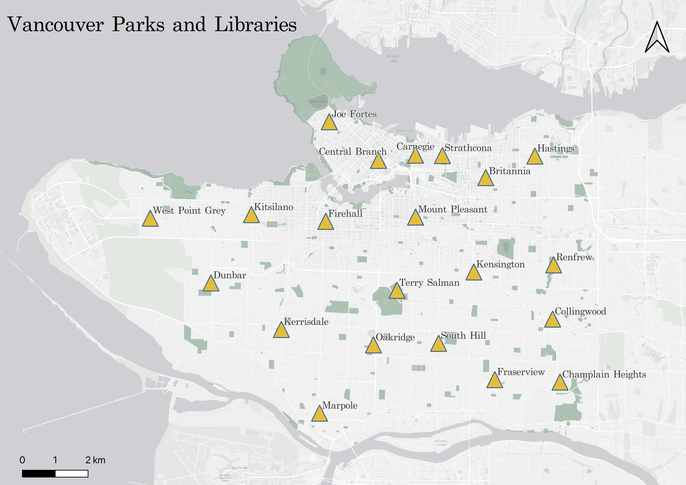 -->

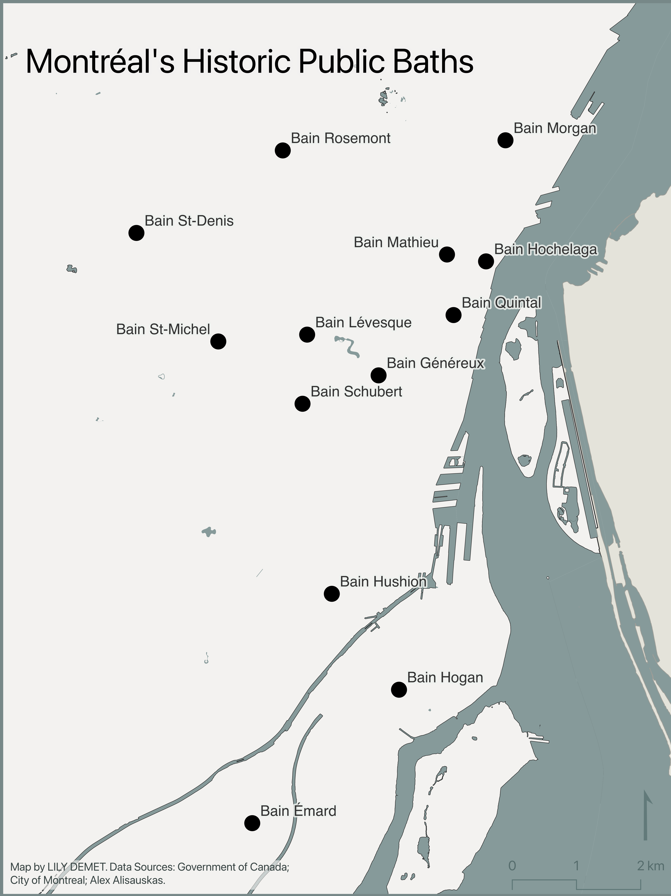

<!--  -->

 

Other reference maps include road atlases, hiking maps (handheld or web-based, like AllTrails), pocket atlases, or transport specific maps such as the below cycling map of Vancouver. The reference map most often used in your everyday is likely Google Maps.

[Vancouver cycling map](https://vancouver.ca/streets-transportation/cycling-routes-maps-and-trip-planner.aspx){:target="_blank"}     

 

**Insets**, which are maps nested within maps, either zoom-in to show a particular area in greater detail or zoom-out to contextualize the area of interest within broader geographical context. Reference maps, like any map, should have at minimum an explanatory title, north arrow, scale, legend, map author and data source statement. If there are only one or two data layers which are intuitively symbolized and clearly marked, a legend is sometimes unnecessary.

 

## Thematic Maps 

Another kind of map is a thematic map. Writes [Statistics Canada](https://www150.statcan.gc.ca/n1/pub/92-195-x/2021001/other-autre/theme/theme-eng.htm){:target="_blank"}: “A thematic map shows the spatial distribution of one or more specific data themes for standard geographic areas.”  Thematic maps render the results of spatial anlaysis. [QGIS](https://docs.qgis.org/2.18/en/docs/gentle_gis_introduction/spatial_analysis_interpolation.html#:~:text=Overview,Geographic%20Information%20System%20(GIS).{:target="_blank"}) defines **spatial analysis** as:

> the process of manipulating spatial information to extract new information and meaning from the original data. Usually spatial analysis is carried out with a Geographic Information System (GIS). A GIS usually provides spatial analysis tools for calculating feature statistics and carrying out geoprocessing activities such as data interpolation.

Below are examples of different thematic maps, all visualizing chestnut street trees by Vancouver neighborhoods. While today's workshop focuses on making simple static *reference maps* for academic publication, the additional optional content under Hands-On contains documentation for making each kind of thematic map below.

### Choropleth maps
Choropleth maps are useful to visualize and compare the density, frequency, or quantity of a value generalized across standardized geographic areas (such as zip-codes, provinces, or countries). See [Axis Map's guide to choropleth maps](https://www.axismaps.com/guide/choropleth){:target="_blank"} for more. Unless you specifically want to emphasize differences in total number of events/data points, it is best practice to normalize your data when choropleth mapping. Normalization is when you divide the values for each geographic area by something like the area in square kilometers or total population of that area. For instance, mapping winter flu cases across census tracts in British Columbia, you’d want to normalize the total cases in each census tract by that tract’s total population. Normalization enables better comparison across multiple geographic areas. See [Axis Maps](https://www.axismaps.com/guide/standardizing-data){:target="_blank"} for more. 

The map below shows total chestnut street trees per Vancouver neighborhood. 

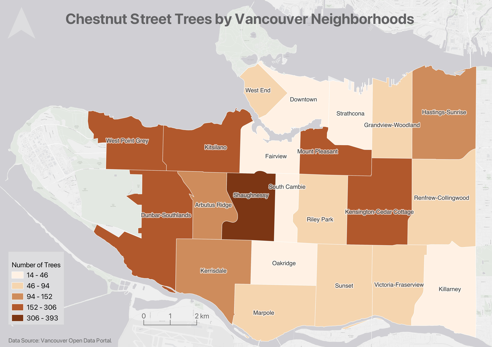

The map below shows chestnut street trees as a fraction of total street trees per Vancouver neighborhood. 

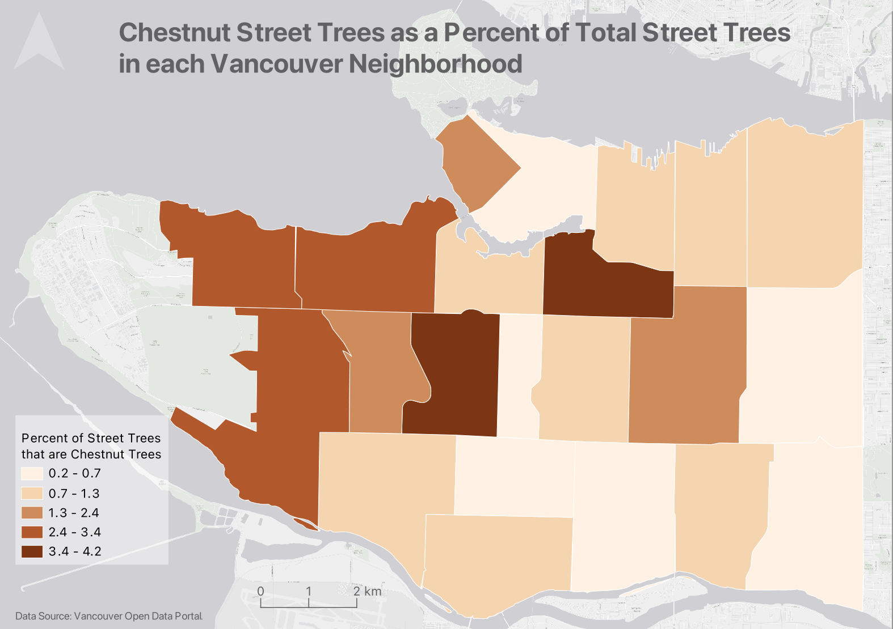

Each map serves a purpose. It's simply important to consider what information you want to convey with your map. 

### Proportional Symbol maps
Choropleth maps use a color gradient to convey value differentials, whereas proportional symbol maps use symbol size. Proportional symbol maps are useful to visualize the quantity of something across respective locations. Proportional symbols are quite intuitive, and can be combined with other parameters like color and lettering size to provide rich spatial information. Proportional symbols can even be layered atop a choropleth map. See [Axis Map's guide to Proportional Symbols](https://www.axismaps.com/guide/proportional-symbols){:target="_blank"} for more.

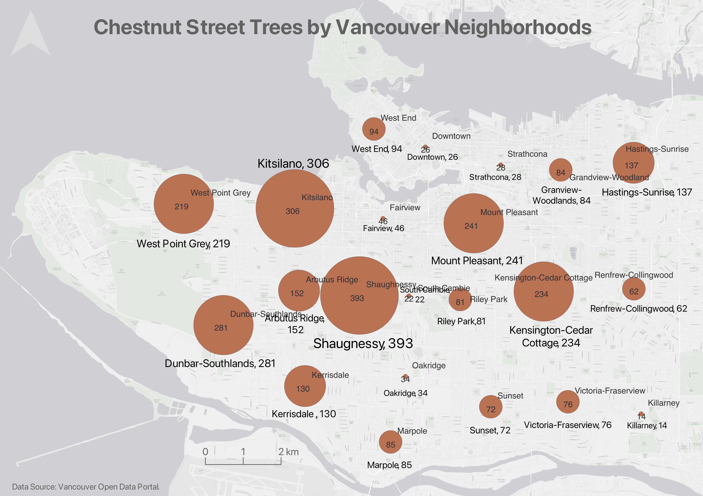

In most cases you do not normalize values when using proportional symbols, as that would reduce the range in difference. If anything, it can be useful to exaggerate the range slightly. While Absolute Scaling renders symbols increasingly larger along a linear scale, Perceptual/Apparent Scaling compensates for the eye’s tendency to reduce difference in sizes close together. See [here](https://makingmaps.net/2007/08/28/perceptual-scaling-of-map-symbols/){:target="_blank"} for more. 

### Dot Density maps
Dot density maps are useful in visualizing the concentration and distribution of discrete incidents. Each dot can represent an event (e.g., an earthquake), or a multiple such as 10. Dot Density maps can over-simplify. See [Axis Map's guide to Dot Density Maps](https://www.axismaps.com/guide/dot-density){:target="_blank"} for more. 

### Heatmaps
Heatmaps are useful in visualizing the intensity or frequency of occurrence. Heatmaps can be thought about as generalized dot density maps.

### Cartograms
Cartograms distort area to emphasize the value associated with a geographic region. When using cartograms, it’s important to consider whether your audience is already familiar with the un-distorted geography, otherwise they might not glean the added information.
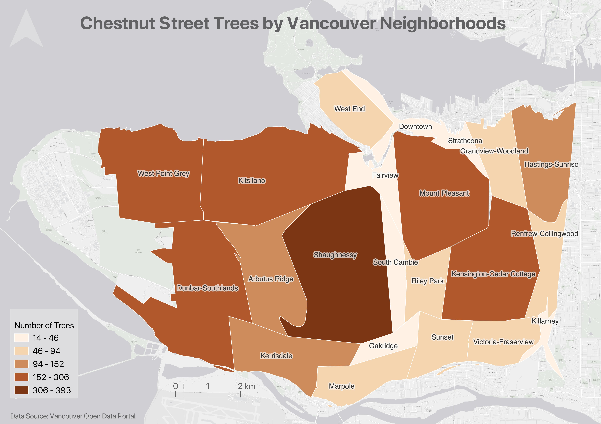

There is a case to be made that all maps are thematic, as the definition of boundaries, borders, names, etc. is a political - and almost always contested - act. In other words, there are no neutral maps that simply, impartially, represent an objective reality or truth. See [Crampton and Krygier (2006)](https://acme-journal.org/index.php/acme/article/view/723){:target="_blank"} or [Harley (1992)](https://quod.lib.umich.edu/p/passages/4761530.0003.008/--deconstructing-the-map?rgn=main;view=fulltext){:target="_blank"} for a seminal introduction to critical cartography, or [Wang and Liu (2022)](https://www.researchgate.net/publication/365011390_Maps_and_cartography_Progress_in_international_critical_cartographyGIS_research){:target="_blank"} for an overview of critical cartography and GIS through the last several decades. See also the classic by Denis Wood, The Power of Maps. For an excellent read on the power of Google Maps, see [Digital territories: Google maps as a political technique in the re-making of urban informality](https://journals.sagepub.com/doi/10.1177/0263775818766069){:target="_blank"}.
{: .note}

 

### Static or dynamic?
{: .no_toc}
While outside the remit of this workshop, may be important to you is whether your map is static or dynamic. Both reference maps and thematic maps can be either static or dynamic. Static maps tell a spatial story at a single scale. Static maps can be exported/stored/formatted as an image (.jpeg or .png), can be exported as a pdf, printed or embedded digitally into website or online publication. They can also be included in an academic paper, poster, or flyer. Dynamic maps, on the other hand, allow the user to interact with your spatial story. Dynamic display data in an interactive fashion, allowing viewers to pan around and zoom in and out to reveal more information at different scales. This workshop focuses on static reference maps. For more on making web maps, please see our [Research Commons Workshop on Webmapping](https://ubc-library-rc.github.io/gis-webmapping/){:target="_blank"}. 

 

----

# Spatial Data
Spatial data, sometimes called 'geospatial data', is data that contains locational information, most often *coordinate points*. Just like text documents require specific software to open and edit them, spatial data require certain software to open, view, analyze, and modify them. While there are different tools and platforms for working with spatial data. The main kind of software for visualizing, analyzing, and modifying spatial data is Geographic Information System, or a GIS. Additionally, there are browser-based platforms for uploading and visualizing spatial data. Today's workshop will use [QGIS](https://qgis.org/){:target="_blank"} — a free and open source Geographic Information System (GIS) — to visualize spatial data and make simple, static maps as one might for academic publication.  While GIS isn't the only way to make a reference map, it provides ample detail and involves your original work.

Before we turn to tools for visualizing spatial data, we must first be able to identify data as spatial. It is important to understand the different forms spatial data take and how to make data legible to different mapping platforms.

## Raster vs. Vector Data
There are 2 main types of spatial data: **vector** and **raster**. 

**Raster data** is made up of pixels arranged in a grid, whereas **vector data** is made up of vertices and the paths between them that create geometries representing real-world features. If you're working with continuous geospatial phenomena such as satellite imagery, topography, or climatic data (like rainfall or temperature), you're likely using raster data. If you’re working with points, lines, or polygons, that’s likely vector data.

### Vector Data
{: .no_toc}
Each vector dataset will contain *either* points, lines, or polygons. However, a dataset can include multiple features (multiple points, *or* multiple lines, *or* multiple polygons). For example, below are a handful of vector datasets, including Vancouver neighborhoods (polygons), city blocks (polygons), restaurants (points) and streets (lines). A Geographic Information System (GIS) allows you to add multiple datasets, layering them on top of each other in order to run calculations between them to answer spatial questions. For instance, in a GIS, you could load in the below datasets and then use vector analysis tools to learn how many restaurants are within a 5 kilometer radius of a given city block, or the square area of each neighborhood.

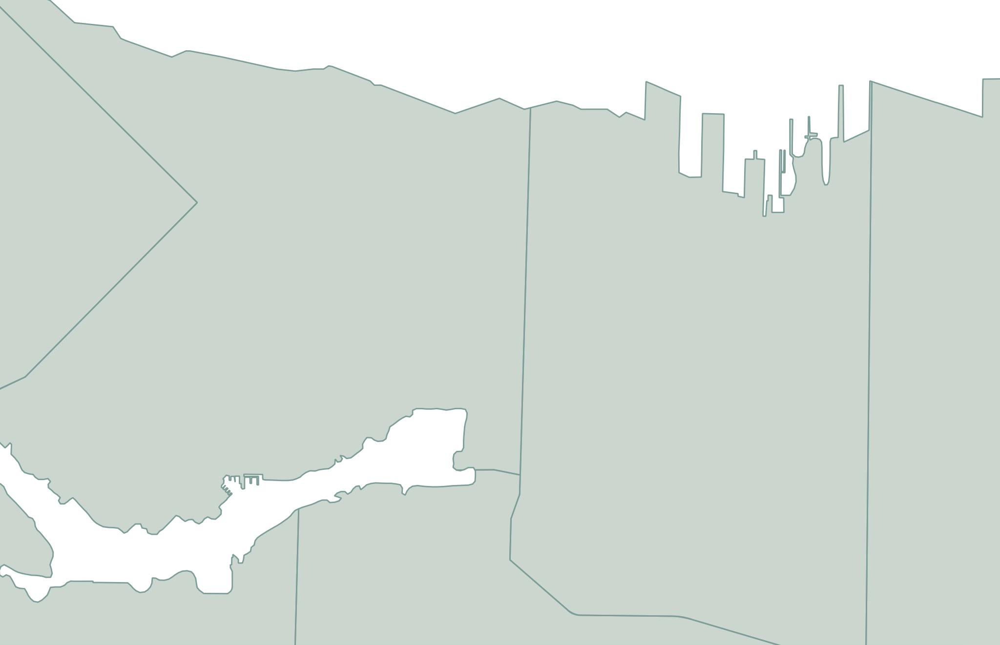 
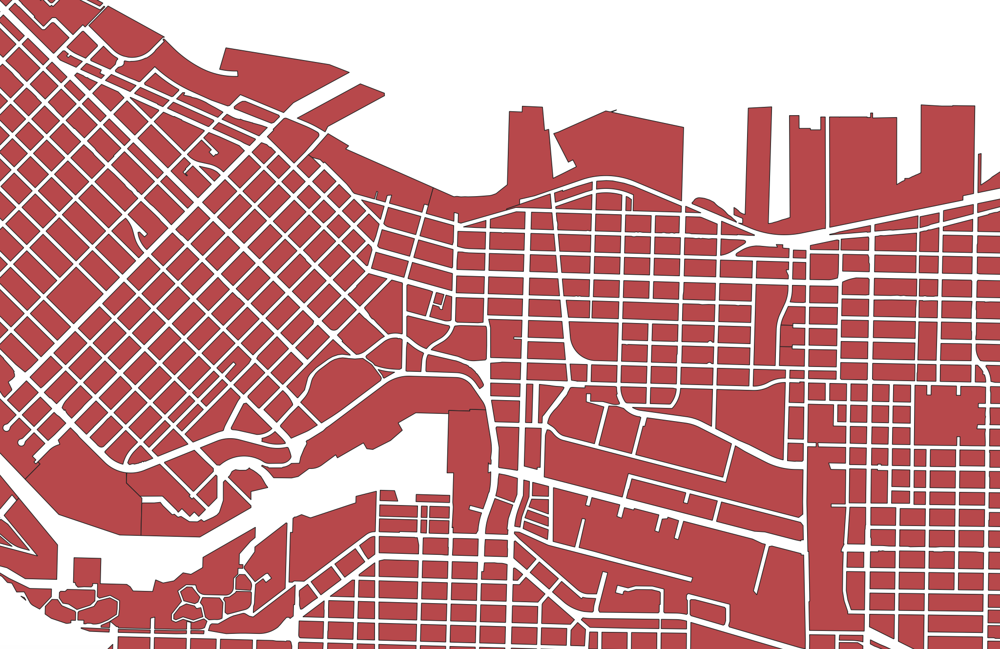
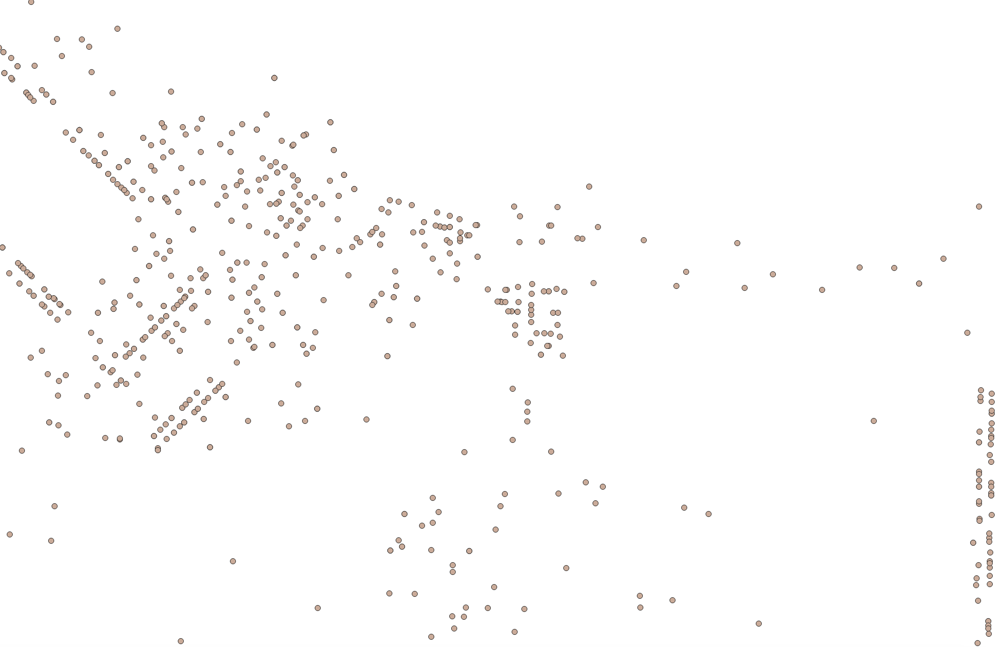 
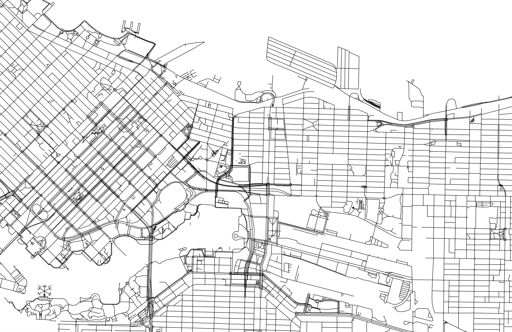 
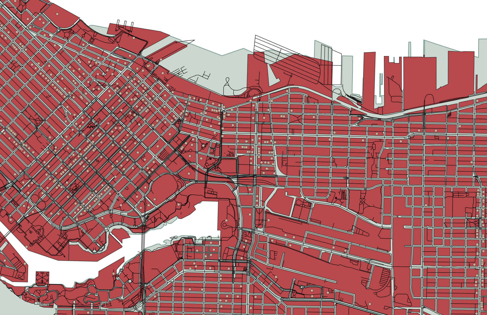 

In another example, below is a map consisting of three layers of vector data: cities (points), major roads (lines), and land/water (polygons). Cities, roads, land, and water are all different datasets consisting of vector data. 
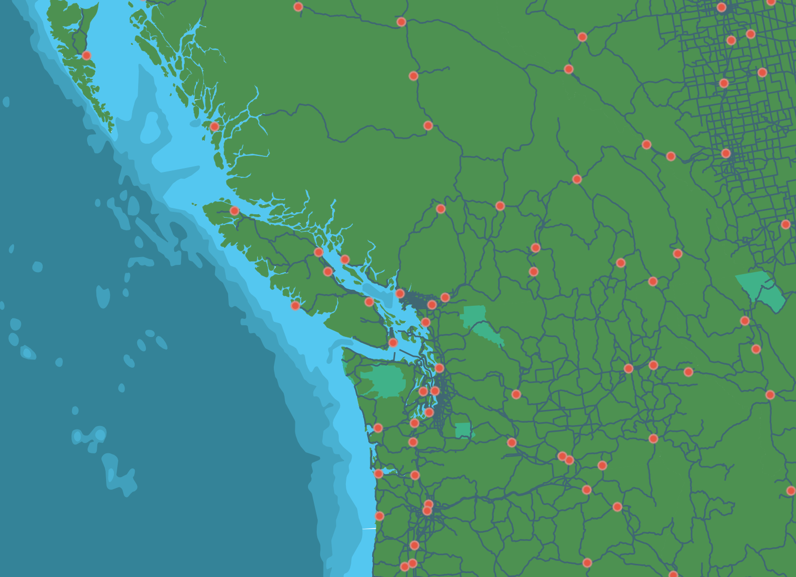

Each feature (each polygon, point, or line within a given dataset of points, lines, or polygons) contains various information such as a unique identifier, the area in square kilometers or length, the name, the population, etc. These attributes can be explored from within a GIS by opening what's called the Attribute Table.

### Raster Data
{: .no_toc}
Rasters, on the other hand, can generally only store one value per pixel. This value could be a color representing different kinds of topography (think of the whites, greens, and browns representing different elevations in the image below) or the quantity of something like rainfall, temperature, or distance. Multiple rasters *can* be overlaid to generate a multi-part raster, but generally, each pixel of a single raster can store one value meaning your raster is showing one variable. You can also do math between raster layers, or run boolean operations to isolate all pixels that do or do not meet certain criteria. An example of this is Suitability Analysis, where multiple rasters are created, each representing the where a single criteria is met; then, these rasters are overlaid to visualize areas of high suitability (such as habitat). 

Below is are three examples of raster data: topography, aerial imagery, and historical rainfall for the month of February (averaged 1970-2000) from [WorldClim](https://worldclim.org/data/index.html){:target="_blank"}, an excellent database of freely available historical climate data. 

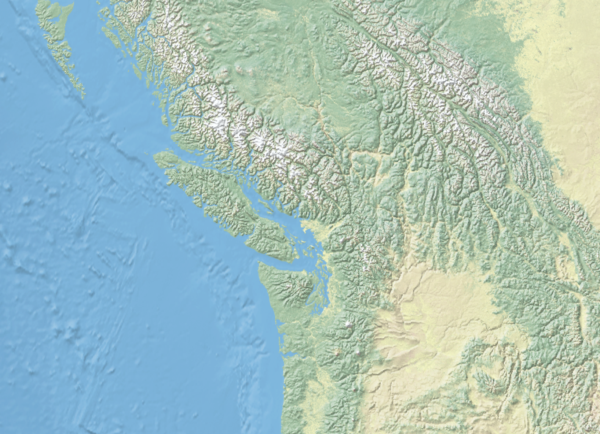

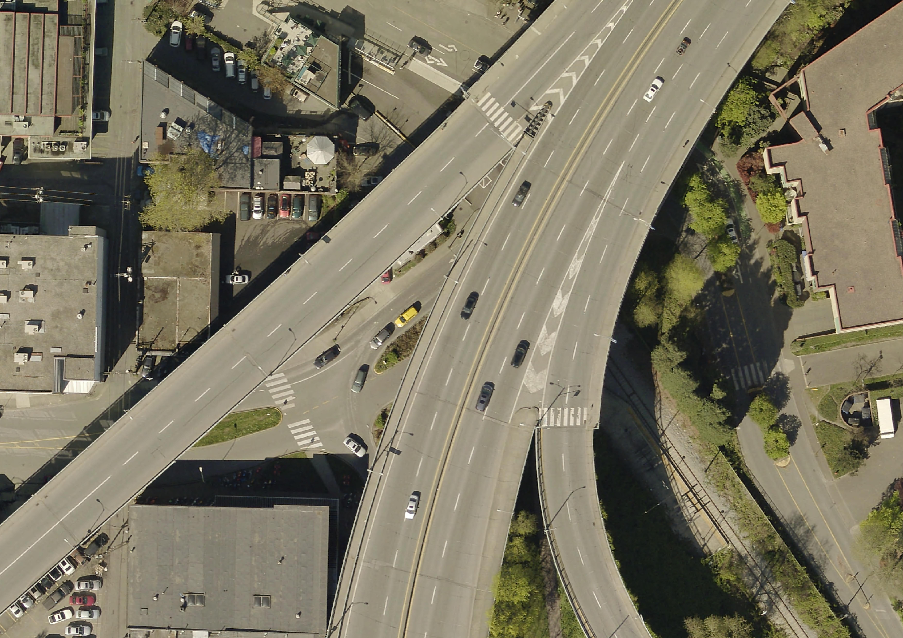
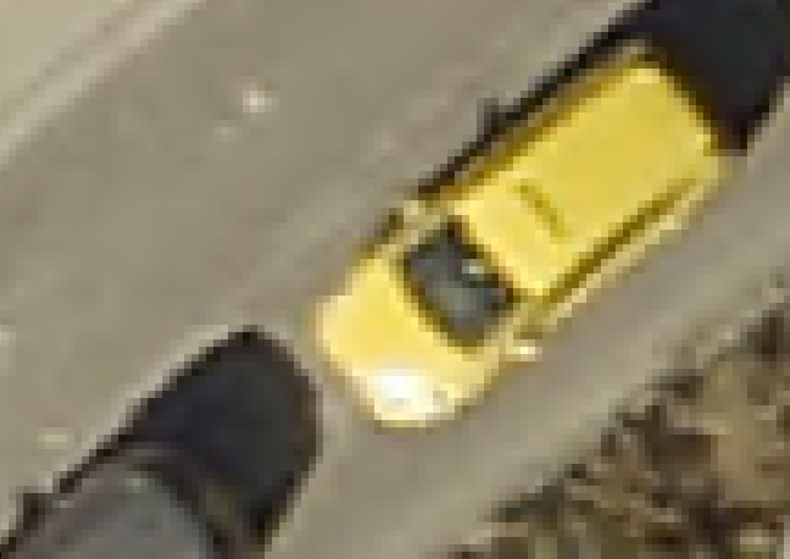

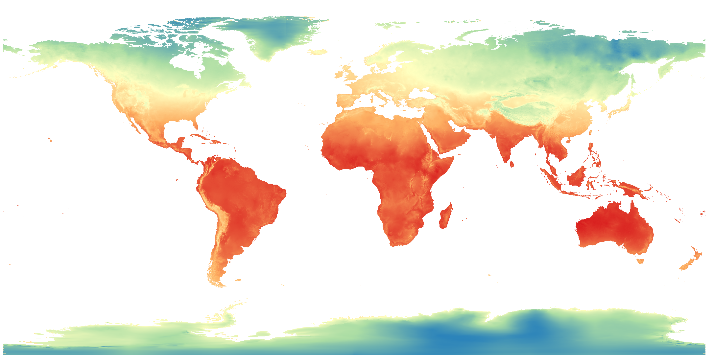

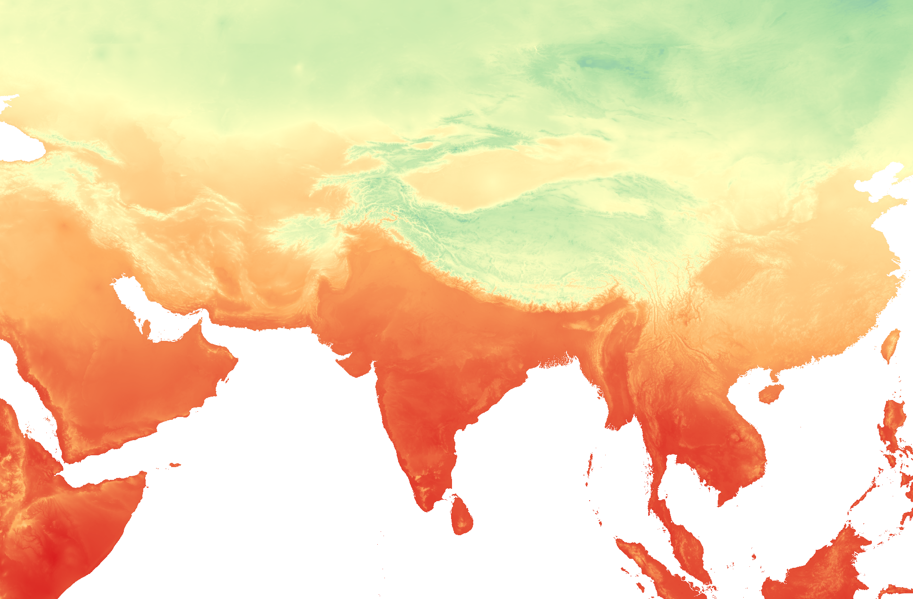
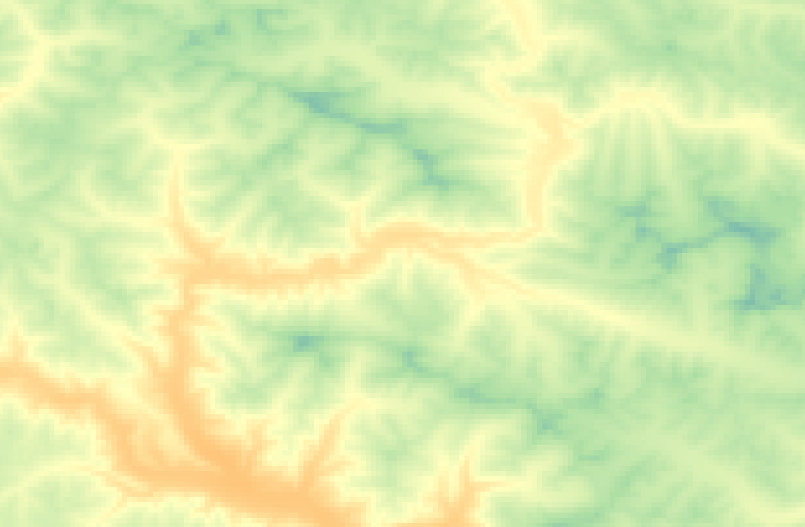
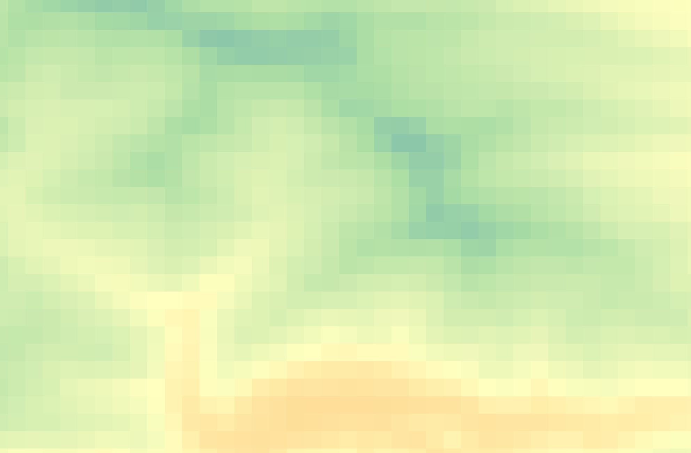
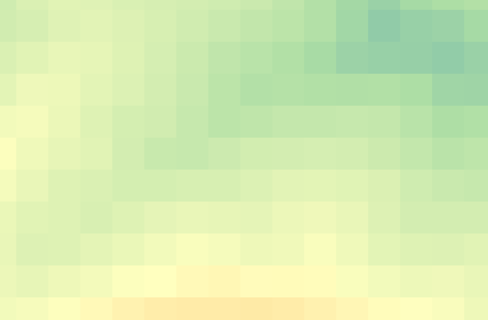

In a GIS, you can convert raster data to vector data and vector data to raster data, and extract raster values to a vector dataset. 

 

## File Extensions
Just like a textual data can be stored in different document formats (`.docx`, `.pdf`, `.txt`, `.rtf`, etc.), spatial data can be stored in different formats too. The file extensions of spatial data give us clues about the kind of data we're working with. Although the nuance of file formats might seem too detail oriented for an introduction to reference mapping, being aware of different spatial data types and formats will help you know what to download and troubleshoot why something may not be opening/working. If you have no prior experience with spatial data, this may be quite overwhelming right now. However, with a little bit of practical experience under your belt file formatting will quickly become common sense to you. See [here](https://gisgeography.com/gis-formats/){:target="_blank"} for an exhaustive list of formats spatial data can take. 

**Raster data** will often be [TIF](https://en.wikipedia.org/wiki/TIFF){:target="_blank"} (aka TIFF) file and have the extension `.tif` or `.tiff`. Raster data may also be in an ASCII text file, with the extension `.asc`, or a compressed raster file formats. 

**Vector data** come in more diverse file formats: 
- The Shapefile is an industry standard format with the extension `.shp` (and a host of "sidecar files" — be sure to keep them all together). Vector data downloaded in a shapefile format will almost always need to be unzipped before use. Shapefiles store data in binary. Therefore, shapefiles are not legible to human eyes and can only be opened and visualized by a GIS. 
- GeoJSON, on the other hand, stores vector data in `.geojson` files that can be opened (and edited) in a code editor or online in [geojson.io](https://geojson.io/){:target="_blank"}. From there, geoJSON can easily be parsed with human eyes.
- Spatial data might even be stored in an excel sheet or a `.csv` file. 
- KML, or Keyhole Markup Language, is particular to Google Earth and Google Maps and doesn't work well in a GIS. This is why, when using Google platforms, you'll need to upload your data in either `.kml` or `.csv` format. 
- If your data does not have an explicit spatial component, but includes place names or addresses, with a little work, this can be made legible to tools and platforms designed to read spatial data. Also note that historical data might come in the form of a scanned map that will need to be "georeferenced", or projected into a 2-dimensional coordinate space. Additionally, in a GIS, you can convert raster data to vector data and vector data to raster data, and extract raster values to a vector dataset.
<!-- doesnt mean its not spatial data, just that the spatial componant isn't legible (yet) to tools/platforms/software designed to read in spatial data.  -->
- If your data's locative information is in the form of text — for example, country/city names or street addresses — this can be made legible to a GIS with a few extra steps (see [geocoding](https://ubc-library-rc.github.io/gis-plugins-qgis/content/geocoding.html){:target="_blank"}). You may have to create new columns and populate them with coordinate information.  

 

----
#### Resources for Finding and Working with Spatial Data
{: .no_toc}
- [Data Wrangling](https://ubc-library-rc.github.io/gis-dhsi/content/day1/5-data-wrangling.html){:target="_blank"}
- [Working with Spatial Data](https://projects.lincolnmullen.com/spatial-workshop/spatial-data){:target="_blank"} by Lincoln Mullen
- [Concordia's Guide to geospatial data](https://www.concordia.ca/library/guides/geospatial-data/geodata.html){:target="_blank"}