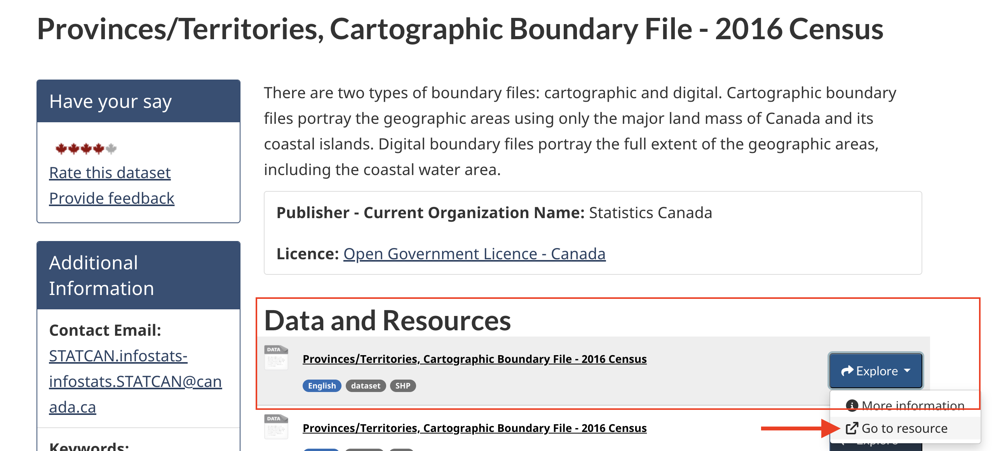
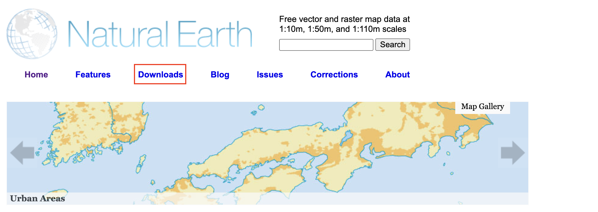
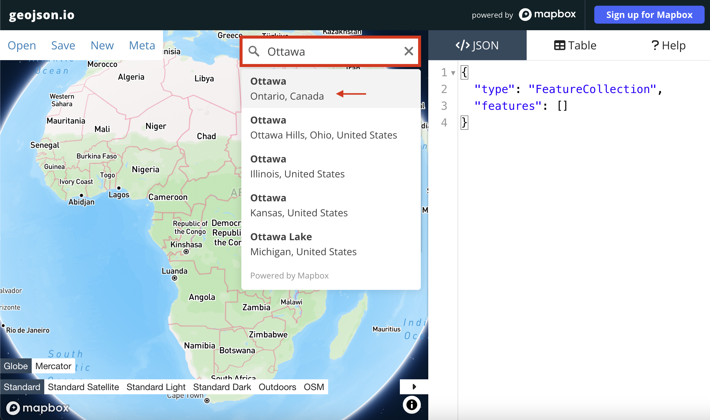
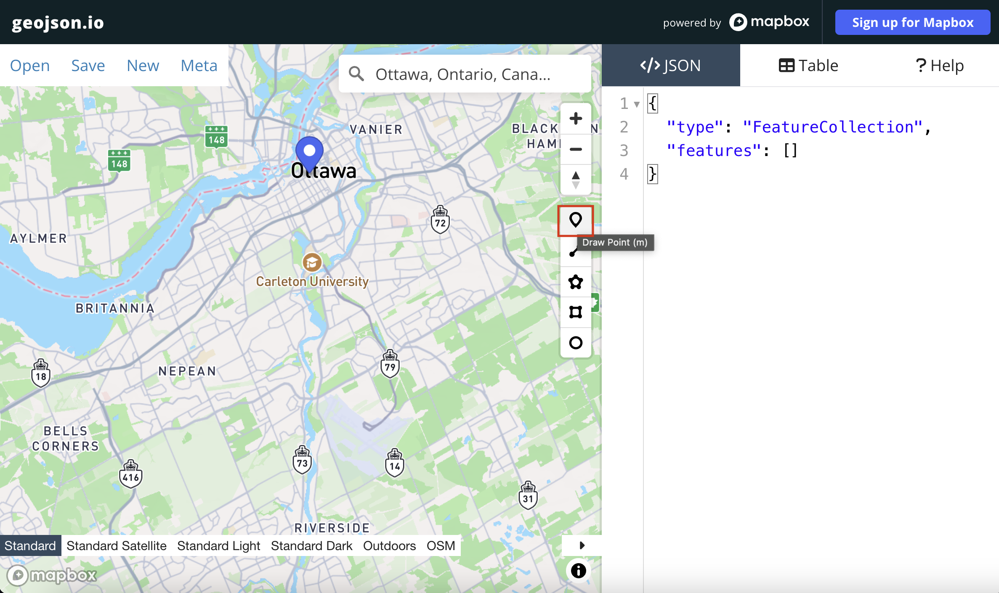
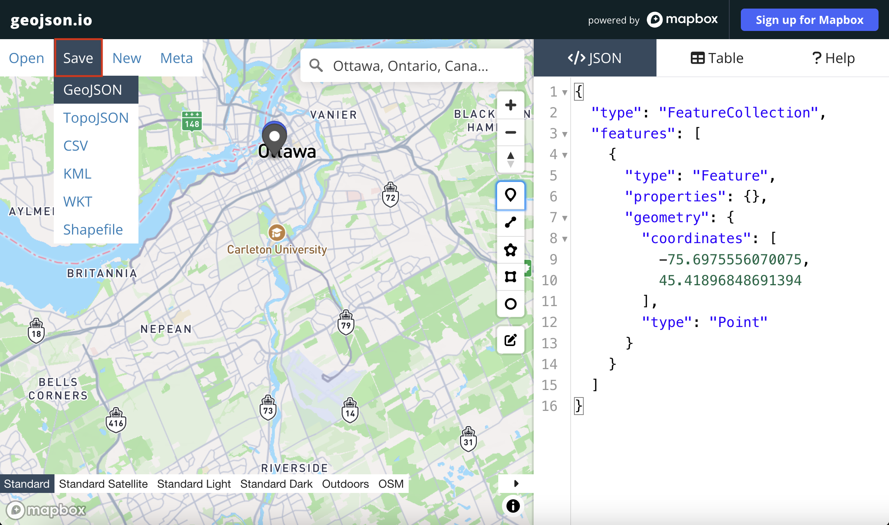

# Gathering Data 
{: .no_toc}

In the [Introduction to Mapmaking with QGIS](https://ubc-library-rc.github.io/gis-mapping-intro/){:target="_blank"}, you learned about spatial data and how to search for the data you need. Because finding, downloading, and preparing spatial data is a major part of mapping for academic publication, you will be guided through downloading the main datasets for today's workshop on your own.

The reference map(s) we will make today will use _vector data_ data from Natural Earth, Statistics Canada, and Native Land Digital. The workshop folder contains some of this data, as well as additional datasets for you to practice thematic mapping. However, we still need data on:

- Canadian provincial & territorial boundaries 
- World countries, lakes, and oceans
- Point over Ottawa, Canada's capital city

Follow the instructions below to find and download this data. Remember, move each dataset you download to the workshop folder and *unzip it* there.

<!-- 

  

    On this page:
  

  {: .text-delta }
 - TOC
{:toc}

 -->
----

## Download Data
 

### **1. Download Canadian provincial boundaries from Statistics Canada**      
For this workshop, we'll use the dataset from 2016 because it downloads the fastest. Navigate to the following link: [https://open.canada.ca/data/en/dataset/a883eb14-0c0e-45c4-b8c4-b54c4a819edb](https://open.canada.ca/data/en/dataset/a883eb14-0c0e-45c4-b8c4-b54c4a819edb){:target="_blank"}. You will see many file options. Download the very first one by clicking **Go to resource**. 

This will take a minute or so to download, so while you're waiting, move on to downloading the next dataset.

<!--(though you are welcome to find and use the [2021 dataset](https://open.canada.ca/data/en/dataset/ef70dc3b-1069-4037-9bce-61f47e628a1d) if you prefer). actually no If you want to use 2021, you can go [here](https://www12.statcan.gc.ca/census-recensement/2021/geo/sip-pis/boundary-limites/index2021-eng.cfm?year=21) and select xyz. The  [2022 provincial dataset](https://open.canada.ca/data/en/dataset/85efc01b-163f-ebba-2378-c43eadfb3b3f) but not as crisp and for some reason doesnt demarcate provinces on load-->

 

### **2. Download Natural Earth Data**    
Navigate to [www.naturalearthdata.com](https://www.naturalearthdata.com/){:target="_blank"}. Go to **Downloads**. 

You have the option to download large scale, medium scale, and small scale data. Large scale will give you the most detail, and therefore be a heftier file. Because our Natural Earth data will be used as context for surrounding countries only, we actually prefer a less detailed, smaller scale outline. So, let's download **vector data** at the **medium scale**. We will download 3 files: **Countries**, **Ocean**, and **Lakes+Reservoirs**. Countries will be under "Cultural" and Ocean and Lakes under "Physical". 
    
 

### **3. Create a point over Ottawa**
Finally, we will create a point over Ottawa. To do this, will use <a href="https://geojson.io/" target="_blank">geojson.io</a>, an online platform where you can click to create simple point, line, and polygon features which can then be downloaded and uploaded to a GIS. 

1. Go to <a href="https://geojson.io/" target="_blank">geojson.io</a> 

2. Simply type "Ottawa" in the search bar and the webmap should zoom to the desired location. 

3. Click the drop-pin icon. Your cursor should turn into a cross hair. Now click on the map, exactly where the drop-pin for Ottawa is already given.     
 

4. Once you click, you will notice some geoJSON code appears on the right-hand panel. This is the geoJSON that stores a single point. Click **Save** in the upper left-hand corner, and save your new point layer as either a `geojson` (notice, however, you can save as a shapefile or another file format as well). Once the file is downloaded, ***move it to your `reference-mapping-workshop` folder. You may need to rename it to `ottawa` rather than `map.geojson` which is the default. 

----

**Remember to move all downloads to your workshop data folder and unzip them there.**

----

## Data Provided
Some data is provided already for you. 

1. Inside the workshop data folder you'll see a subfolder called `thematic-mapping`. This contains data on chestnut street trees of Vancouver, downloaded from [Vancouver's open data portal](https://opendata.vancouver.ca/pages/home/){:target="_blank"} and modified slightly to make them ready for mapping. You are welcome to use these layers to practice thematic mapping. 

2. Indigenous territories from [Native Land Digital API](https://api-docs.native-land.ca/){:target="_blank"}. This data was downloaded for the entire Earth in `.geojson` format. While the file is provided for you in the workshop data folder, you can practice downloading it yourself after this workshop by either signing up for your own API key, or using `AADlPNbKCBAepz816odRT` (my key) and following the instructions [here](https://api-docs.native-land.ca/full-geojsons){:target="_blank"}. 

<!-- also show geojson dot io and overlapping -->

Take a moment to explore [native-land.ca](https://native-land.ca/){:target="_blank"} so that you can visualize the Indigenous territories, languages, and treaties in your area. Below is an interactive snapshot of where we are. Explore the full globe map [here](https://native-land.ca/maps/native-land){:target="_blank"}. On the left, you can search by territories, languages, and/or treaties. At the bottom right, you can choose to show or hide colonial boundaries, roads, and namings. You can also increase the text size and save/download your current view as an image. 

<iframe src="https://native-land.ca/api/embed/embed.html?maps=territories&position=49.244770894278666, -123.16698232306474&key=AADlPNbKCBAepz816odRT" style="width:100%; height:400px; border:none;"></iframe>

