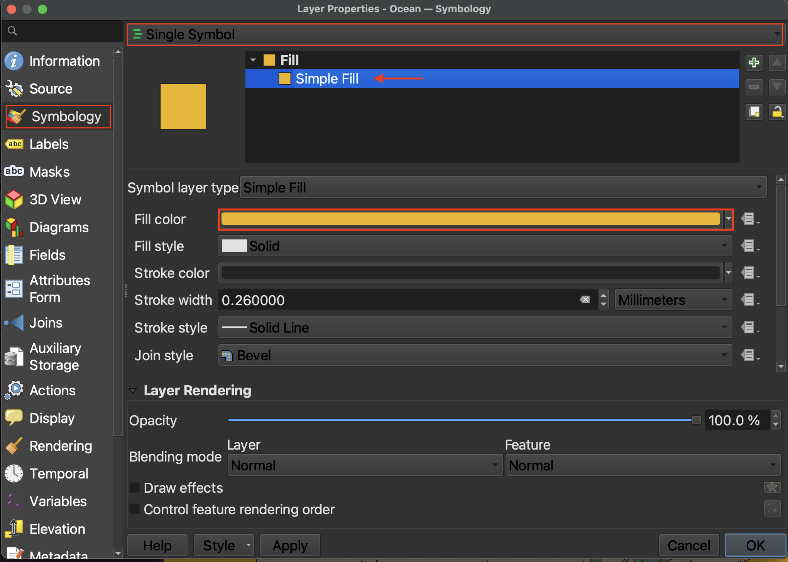
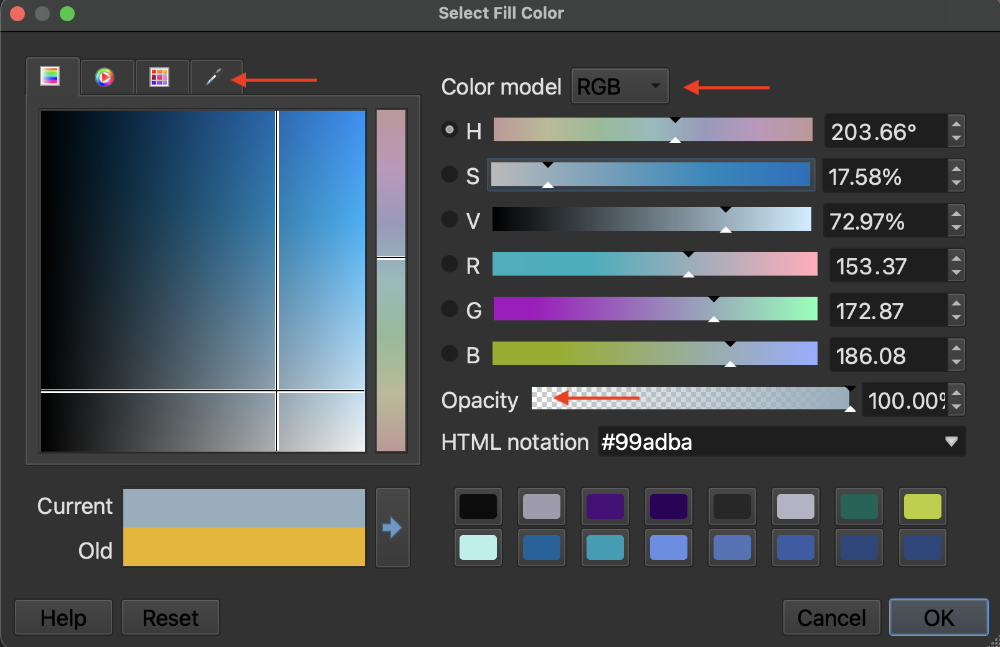
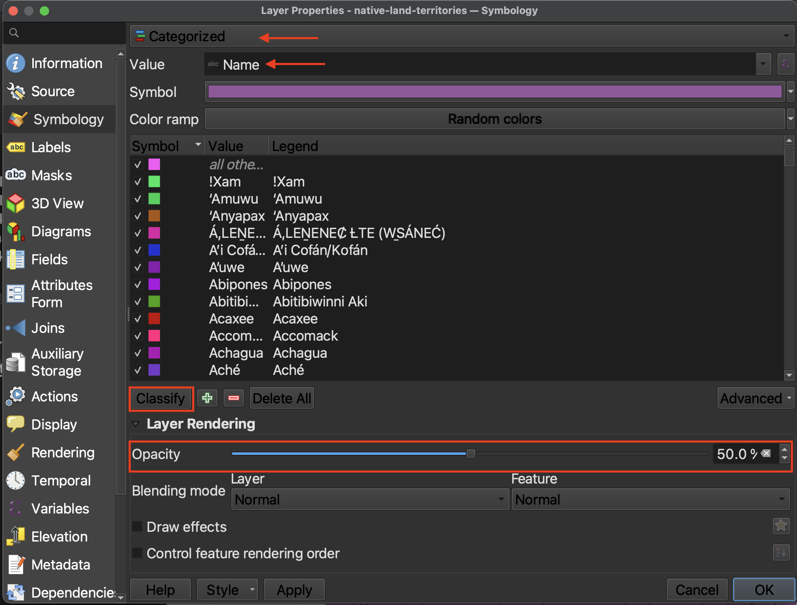
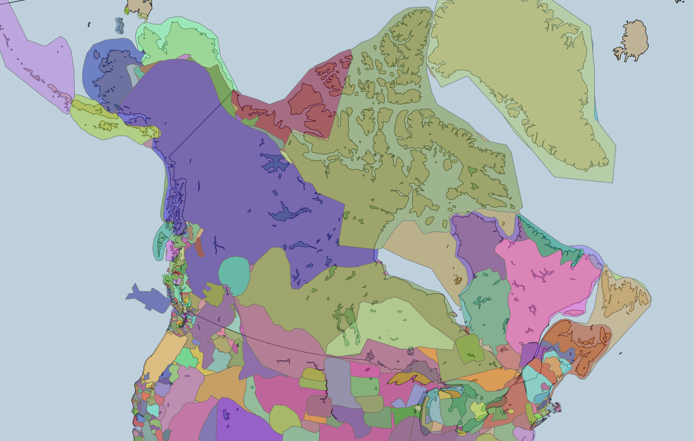
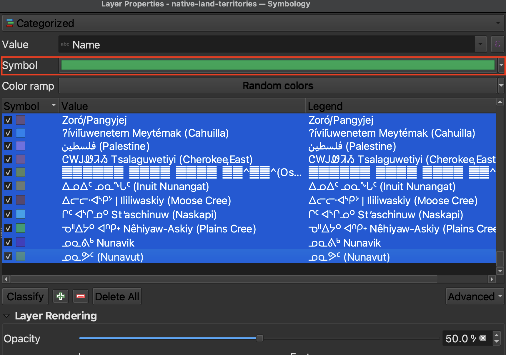
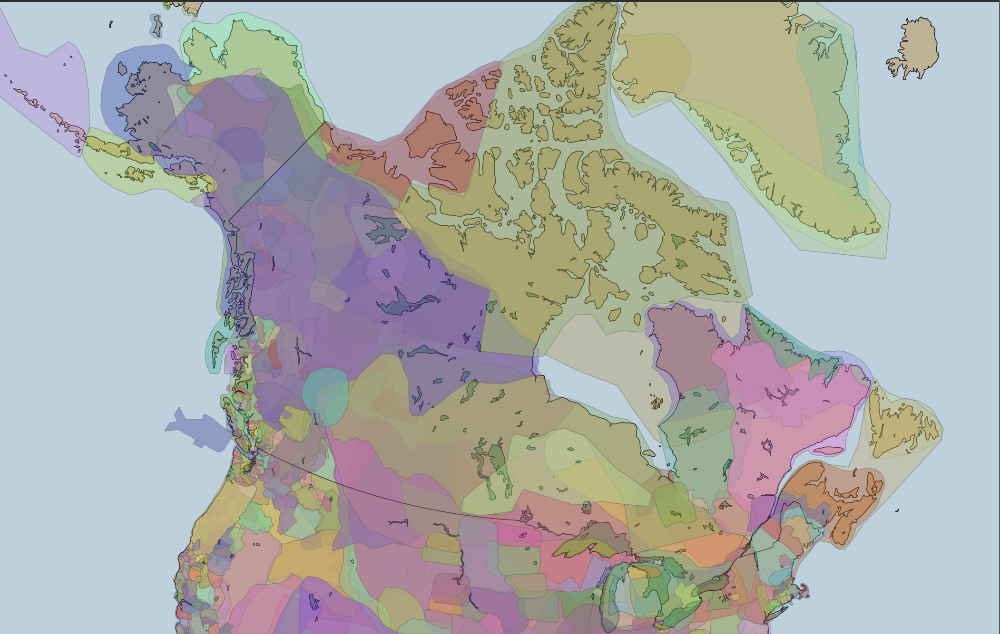
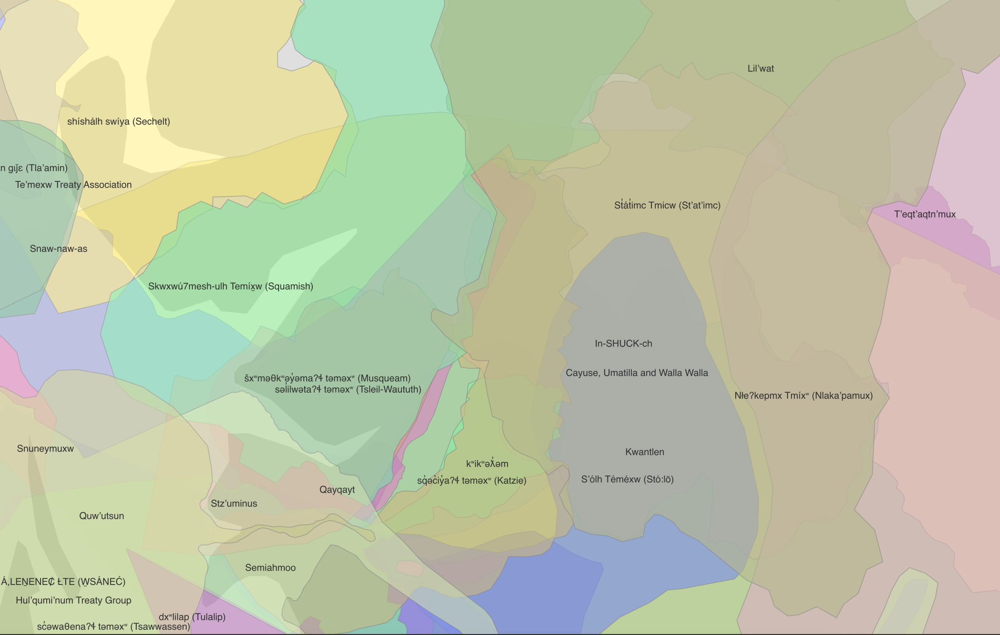

# Layer Symbology
{: .no_toc}

Just as the QGIS Project had Project Properties, each layer has properties of its own. To view a layer's properties, right-click the layer in the Layers Panel and go to "Properties..." at the bottom. 

**Symbology** governs the outline and color fill of points, lines, and polygons. Depending on the audience and publisher of your reference map, you might have constraints such as Black & White. Keep this in mind. For now, we'll map in color. See the [QGIS Lesson on Symbology](https://docs.qgis.org/3.44/en/docs/training_manual/basic_map/symbology.html){:target="_blank"} for more.

<!-- 

  

    On this page:
  

  {: .text-delta }
 - TOC
{:toc}

 -->
----

## Changing Layer Symbology
As they are, the layers we've added to our map canvas aren't particularly aesthetic, nor is foreground adequately differentiated from background. Before we compose our map for export, let's take some time to modify our layers' symbology to create a more polished looking map.

To Do
{: .label .label-green }
Change the color of the ocean.

1. Right-click the ocean layer and go to Properties --> Symbology. 
2. Click down to Simple Fill. 
3. Click on the color bar to change the color. Expand the dialogue window if necessary. 
4. You can also change the "stroke", or outline color, or, by setting Stroke style to "No line", remove it all together. 

 If you want to make your map in Black & White, change the Color Model from RGB to CYMK. Then set everything but K to 0. You can also color sample from the eye-dropper tab. 

  

## Categorized Symbology
{: .no_toc}
Imagine you had a polygon layer with multiple features, such as provinces in Canada or Indigenous territories, and you wanted each province or territory to be distinguished by its own color. In this case, you'd want to change the symbology type from Single Symbol to Categorized. 

To Do
{: .label .label-green } 
Change the symbology for the Native Land dataset. 

Currently, each territory has a random color. You can click each color square beside the province to individually change its color. We won't attempt this, however, as there are too many features. Decreasing the layer's opacity (aka increasing its transparency) will allow the provinces or landforms to be seen beneath it. Try hiding the provinces for a moment. 

Notice, however, that transparent or not, the territories from the Native Land dataset do not appear to overlap. However, when referencing the original map, [native-land.ca](https://native-land.ca/), we see much overlap in the boundaries. In order to show this in our QGIS project, we have to adjust the symbology for each territory. If you remember, there were a lot! Luckily, we can do a sort of select-all to edit them all at once.

Select the first territory listed. Holding the Shift key of your computer down, scroll to the bottom and select the last territory. This should highlight the whole list. 

Then, click on "Symbol". On "Fill", decrease the opacity to around 60%. Then click "OK". Click "Apply" from symbology window to see the results on your map canvas. There should now be significant overlap. Click "OK" to close the symbology window. Save your project. 

Turn on labels for Indigenous territories, and zoom in. 

