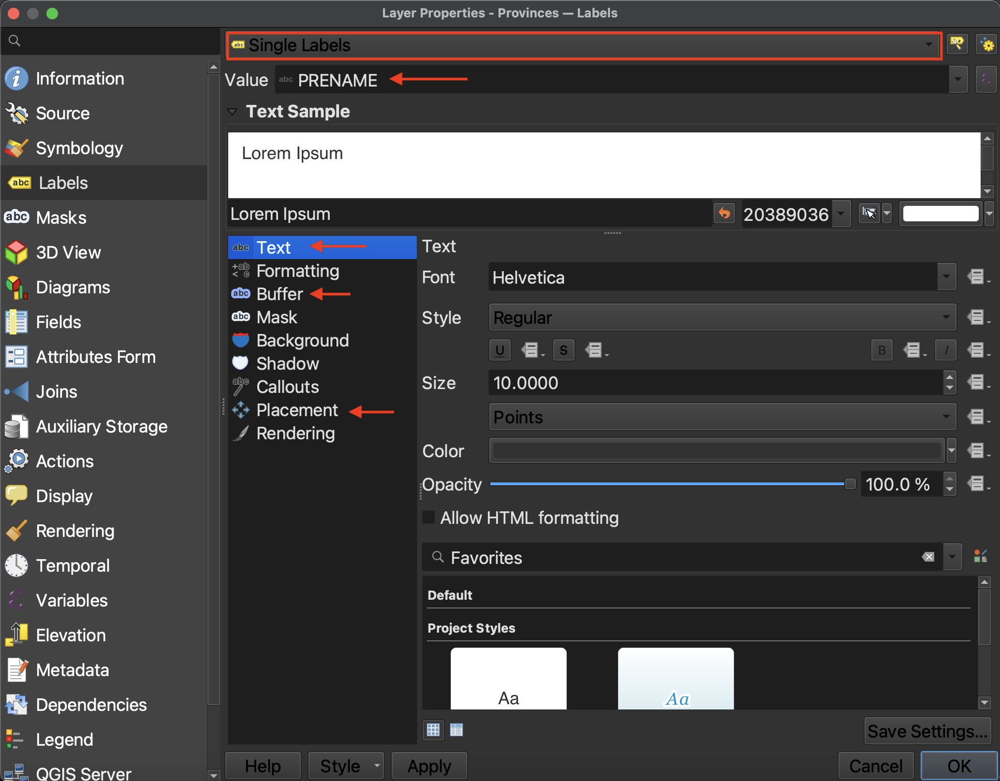
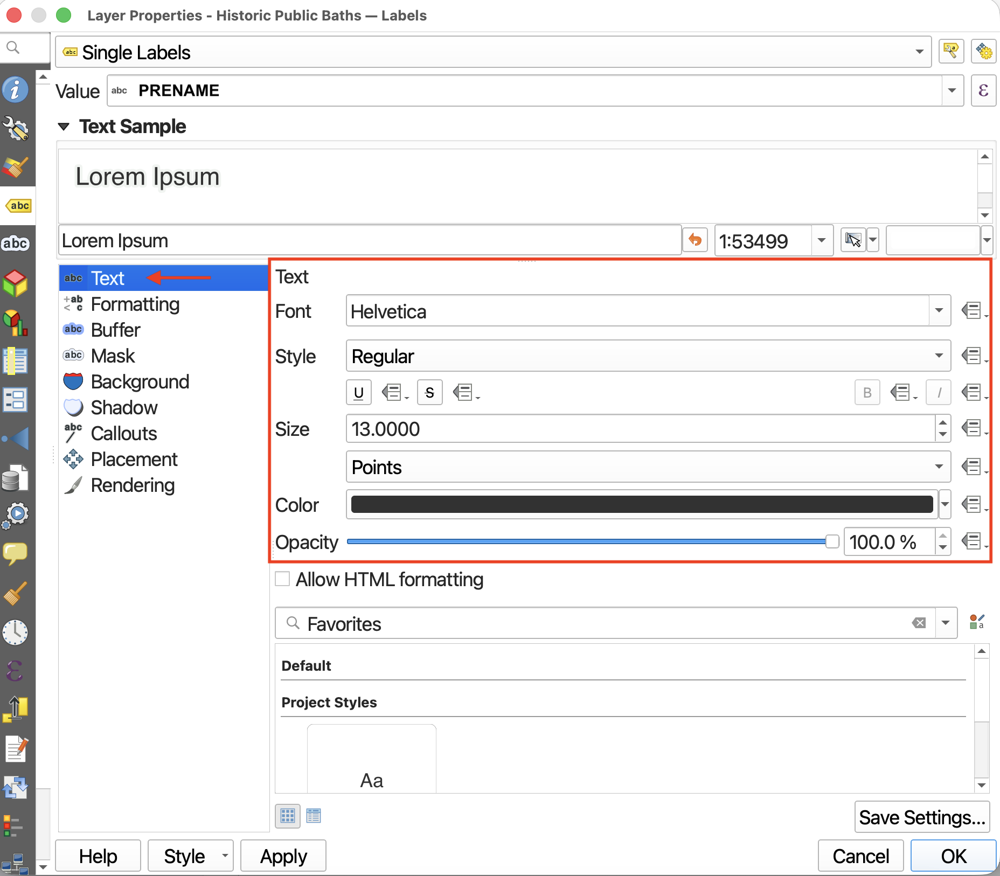
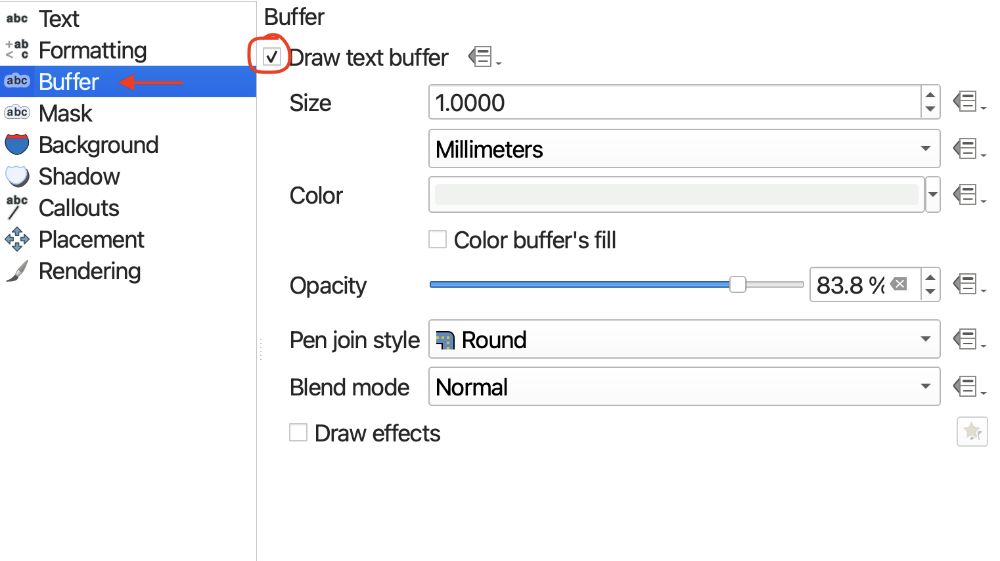
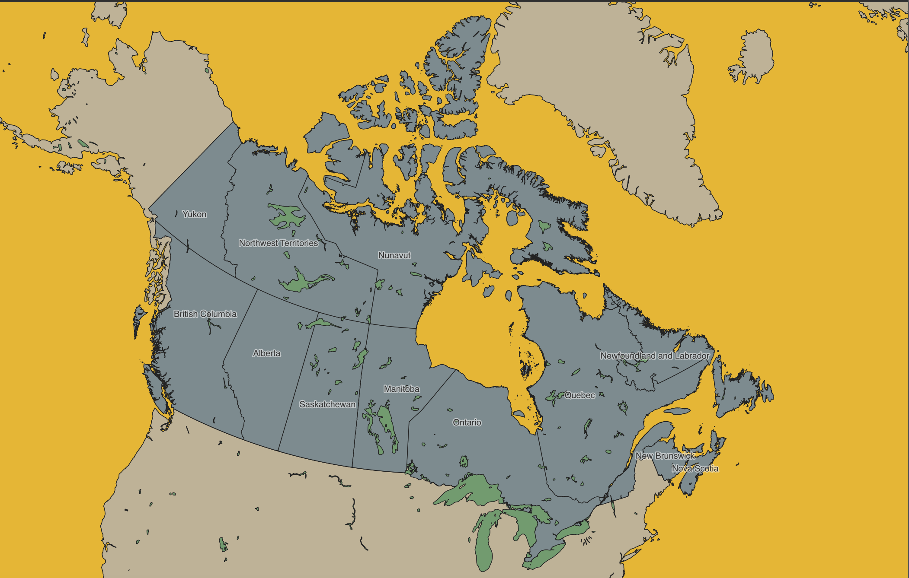

# Labelling
{: .no_toc}
Another Layer Property useful to know is Labels. The Labels Property allows you to add labels to a layer based on a specified attribute value. You can turn off the labels at any time by returning to a layer’s properties, or by right-clicking the layer and clicking “Show Labels” again.
 

## Add Provincial Labels
Open the **Layer Properties** for `provinces`. Navigate to **Labels** just beneath Symbology.

>  Change **No Labels** to **Single Labels**. 
 

>  Set the **Value** to `PRENAME. This way the labels will appear as each Province's name (English). 

 
You can customize your labels quite a bit. 

First, you can change the size, font, color, and opacity (or transparency) of your text from the **Text** option.

 

If your text is difficult to read, you can add a buffer to highlight it from the background. Considering visual hierarchy, it can be a good idea to use a semi-transparent color that's already predominant in the map's background to highlight your text. 

Finally, you can adjust the labels' placement around a point by going down to **Placement**. This is most useful when labelling polygons.

