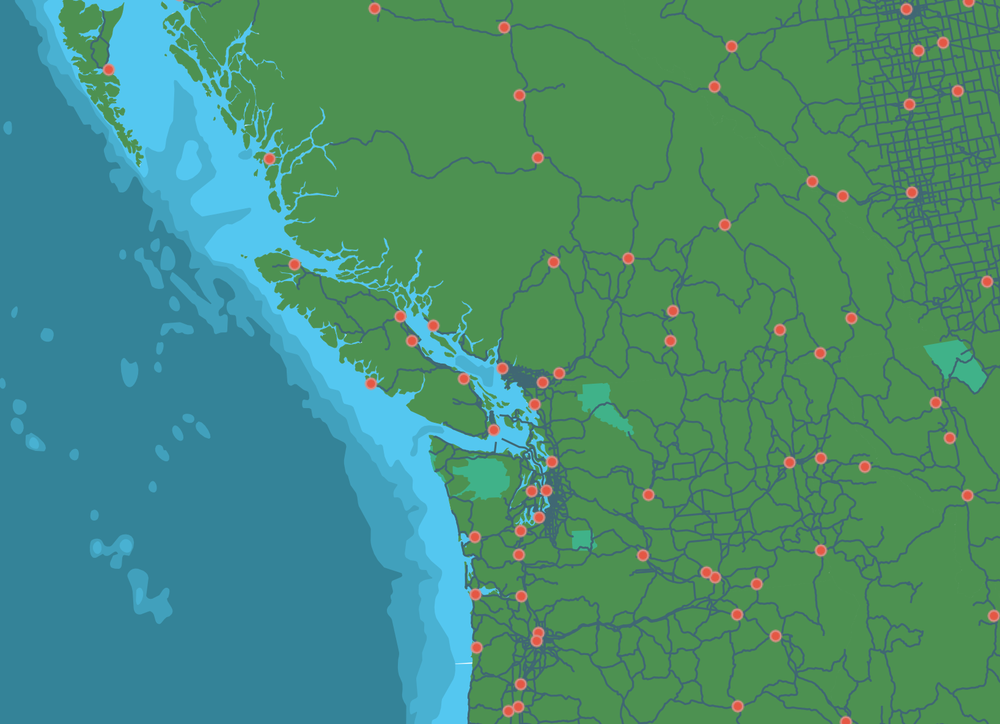

# Gathering Data

## Spatial Data (and how to know if your data is spatial)
A Geographic Information System (GIS) works with data that is tied to a location on Earth. This type of data is often referred to as "spatial data", "geospatial data", or even "GIS data", and is spatially referenced using location information — most commonly geographic coordinates. A GIS uses this location information to project a geospatial file into a virtual geographic space where it can then be visualized and analyzed. If your data's locative information in the form of countries, cities, or street addresses, this can be made legible to a GIS with a few extra steps. 

 If you’re working with points, lines, or polygons, that’s likely vector data.

There are 2 main types of geospatial data: **vector** and **raster**. **Raster data** is data which is made up of pixels arranged in a grid, whereas **vector data** is made up of vertices and the paths between them – creating geometries that represent real-world features or phenomena. If you're working with continuous geospatial features such as satellite imagery, topography, or climatic data, you're likely using raster data.  If you’re working with points, lines, or polygons, that’s likely vector data.

Below is a map consisting of vector data, with cities (points), major roads (lines), land/water (polygons), and parks (polygons).

Each vector dataset can only be lines, points, *or* polygons. However, a dataset can include multiple features, such as polygons representing all the provinces of Canada. For each feature (in this example, each province), various information may be stored such as a unique identifier, the area in square kilometers, the name, the population, etc. Rasters, on the other hand, can only store one value per pixel. This value could be a color representing different kinds of topography (think of the whites, greens,and browns representing different elevations) or the quantity of something like rainfall or temperature. Multiple rasters *can* be overlaid to generate a multi-part raster, but generally, each pixel of a single raster can store one value meaning your raster is showing one variable. You can also do math between rasters etc. 

    
Spatial data have different file extensions that you may be used to. Raster data will often be [TIF](https://en.wikipedia.org/wiki/TIFF) (aka TIFF) file and have the extention `.tif` or `.tiff`. Vector data come in more diverse file formats. The Shapefile is an industry standard format with the extension `.shp` (and a host of "sidecar files" - be sure to keep them all together). Shapefiles store data in binary, and it is therefore not legible to human eyes and can only be opened and visualized in a GIS. GeoJSON, however, stores vector data in `.geojson` files that can be opened in a code editor or online in [geojson.io](https://geojson.io/) and quite easily parsed with human eyes. See [here](https://gisgeography.com/gis-formats/) for an exhaustive list of formats spatial data can take. Although the nuance of file formats might seem too detail oriented for an introduction to reference mapping, being aware of different spatial data types and formats will help you know what to download and troubleshoot why something may not be opening/working. If you have no prior experience with spatial data, this may be quite overwhelming right now. However, with a little bit of practical experience under your belt this will quickly all become common sense to you. 

Finally, **tabular data** is simply data formatted into a table by rows and columns. All vector data has associated tabular data that can be opened and viewed inside a GIS. Your tabular data may have a spatial component, like coordinates, or it may not. If a spatial component is present, you can simply load it into a GIS and tell the GIS to create a spatial layer by referencing the stored latitude and longitude (you will need to ensure lat and long are in separate columns, and the GIs is reading latitude as _y_  and longitude as _x_/). If your tabular data does not have locative information, you can still load it into GIS and join it with a spatial layer that already exists based on a key value. However, your tabular data *must be in `.csv` format, so make sure to export any excel sheets as comma separated values before attempting to load them in GIS. 

(have a demo or resources for doing everything mentioned above)

---

## Data sources
Where to find data? Maybe you already have some, maybe you're still searching. Try UBC Library data search, municipal and governmental agencies local to your project such as vancouver open data portal or statscan. Humanitarian data exchange is great for xyz. Worldclim is good for xyz. Internet searching. Refer to our [Tools and Workflows in QGIS Workshop](https://ubc-library-rc.github.io/gis-tools-workflows/content/downloading-data.html) for example of downloading spatial data from municipal open data portals. [Open Street Maps (OSM)](https://www.openstreetmap.org/#map=11/49.2151/-123.0393) is a great research for free and open source infrastructural data. Refer to our [Plugins in QGIS Workshop](https://ubc-library-rc.github.io/gis-plugins-qgis/content/extracting-osm-data.html) for a demonstration of how to extract and download OSM data or use it as a basemap for your maps. [Natural Earth](https://www.naturalearthdata.com/downloads/) provides  free, public domain raster and vector data at a global scale. Natural Earth is an excellent resource for simple reference mapping.

<!-- 
 Th also provides free Natural earth --Shapefiles and rasters. hillshade/topogoraphy, countrie outlines, water bodies (lakes and rivers). some mapping -- think about borders as political... always double check xyz.  -->

Refer to our [Project Design workshop and resource](https://ubc-library-rc.github.io/gis-spatial-stories/content/resources-for-data-assembly.html) for important considerations as you search, download, store, and use data. 
.{note}

Finally, you can always create shapefiles. eg
or, if you have historical map, you can georeference it (see workshop) and then trace certain features to create a new shapefile. 
can also follow sattelite imgaery to do this (have walk-through demo of creating a shapefile, or include as part of workshop)

---
## For today's workshop... 

To do... this workshop we will download from natural earth. also example of creating our own shapefile 

document and demo 