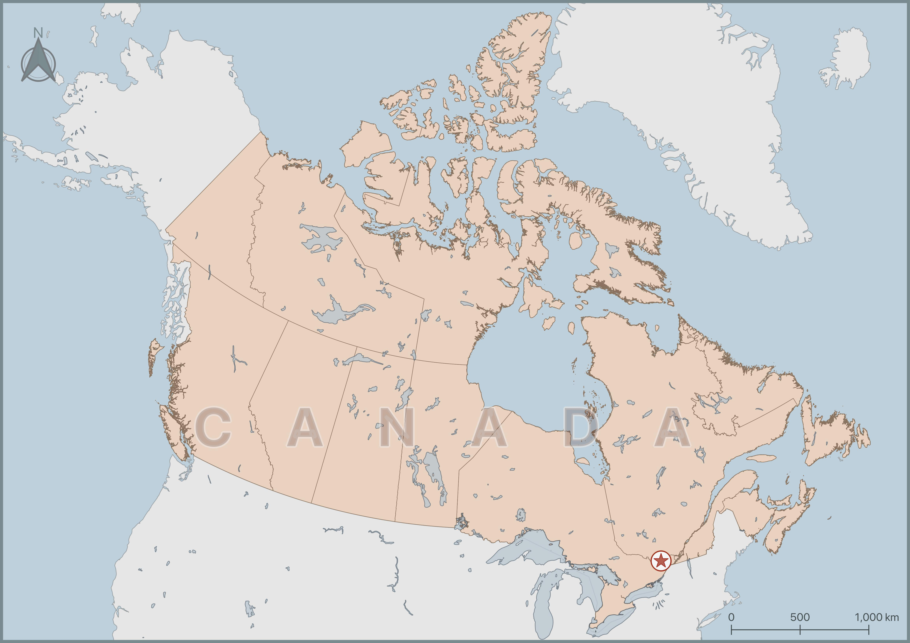
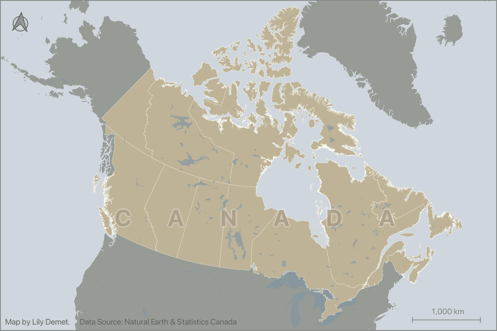
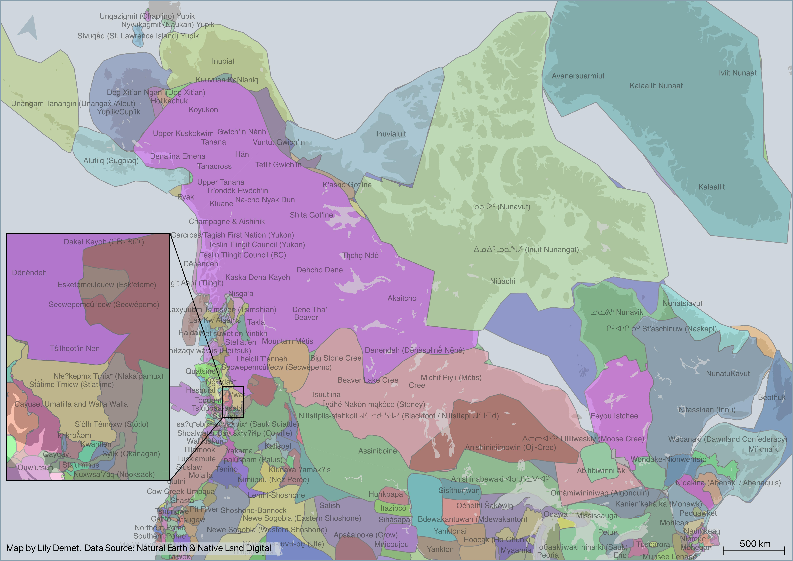

# Hands On
This section will guide you through making simple, static reference maps for academic publication. Because making maps for academic publication often requires downloading, modifying, and synthesizing data from the web, you will practice retrieving data from Natural Earth and Statistics Canada. However, the QGIS project is already set up for you. If you haven't already, please **download and unzip the workshop folder**. Remember to download it to a location on your physical computer, like Desktop or Downloads. *Do not download it to OneDrive*. 

<!-- Note about working with vector data. Add note about making screen 110% at least because  new updated workshop website template makes everything smaller.  -->

[Download Workshop Data](../reference-mapping-workshop.zip){: .btn .btn-blue }

The **Additional Content** section of this workshop contains documentation on how to add basemaps, design insets, generate thematic maps and more. Time allowing, you are welcome to try these optional exercises at the end of today's workshop. You are also encouraged to return to them asynchronously for further practice or for reference later on. 

Finally, though the following workflow and technical documentation will focus on creating a map of Canadian provinces and territories, the workshop folder also contains data from the [Native Land Digital API](https://api-docs.native-land.ca/) that visualizes Indigenous territories across Turtle Island. Recollect that no map is neutral, and that critical cartographers would contest the distinction between "thematic maps" and "reference maps" because even so-called basemaps or context layers are political in their naming, boundaries, and projections. The making of a reference map of Canada is, therefore, a re-inscription of colonial borders that dispossess Indigenous lands. By encouraging engagement with spatial data visualizing Indigenous territories in addition to that of Canadian provinces, this workshop aims to highlight how choices of inclusion and omission are immanent to the very process of cartography, and that these choices mean maps are never neutral. 
    
 

Here is an example of the map we will make, styled in different ways.

