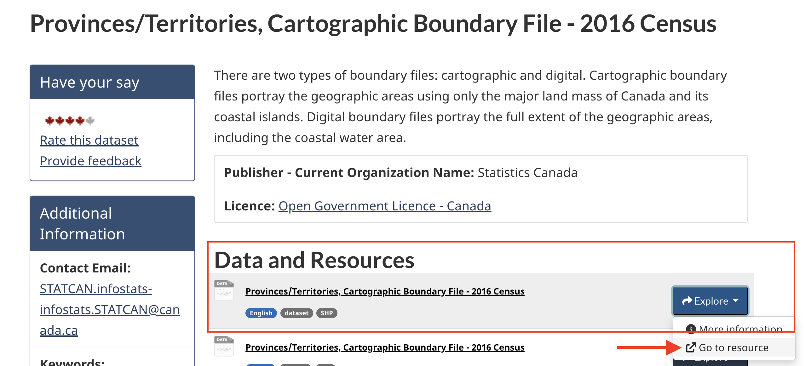
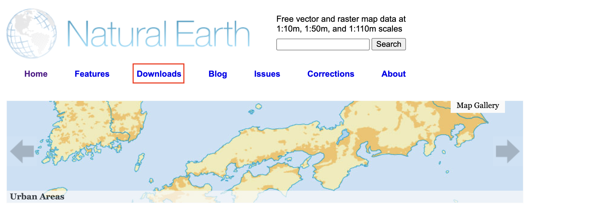

# Gathering Data 

So where do you find spatial data? Maybe you already have some, maybe you're still searching. A lot of spatial data is accessible via the internet, albeit under different licenses. [UBC Library](https://gis.ubc.ca/data/) contains various datasets in [Abacus Data Network](https://abacus.library.ubc.ca/). Municipal and governmental agencies local to your project are also great places to start looking. For example, [Vancouver Open Data Portal](https://opendata.vancouver.ca/pages/home/), [Data BC](https://catalogue.data.gov.bc.ca/), and [Natural Resources Canada](https://natural-resources.canada.ca/science-data/data-analysis/geoca). The [Humanitarian Data Exchange](https://data.humdata.org/) contains lots of global data. [WorldClim](https://worldclim.org/) has historical climate data such as precipitation and temperature, [Natural Earth](https://www.naturalearthdata.com/downloads/) provides  free, public domain raster and vector data at a global scale. Here, you can download hillshade/topography data, country and state outlines, and waterbodies, rivers, and landmasses. For free and open-source infrastructural data, see [Open Street Maps (OSM)](https://www.openstreetmap.org/#map=11/49.2151/-123.0393). Satellite imagery can often be downloaded directly from providers. For example, download Sentinel data from the [Copernicus Browser](https://browser.dataspace.copernicus.eu/?zoom=5&lat=50.16282&lng=20.78613&demSource3D=%22MAPZEN%22&cloudCoverage=30&dateMode=SINGLE). If you're using QGIS, the [SRTM-Downloader](https://plugins.qgis.org/plugins/SRTM-Downloader/) plugin is a handy tool to download NASA data for a specific area of interest directly from within your GIS interface. If you are a UBC student, staff, or faculty, you can [request a Planet account](https://researchcommons.library.ubc.ca/planet-imagery/) to gain access to much more imagery. Refer to our [Project Design workshop and resource](https://ubc-library-rc.github.io/gis-spatial-stories/content/resources-for-data-assembly.html) for important considerations as you search, download, store, and use data. 
<!-- Refer to our [Plugins in QGIS Workshop](https://ubc-library-rc.github.io/gis-plugins-qgis/content/extracting-osm-data.html) for a demonstration of how to extract and download OSM data or use it as a basemap for your maps.  -->

Finally, you can always create your own vector layers, or create new shapefiles within a GIS by tracing existing data. If you are working with historical or physical maps and want to digitize them or otherwise create spatial data using them as template, see our workshop on [georeferencing](https://ubc-library-rc.github.io/gis-georeferencing/) or our [georeferencing resource page](https://ubc-library-rc.github.io/gis-spatial-stories/content/resources-for-georeferencing.html). 

**If you haven't already, download the workshop folder for today. Be sure to download it to a folder on your physical computer, such as Desktop or Downloads, _not_ OneDrive. Then, unzip it.** 

[Download Workshop Data](../reference-mapping-workshop.zip){: .btn .btn-blue }

----

## For today's workshop... 

Today's workshop will use data from Natural Earth, Statistics Canada, and Native Land Digital. The workshop folder contains some of this data, as well as additional datasets for you to practice thematic mapping. However, because finding, downloading, and preparing spatial data is a major part of mapping for academic publication, you will be guided through downloading the main datasets for today's workshop on your own. Remember, move each dataset you download to the workshop folder and *unzip it* there. 

### Data needed

To Do
{: .label .label-green }

**1. Download Canadian provincial boundaries from Statistics Canada** For this workshop, we'll use the dataset from 2016 because it downloads the fastest. Navigate to the following link: [https://open.canada.ca/data/en/dataset/a883eb14-0c0e-45c4-b8c4-b54c4a819edb](https://open.canada.ca/data/en/dataset/a883eb14-0c0e-45c4-b8c4-b54c4a819edb). You will see many file options. Download the very first one by clicking **Go to resource**. 

This will take a minute or so to download, so while you're waiting, move on to downloading the next dataset.
<!--(though you are welcome to find and use the [2021 dataset](https://open.canada.ca/data/en/dataset/ef70dc3b-1069-4037-9bce-61f47e628a1d) if you prefer). actually no If you want to use 2021, you can go [here](https://www12.statcan.gc.ca/census-recensement/2021/geo/sip-pis/boundary-limites/index2021-eng.cfm?year=21) and select xyz. The  [2022 provincial dataset](https://open.canada.ca/data/en/dataset/85efc01b-163f-ebba-2378-c43eadfb3b3f) but not as crisp and for some reason doesnt demarcate provinces on load-->

 

**2. Download Natural Earth Data** Navigate to [https://www.naturalearthdata.com/](https://www.naturalearthdata.com/). Go to **Downloads**. 

You have the option to download large scale, medium scale, and small scale data. Large scale will give you the most detail, and therefore be a heftier file. Because our Natural Earth data will be used as context for surrounding countries only, we actually prefer a less detailed, smaller scale outline. So, let's download at the **medium scale**. We will download 3 files: Countries, Ocean, and Lakes+Reservoirs. Countries will be under "Cultural" and Ocean and Lakes under "Physical". Again, remember to move all downloads to your workshop data folder and unzip them there. 

### Data Provided

1. Inside the workshop data folder you'll see a subfolder called `thematic-mapping`. This contains xyz layers you are welcome to use when practicing thematic mapping. 

2. Indigenous territories from [Native Land Digital API](https://api-docs.native-land.ca/). Data was downloaded for the entire Earth in `.geojson` format. While the file is provided for you in the workshop data folder, you can try your hand at downloading it yourself by either signing up for your own API key, or using `AADlPNbKCBAepz816odRT` (my key) and following the instructions [here](https://api-docs.native-land.ca/full-geojsons). 

Please take a moment to explore [native-land.ca](https://native-land.ca/) so that you can visualize the Indigenous territories, languages, and treaties in your area.

<iframe src="https://native-land.ca/api/embed/embed.html?maps=territories&position=49.244770894278666, -123.16698232306474&key=AADlPNbKCBAepz816odRT" style="width:100%; height:400px; border:none;"></iframe>

