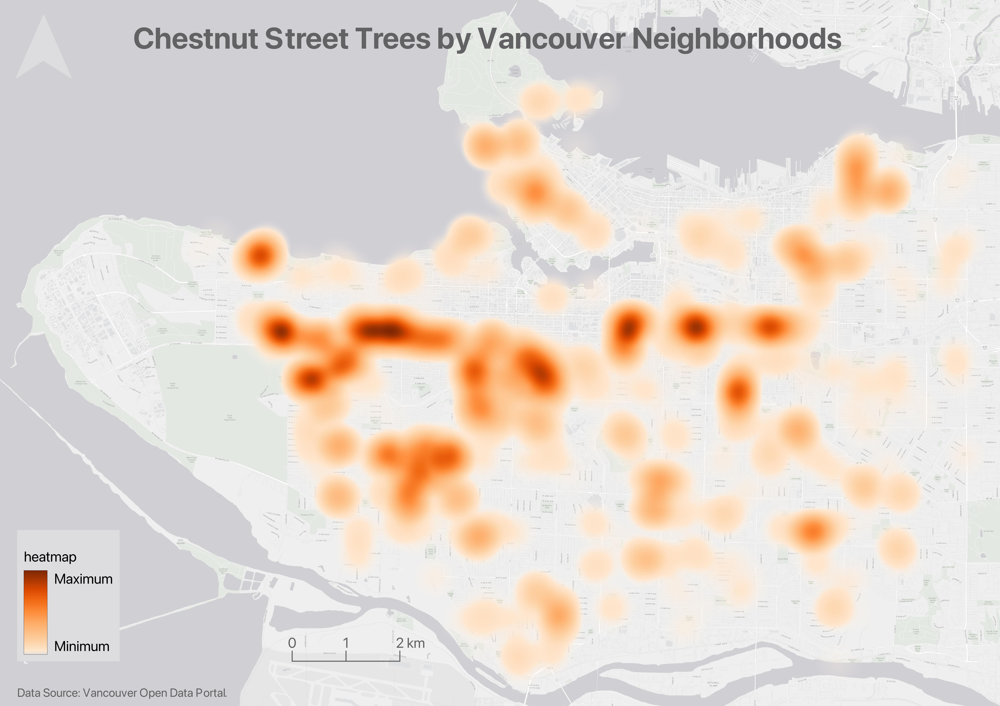
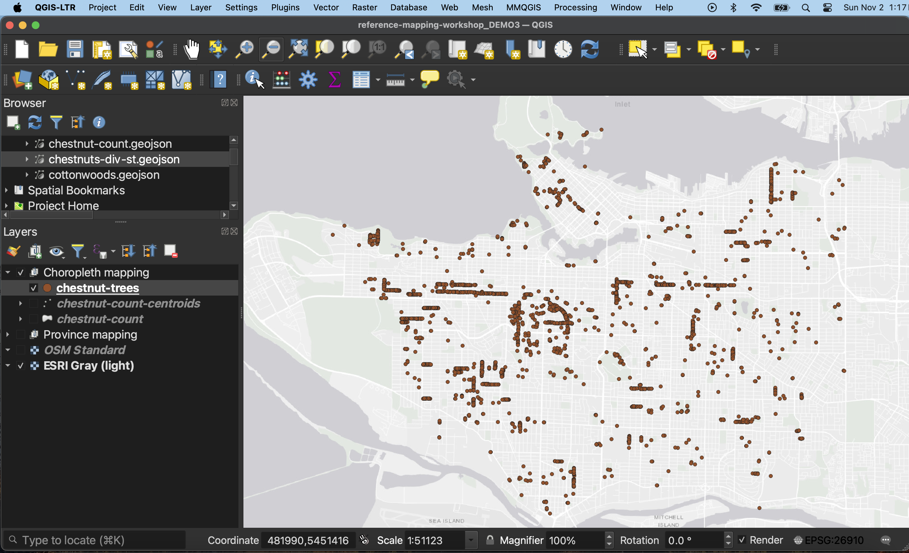
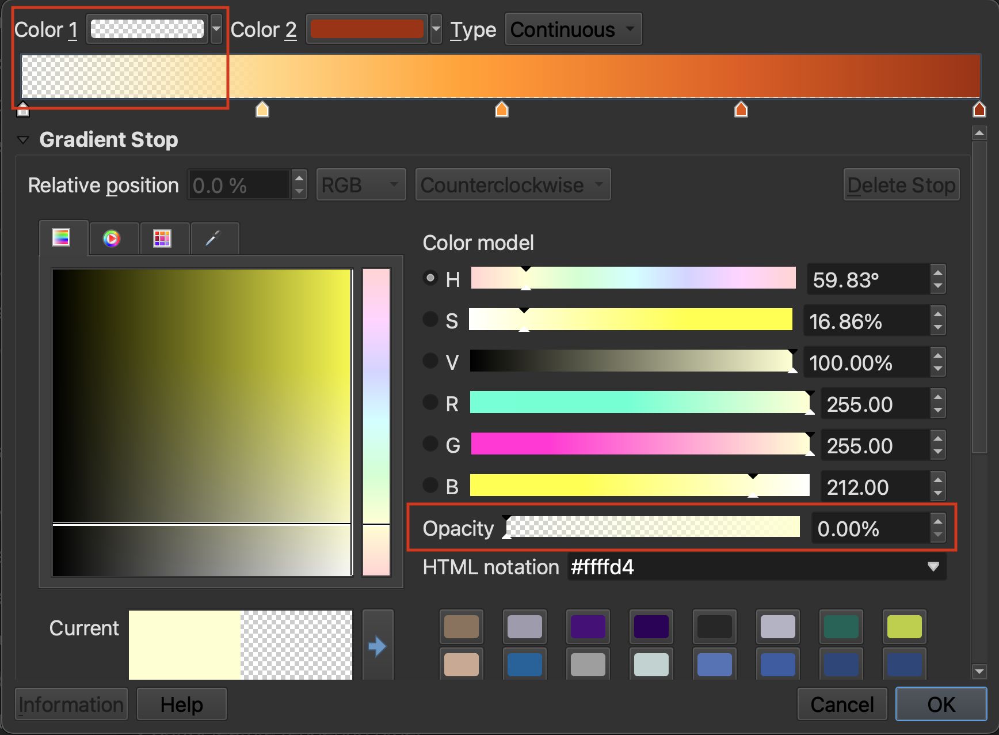
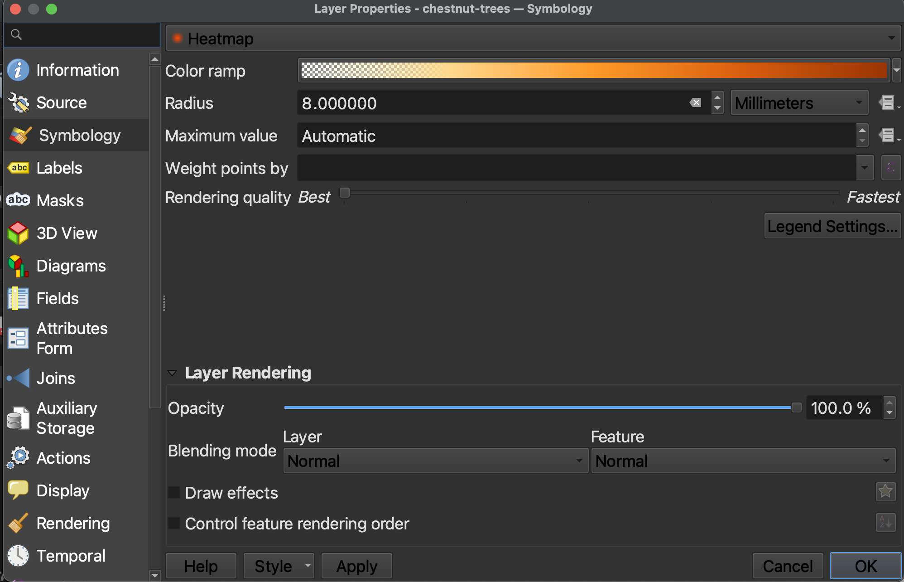
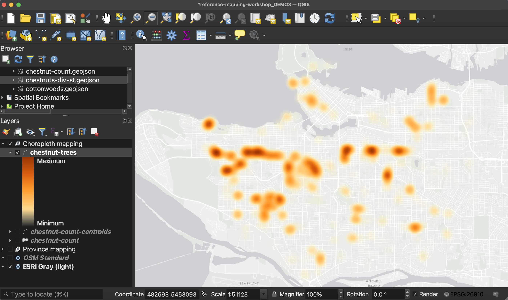

# Heatmaps
Heatmaps are useful to show intensity or frequency of occurrence. Heatmaps can be thought about as generalized dot density maps. 

---

## Making a heatmap
*1*{: .circle .circle-yellow} Add the layer `chestnut-trees.geojson` from the thematic mapping subfolder to your QGIS project. 

As it is, this is a dot density map. Now let's make it into a heatmap to accentuate areas where there are more chestnut street trees.

 

*2*{: .circle .circle-yellow} Open the **Layer Properties** and go to **Symbology**. Change the symbolization to **Heatmap**. 

 

*3*{: .circle .circle-yellow} Choose an appropriate color ramp. Then, click on the color ramp itself in order to adjust Color 1. Set the Opacity of Color 1 to be 0. In other words, make the lighter/lower end of the color ramp totally transparent. This will ensure that areas that have no value are see-through, and don't hide the map. 

 

*3*{: .circle .circle-yellow} **Radius** has to do with how far around the points the color blurs. 8-12 works well. I also recommend adjusting the **Rendering Quality** all the way to ***Best***, otherwise, the heatmap becomes quite pixelated. 

 

