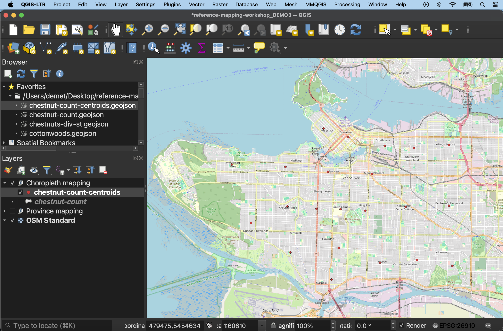
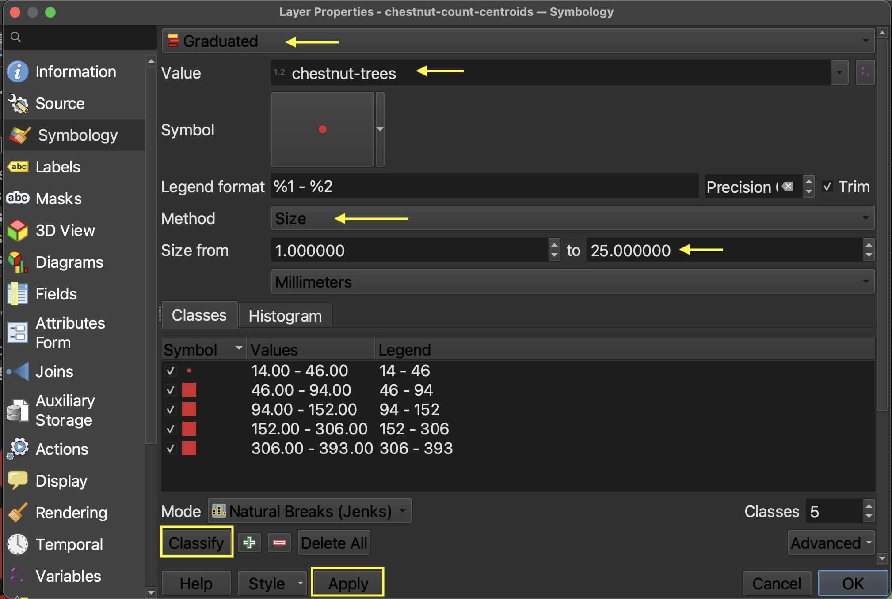
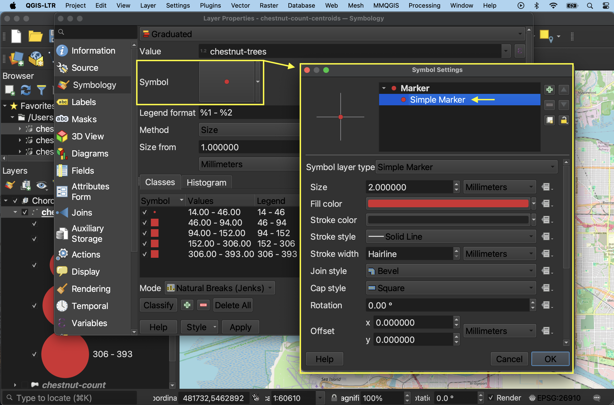
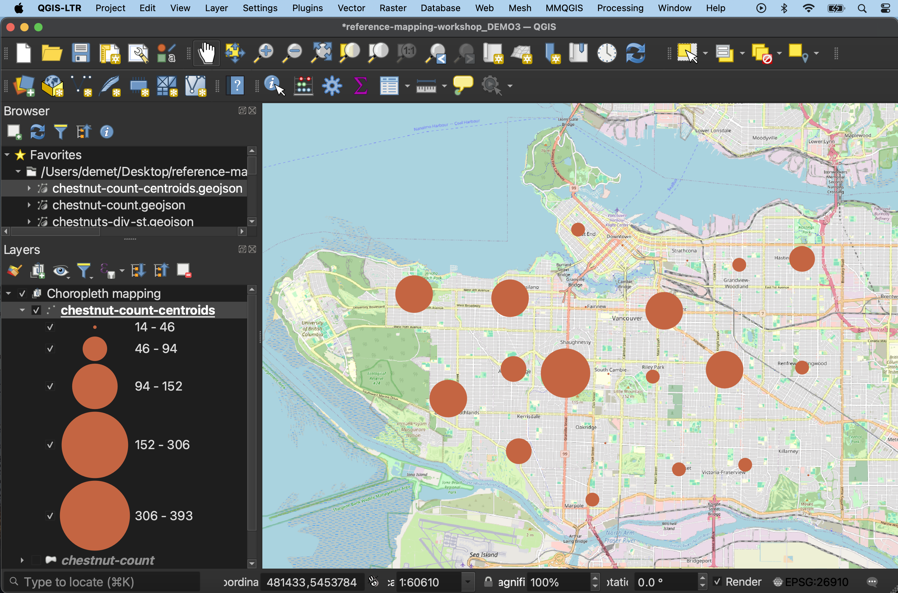
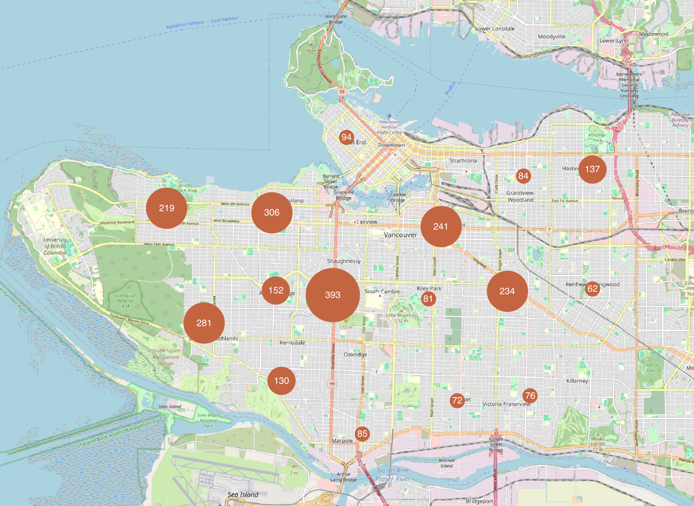

# Proportional Symbol Maps

Proportional symbol maps are useful to visualize the quantity of something across respective locations. Choropleth maps use a color gradient to convey value differentials, whereas proportional symbol maps use symbol size. Proportional symbols are quite intuitive, and can be combined with other parameters like color and lettering size to provide rich spatial information. Proportional symbols can even be layered atop a choropleth map. See [Axis Maps](https://www.axismaps.com/guide/proportional-symbols) for a guide to proportional symbol maps. 

Note: In most cases you *do not* normalize values when using proportional symbols, as that would reduce the range in difference. If anything, it can be useful to exaggerate the range slightly. While Absolute Scaling renders symbols increasingly larger along a linear scale, Perceptual/Apparent Scaling compensates for the eye's tendency to reduce difference in sizes close together. [See here for more](https://makingmaps.net/2007/08/28/perceptual-scaling-of-map-symbols/). 

<!-- https://schoolofcities.github.io/urban-data-storytelling/urban-data-visualization/proportional-symbol-maps/proportional-symbol-maps.html -->

----

## Making a proportional symbol map in
You can make proportional symbol maps in QGIS simply by converting polygons to centroids (if not already points) and then going to symbology and choosing Graduated. The following documentation breaks down how to do this. 
 

*1*{: .circle .circle-yellow} To make a proportional symbol map like the above, where symbol size corresponds to the number of chestnut trees per neighborhood, we first need to run the **Centroids** tool on the `chestnut-count` polygon layer. You can also find the results of this in the `thematic-mapping` subfolder. Either create a centroids layer, or add the file `chestnut-count-centroids.geojson` to your project. 

 

*2*{: .circle .circle-yellow} Open the layer properties. 
> - Change the symbology type to **Graduated**. 
> - Set the **Value** to `chestnut-trees`. 
> - Then, change method to **Size**. 
> - Update the maximum size to at least `20`. Then, hit **Classify** and **Apply**. 

 

*3*{: .circle .circle-yellow} Just like in the previous page, you can change the classification mode. 

*4*{: .circle .circle-yellow} To change the symbol symbology, click on **Symbol** option and then select "Simple Marker".

 

*5*{: .circle .circle-yellow} You can add Labels from the layer Properties as well, setting **Single Labels** according to the **Value** `chestnut-trees`. Adding a **Buffer** or adjusting the font color, and changing the **Placement** mode to "Offset from Point" will allow you to visualize the number above the symbol. 

  

### Proportional symbol maps by hand
Alternatively, if you want to spend extensive time styling your map and proportional symbols manually, you can export centroids (and other geographic layers) as an `.svg` file and open it in an illustration software like Adobe Illustrator or [Inkscape](https://inkscape.org/). The formula for *radius* of proportional symbols in absolute scaling is as follows: 
> rC = (vC / vL) 0.5 * rL
 

> where rC is the radius of the circle to be calculated, 
> rL is the radius of the largest circle, 
> vC is the data value of the circle to be calculated, and 
> vL is the data value of the largest circle 

For perceptual scaling, increase the exponent to 0.57.   

Formula Credit: *Slocum TA et al. Thematic Cartography and Geovisualization. 4th Ed. Boca Raton, FL: CRC Press, Taylor & Francis Group. 2023.* For more, see Chapter 18 ("Proportional Symbol Mapping") of UBC Library's e-book edition.

---- 