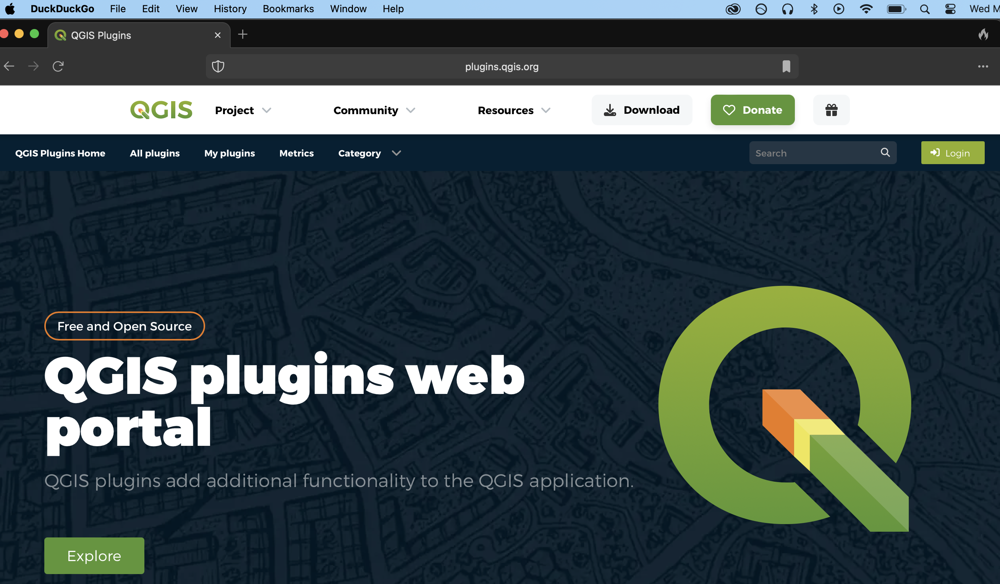
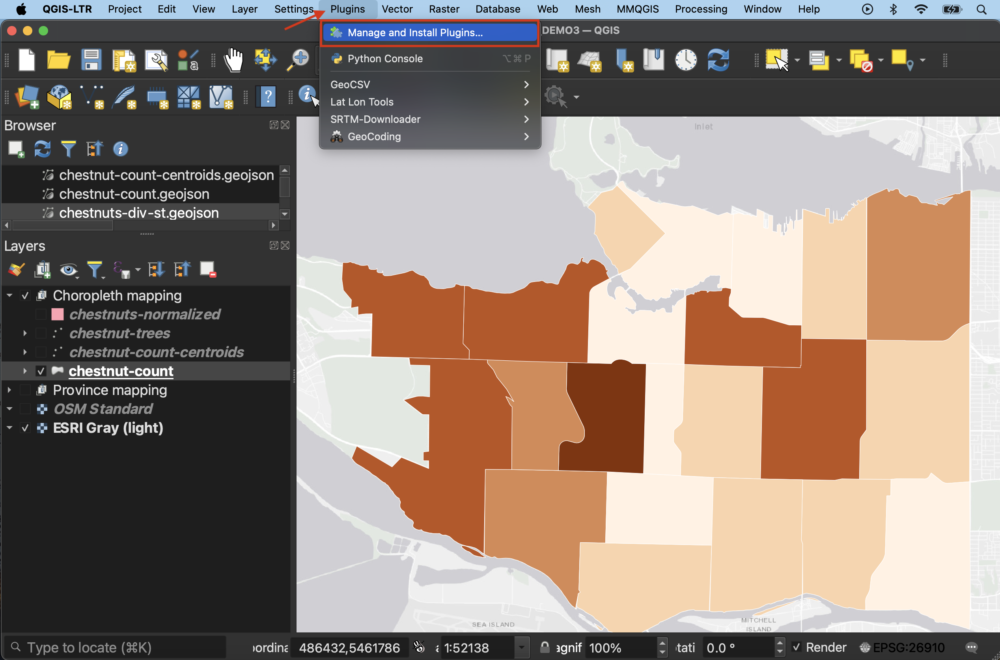
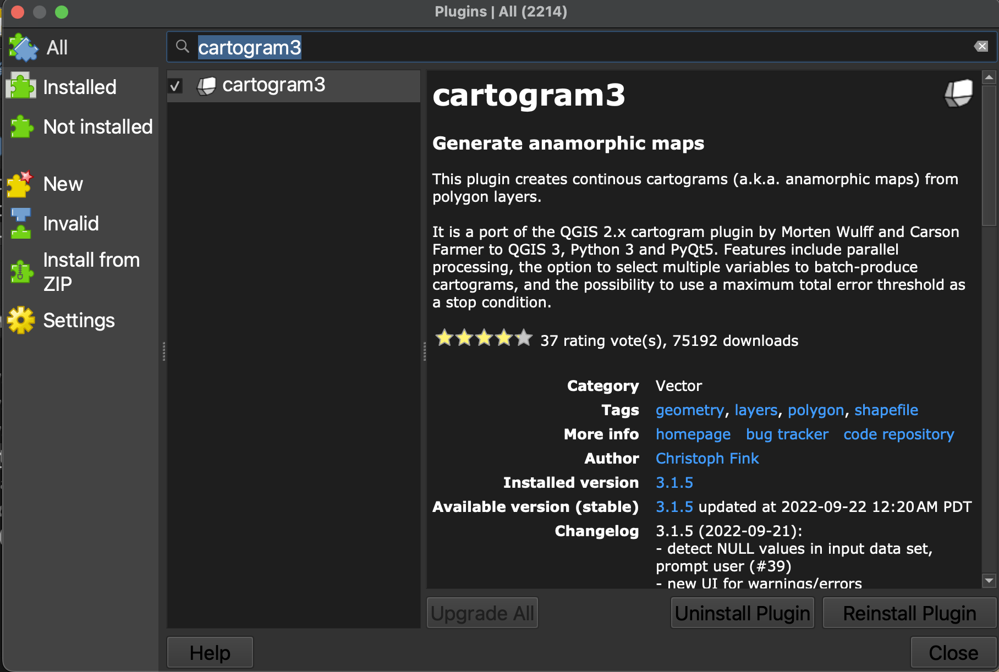
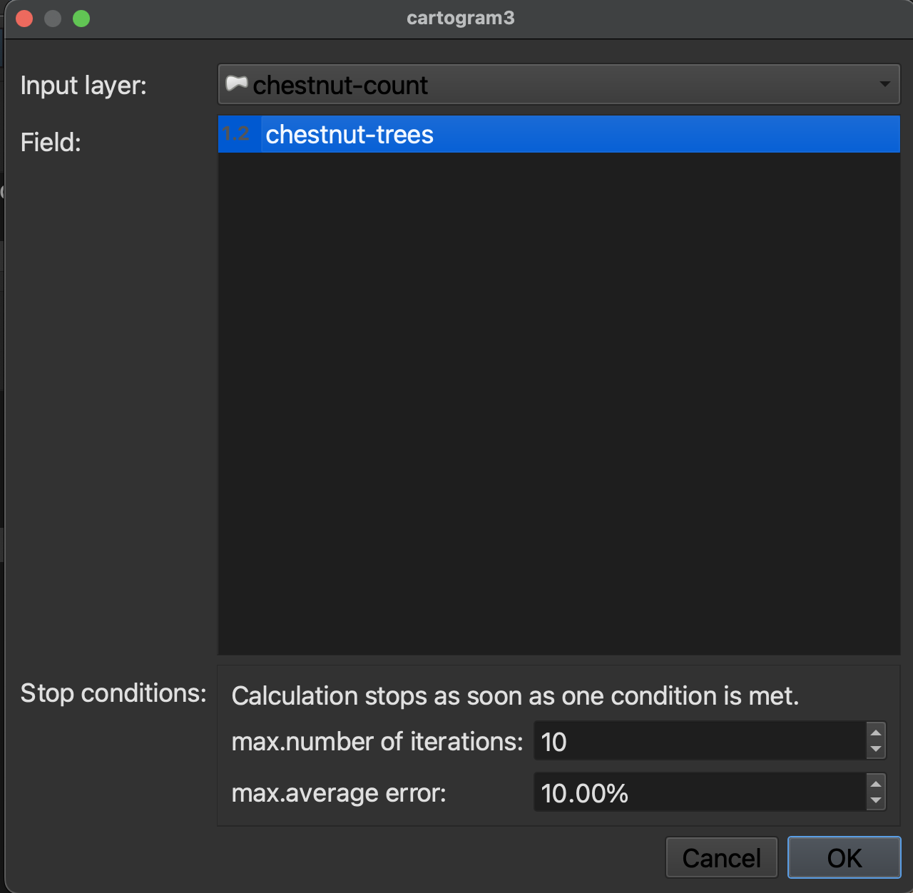
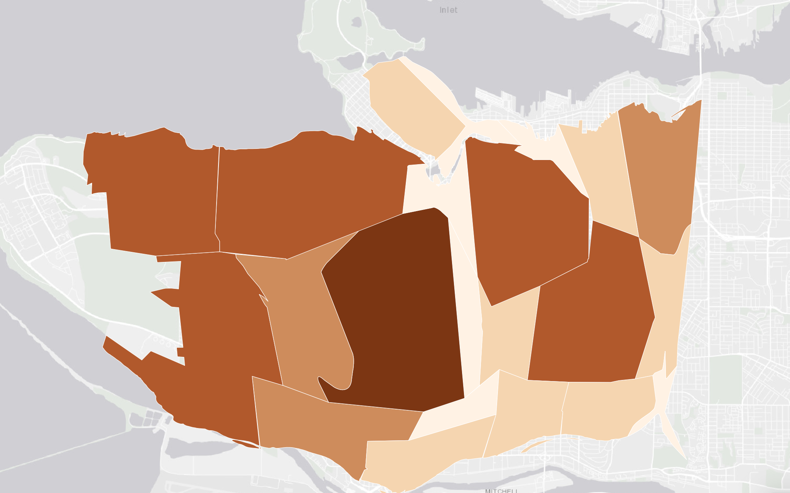

# Thematic Mapping - Cartograms

Cartograms distort area to emphasize the value associated with a geographic region. When using cartograms, it's important to consider whether your audience is already familiar with the un-distorted  geography, otherwise they might not glean the added information. 

----

## Making a cartogram
Turn back on the `chestnut-count` layer. In order to create a cartogram, we need to install a **plugin**. [QGIS plugins](https://plugins.qgis.org/) are user developed tools that extend QGIS functionality beyond the basics. Explore our workshops on [plugins in QGIS](https://ubc-library-rc.github.io/gis-plugins-qgis/) for more. 

<!--  -->

*1*{: .circle .circle-yellow}  Plugins can be downloaded directly from the web, or from within the QGIS interface. To download plugins from within the QGIS interface, click on the **Plugin** menu at the top of your screen and select **Manage and Install Plugins...**. Go down to Settings and ensure you are including Experimental Plugins in your search.

 

The plugin we will install is called `cartogram3`. Search for it and then click **Install**. 
 
 

<!-- When you download plugins, they will show up as additional tools in your menu drop downs as well as toolbox. If you can't find a plugin, you can always search it by name in the **Help** menu. You only have to install plugins once. However, sporadically you will get a notification upon opening QGIS to update a plugin. You can update any plugin by simply searching it in the Plugins Manager and following the button prompts. If you ever install a new version of QGIS, you *will* have to re-install your plugins. 
{: .note} -->

 

*2*{: .circle .circle-yellow} Your newly installed cartogram plugin should now show up under the **Vector Tool** menu at the top of your screen.

 

*3*{: .circle .circle-yellow} Set `chestnut-count` as the Input Layer, and select `chestnut-trees` as the Field. Then run the tool.

