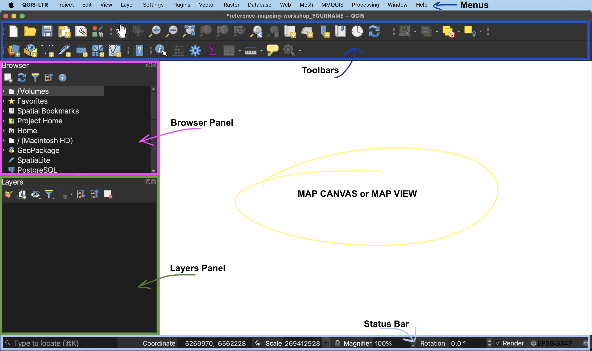
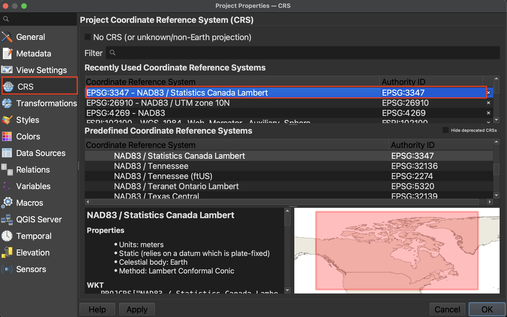

# Loading Data into a QGIS Project

In your workshop folder, open the file called `reference-mapping-workshop_YOURNAME.qgz`. If you have sucessfully downloaded and installed QGIS on your computer, this file should open in the application. If need be, click New Empty Project. 

- **Menus** At the very top of your screen you'll see menus which, when clicked on, expand with many options. Notice that these menus are only visible when you've clicked into the QGIS application. Though you can drag the application interface around your screen, the menus stay at the top. If you click out of the QGIS application they will disappear. These menus provide easy access to a variety of tools you'll use in your everyday mapping, but some time to become familiar with. 

- **Toolbars** - Toolbars are where you will find the most useful geoprocessing, editing, navigation, and other tools. You can customize this area of your GUI to fit your needs.

- **Browser and Layers Panel** - The browser panel lets you easily navigate your file system for data and project files. Your layers panel displays your project’s data layers and provides access to configuration settings. If you ever accidentally close a Panel, you can open it again by going to the View Menu at the top of your screen, down to Panels and then selecting the ones you wish. You can also right-click anywhere in the toolbar’s greyspace and select Panels and Toolbars to show/hide.

- **Status Bar** - The status bar displays current information about the map canvas, and allows you to make adjustments in the map’s scale and rotation.

- **Map Canvas or Map View** - Call it either one. This is where the map is displayed as layers are loaded. You can zoom/pan the map canvas as well as select features and other operations.

You can change the look and feel of your GUI, as well as adjust default settings from the menu **QGIS-LTR --> Preferences** or the menu **Settings --> Options.** To increase the size of icons and text on your interface, go to the **Settings** menu at the top of your screen and click on **Options**. Then, resize the dialogue box so you can see the drop-down for "icon size" and "font." Icon changes will happen as soon as you click OK. Changes in font size won't update until you quit and restart QGIS, so make sure you save your project now. 
   
---- 

## Project Properties
You can access the Project Properties from the the **Project** menu. Click down to **CRS**. CRS stands for Coordinate Reference System, and describes the mechanics behind the 3-dimensional Earth's transformation to fit on 2-dimensional screens. A projection is part of the Coordinate Reference System, and is responsible for projecting a set of points from a 3-dimensional space onto a 2-dimensional plane. There are a variety of projections, each one preserving some characteristics of shape, area, distance, and direction, while distorting others. When choosing the best projection for your map, it is important to consider the content you are visualizing and the extent of the geographic area. Every spatial data layer comes with its own stored projection, often noted at the point of download. If you don't set a projection at the start, your QGIS project will assume the projection of the first layer you add. 

To Do
{: .label .label-green }

For today's workshop and mapping Canada, we will use the CRS: `NAD83 / Statistics Canada Lambert`. This will preserve direction and shape which is important as we are mapping a large geographic area that is quite close to the north pole. You can try different projections to see how they change the map but be sure to set your project CRS to `NAD83 / Statistics Canada Lambert` in the end. 

Setting the project CRS doesn’t change the stored projection of each layer, only how they are rendered ‘on the fly’ by QGIS. QGIS will reproject all the project layers ‘on the fly’ to match the project CRS. You can change the stored projection of layers with the Warp and Reproject Layer tools.

For more on Coordinate Reference Systems, see [here](https://ubc-library-rc.github.io/gis-georeferencing/content/projections.html) or check out our resource on [Understanding Map Projections](https://ubc-library-rc.github.io/map-projections/) for more. QGIS also has extensive documentation on [coordinate reference systems](https://docs.qgis.org/3.40/en/docs/gentle_gis_introduction/coordinate_reference_systems.html), and [pbcGIS](https://www.pbcgis.com/projection_fundamentals/) offers more background information if you're curious.
{: .note}

----

## Load Data
Once you’ve gathered your relevant data, the next step is to add it to a QGIS project. There are a couple ways to add data to your map canvas. 

- **Browser panel** From the Browser panel, likely docked to the left of your screen, expand the `Home` directory (aka folder) and navigate to your workshop data folder. Expand that folder to see the data inside, then double-click or drag and drop each file to add it to your project. Alternatively, you can add a **Favorite** connection in the Browser panel to save you the trouble of finding your data folder. To do this, click “Favorites” at the top of the Browser panel's list and connect the workshop data folder as a favorite directory. Make sure not to click *into*, merely select it. 
- **Data Source Manager** The Data Source Manager is the same sort of portal as the Browser, just in a separate dialogue box rather than a docked panel. You can open the Data Source Manager by double-clicking the 3 colorful squares icon in the Toolbar, or from the Layer menu at the top of your screen.
- **Layer menu** A third way to add layers to your map canvas is through the Layer menu at the top of your screen. Under Layer, navigate to **Add Layer** (it should be the third item down) and select Add Vector Layer... or Add Raster Layer.... This will open the same Data Source Manager dialogue box as before.
- **Drag and drop** files from your data folder directly onto your map canvas.      

## Managing Layers
Although this workshop works with only a handful of layers, some projects require you to juggle more than 10 layers. Having strategies to stay organized is therefore important. Additionally, if you have layers that cover the entire Earth, they are quite large and every time you pan around your map, QGIS is working hard to load the entire dataset anew. Best practice is to hide layers you're not currently working on or to clip them to your area of interest so as not to slow down your computer. 

- Rendering order

- Turning layers on and off

- Grouping layers (remember their visibility)

- Removing and adding layers

- Selecting and exporting layers

- checking the file path of layers

- saving temporary layers

## Spatial bookmarks
Another tip, especially if you're using one layer to make a map of different locations, is to make spatial bookmarks. A spatial bookmark is what it sounds like: a way to bookmark a canvas extent. You can add a spatial bookmark by going to here or there. You can then set it to your map canvas, or a layer, etc. You can then save the bookmark with a name to your project (this project alone) or to your user settings (every QGIS project you ever make and open). 

To Do
{: .label .label-green }

Make a spatial bookmark of cananda. 

SAVE YOUR PROJECT. 

