# Modifying Layers
{: .no_toc}

As they are, the layers aren't particularly aesthetic, nor is foreground adequately differentiated from background. This page will guide you through modifying your layers' symbology to create a more polished looking map. 

<!-- as well as note some considerations for mapping for academic publication.  -->

  

    On this page:
  

  {: .text-delta }
 - TOC
{:toc}

----

## Attribute Table
The attribute table contains the tabular data associated with a layer. Though not relevant to our simple reference map today, it is important you know what the Attribute Table is and how to access it. To open a layer's attribute table, right-click the layer in the Layers Panel and go to "Open Attribute Table". For more experience in with the attribute table, you are encouraged to explore our [Intro to QGIS](https://ubc-library-rc.github.io/gis-intro-qgis/) and [Tools and Workflows in QGIS](https://ubc-library-rc.github.io/gis-tools-workflows/) beginner workshops.

To Do
{: .label .label-green }
Open the attribute table of the `Provinces` layer. 
Note that there are several attributes (columns) that describe each feature (row) in this dataset. Manually re-size the column widths until you can read each attribute.

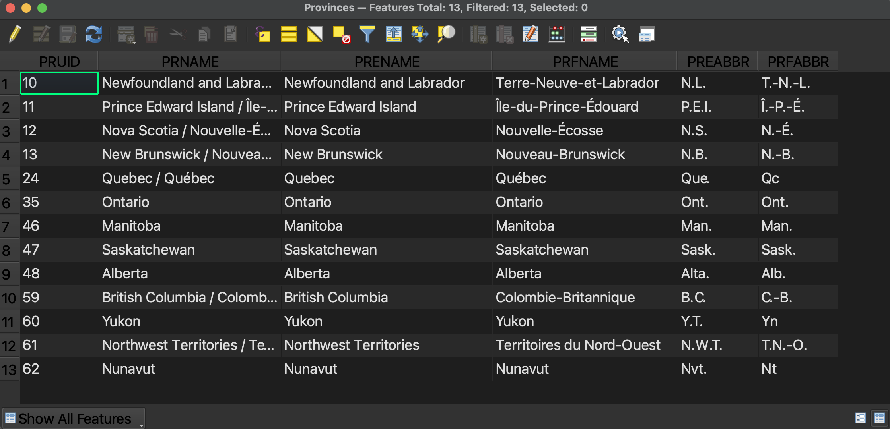

## Layer Properties 
{: .no_toc}
Just as the QGIS Project had Project Properties, each layer has properties of its own. To view a layer's properties, right-click the layer in the Layers Panel and go to "Properties..." at the bottom. We won't dwell on all the project properties today, but notice you can learn more information about the layer here, including where it's stored on your computer, and its projection. 

## Labelling 
Two project properties we _will_ concern ourselves with are Labels and Symbology. Labels allow you to add labels to a layer based on an attribute value. You can turn off the labels at any time by returning to a layer's properties, or by right-clicking the layer and clicking "Show Labels" again. 

To Do
{: .label .label-green }
Add provincial labels based on `PRENAME`. You can customize your labels by increasing the text size, adding a buffer, or changing the label placement. 

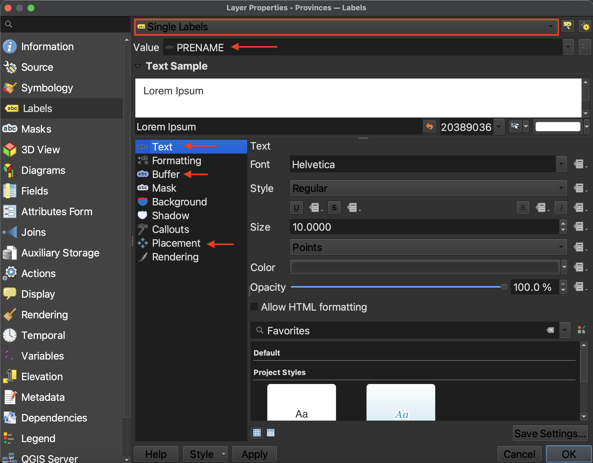
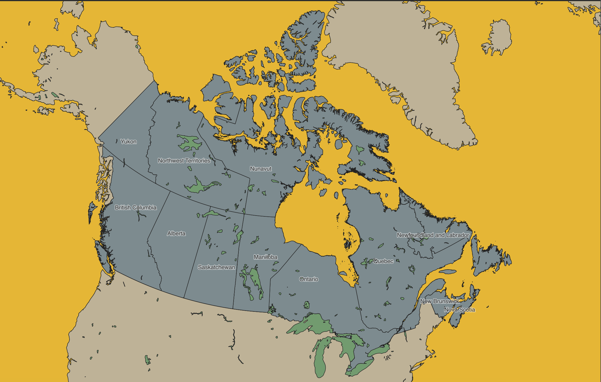

## Symbology
The other important layer property for reference mapping is Symbology. Symbology governs the outline and color fill of points, lines, and polygons. The symbology style for any given vector layer can be Single, Categorized, Graduated, etc. For now, let's stick with Single. This means that each layer will have a single symbology, or color/outline. 

Depending on the audience and publisher of your reference map, you might have constraints such as Black and White. Keep this in mind. For now, we'll do color mapping but notes will be made... 

To Do
{: .label .label-green }
Change the color of the ocean.

1. Right-click the ocean layer and go to Properties --> Symbology. 
2. Click down to Simple Fill. 
3. Click on the color bar to change the color. Expand the dialogue window if necessary. 
4. You can also change the "stroke", or outline color, or, by setting Stroke style to "No line", remove it all together. 

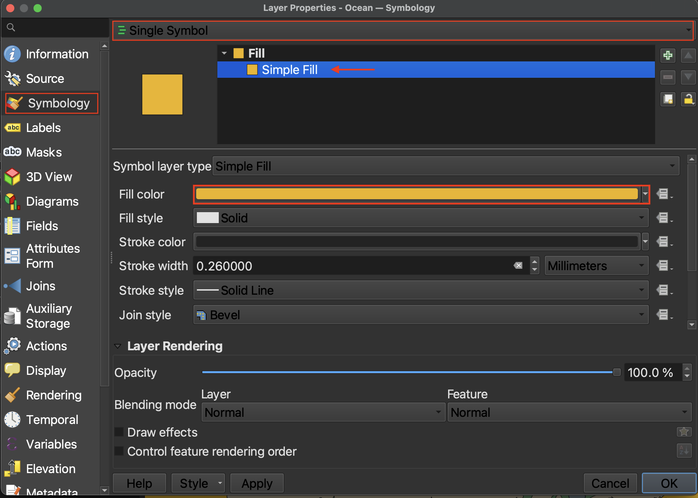

When changing color, if you want to make your map in Black & White, change the Color Model from RGB to CYMK. Then set everything but K to 0. You can also color sample by changing to the eye-dropper tab. 

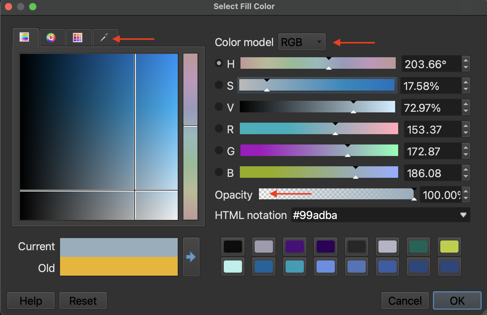

### Categorized Symbology
{: .no_toc}
Imagine you had a polygon layer with multiple features, such as provinces in Canada or Indigenous territories, and you wanted each province or territory to be distinguished by its own color. In this case, you'd want to change the symbology type from Single Symbol to Categorized. 

To Do
{: .label .label-green } 
Change the symbology for the Native Land dataset. 

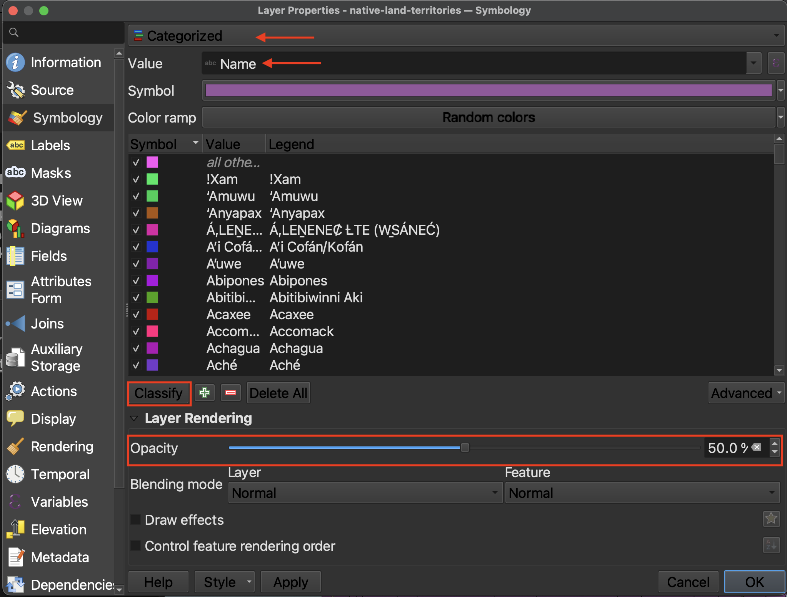

Currently, they are all random colors. You can click each color square beside the province to individually change its color. We won't attempt this, however, as there are too many classifications. Decreasing the layer's opacity (aka increasing its transparency) will allow the provinces or landforms to be seen beneath it. Try hiding the provinces for a moment. 

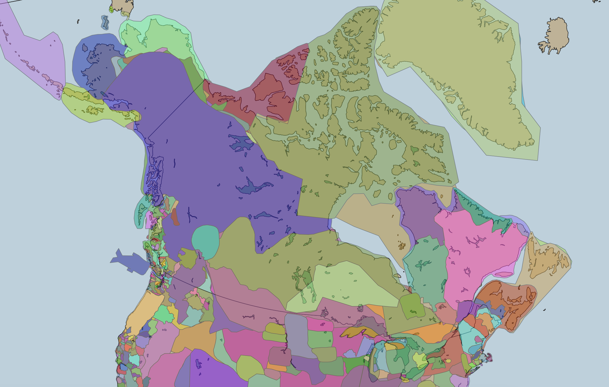

Notice, however, that transparent or not, the territories from the Native Land dataset do not appear to overlap. However, when referencing the original map, [native-land.ca](https://native-land.ca/), we see much overlap in the boundaries. In order to show this in our QGIS project, we have to adjust the symbology for each territory. If you remember, there were a lot! Luckily, we can do a sort of select-all to edit them all at once.

Select the first territory listed. Holding the Shift key of your computer down, scroll to the bottom and select the last territory. This should highlight the whole list. 

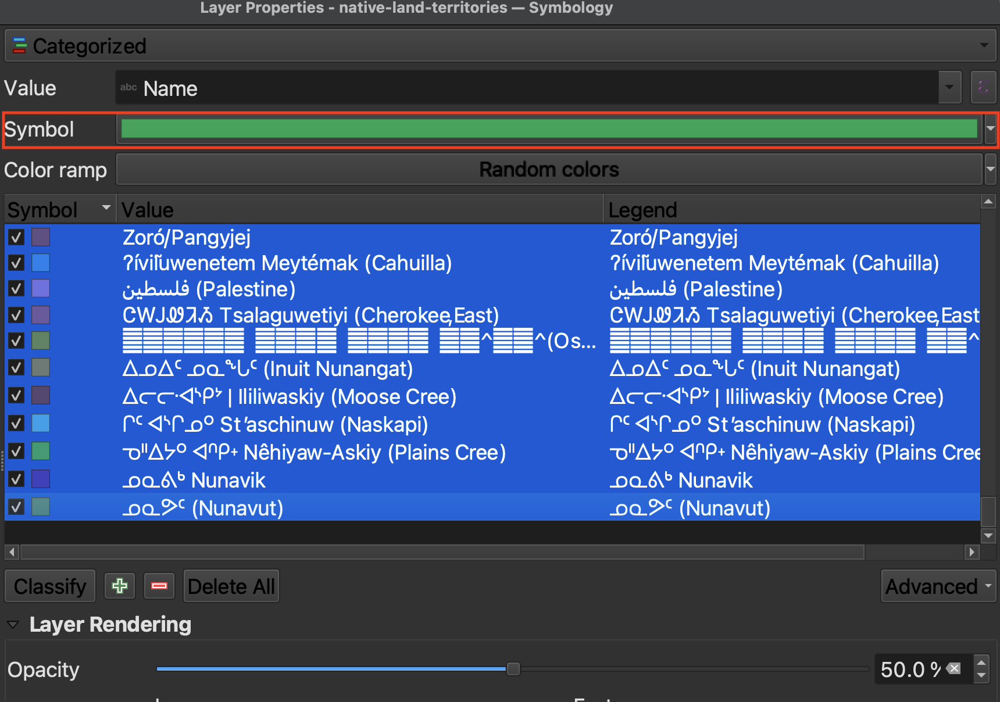

Then, click on "Symbol". On "Fill", decrease the opacity to around 60%. Then click "OK". Click "Apply" from symbology window to see the results on your map canvas. There should now be significant overlap. Click "OK" to close the symbology window. Save your project. 

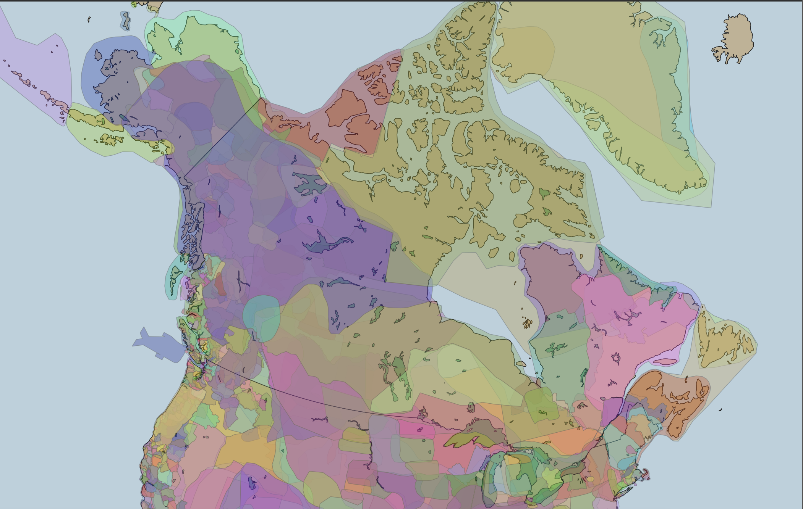

Turn on labels for Indigenous territories, and zoom to the Vancouver area. 

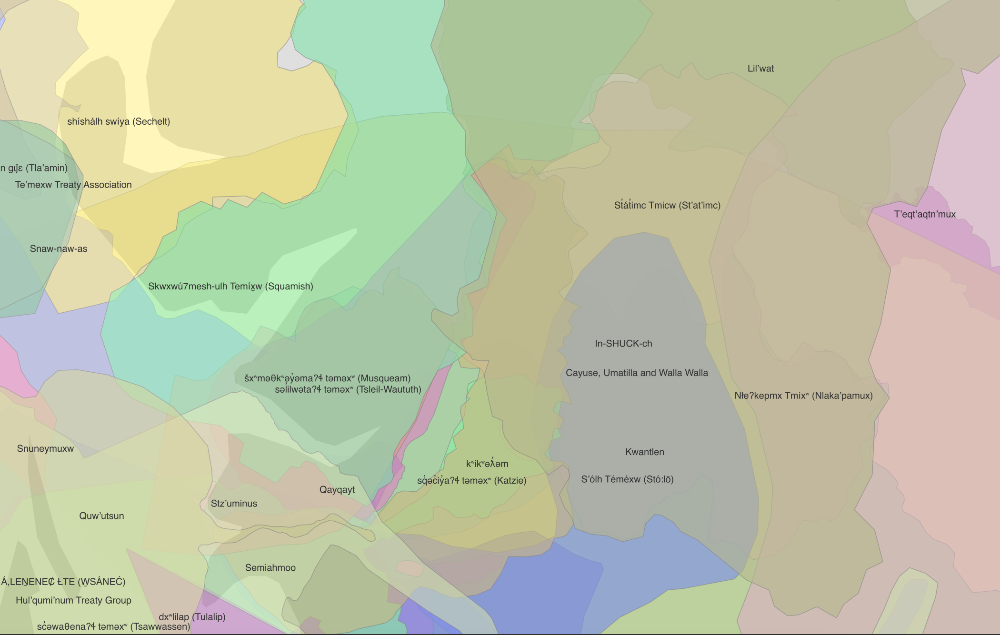

<!-- If you wanted each province to have a different color, change the symbology from "Single Symbol" to "Categorized". Choose `PRENAME` as the value. Then click "Classify". 

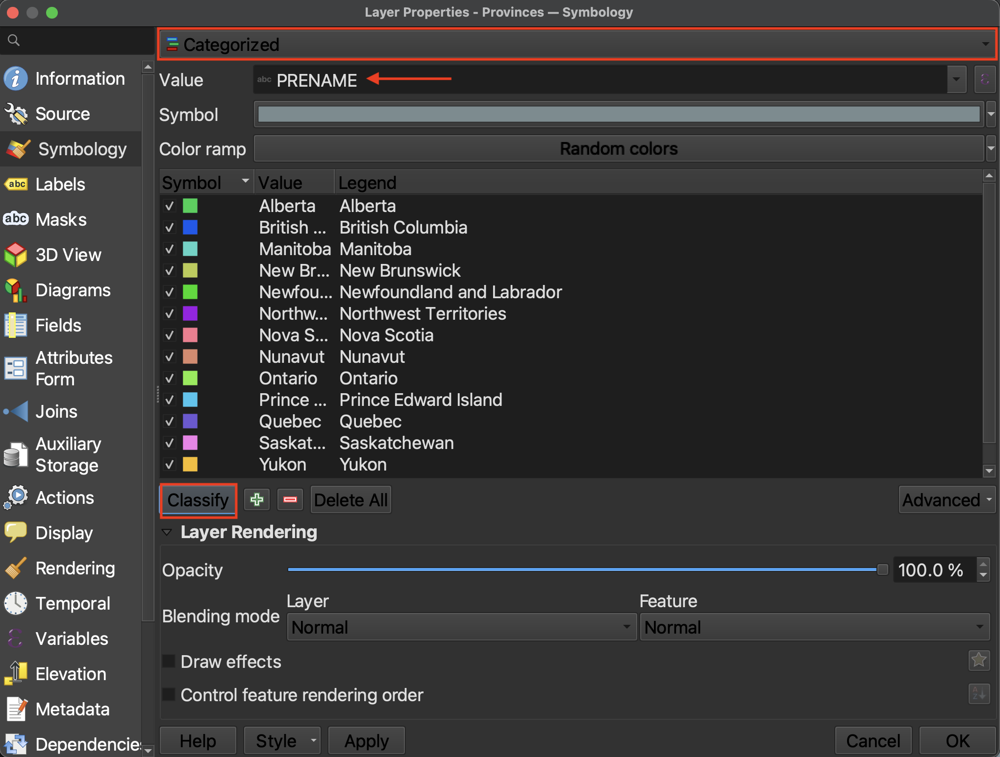

Currently, they are all random colors. You can click each color square beside the province to individually change its color. To edit all at once, for instance to remove the outlines of all provinces, hold the Shift key down as you select Alberta to Yukon, then click on "Symbol" at the top. Go down to "Simple Fill" and set the "Stroke style" to "No Line". Hit Apply in the main Symbology dialogue window to view the results. 

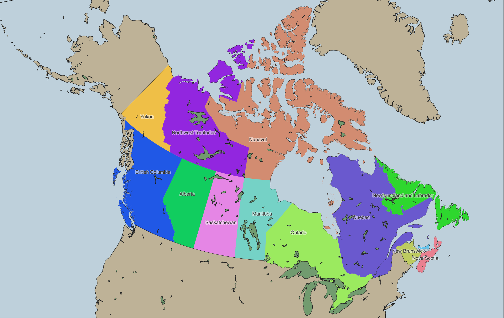 -->

 

Before changing any more symbology, let's talk about **Visual Hierarchy**. 

## Visual hierarchy
Visual hierarchy describes the order in which elements on a map grasp the viewer's attention. What elements do you want to prioritize and what is the order of importance? Maps can become busy places when everything is vying for attention. The following are considerations and techniques for foregrounding what's important, and backgrounding what's less so. 

Note: Some of the elements mentioned below aren't things you currently have on your map, but rather items you'll add to your final map layout like a scalebar, north arrow, and legend. 

- **Color** *Bright* and *dark* colors jump forwards, whereas pale and desaturated hues fade to the back. (When working in Black & White, think about your grayscale as a palette in and of itself.) First, decide whether darker colors will be your foreground or background. If there are multiple elements  Make either the background darker than the foreground, or foreground darker than the background. If there are multiple elements in the foreground, choose contrasting colors to distinguish them, or, choose similar colors to connect them. Likewise, choosing similar colors for backgrounded items like a data source statement and north arrow, can help minimize the number of colors the viewer has to interpret. Additionally, it can help to use the eyedropper color sampling option to match these elements' color to whatever they are on top of (like the ocean) and then simply make them a tad darker so they are visible still. Same thing with legend backgrounds and neatlines (borders around map items). 

    - [ColorBrewer](https://colorbrewer2.org/#type=sequential&scheme=BuGn&n=3) is a fantastic resource for generating customized color palettes. [Coloring for Colorblindness](https://davidmathlogic.com/colorblind/#%23D81B60-%231E88E5-%23FFC107-%23004D40) will help you design colorblind-friendly palettes. 

    - Be careful, however, not to make colors too light, lines to thin, or text too small. What appears contrasting on the computer screen will be less contrasting in print. Best practice is to have text size _at minimum_ 7pt, and line width _at minimum_ .3 or .5pt. Again, it depends on your medium of publication but if you plan to publish your maps in print, err on the side of darker, wider, and bigger. 

    

- **Outlines** An outline brings something to your attention, adding crispness to form. To send elements to the background, consider removing their outlines. A light-colored outline against a darker foregrounded element will help it stand out and vice versa. If both foreground and background are outlined, consider color matching by adding light-colored outlines to light objects, and dark outlines to darker objects.  light-colored outlines  Consider removing outlines from background layers, such as ocean, lakes, and countries. Consider adding a light outline to provinces of all once color, or removing alltogether if provinces symbolized in a categorized manner. 

  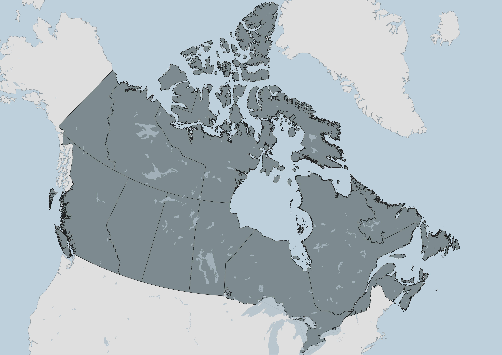

  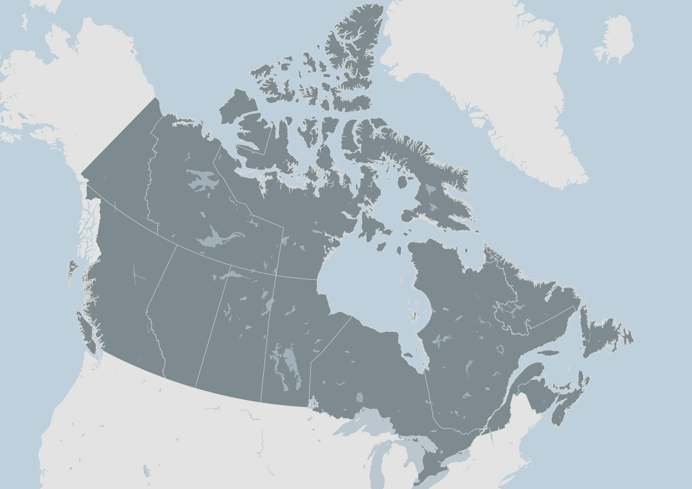

    
- **Transparency** Transparency allows overlapping layers to be seen, as well as lightens the overall hue of a layer. Transparency helps elements fade into the background, like the backing of a legend or a north arrow. 

  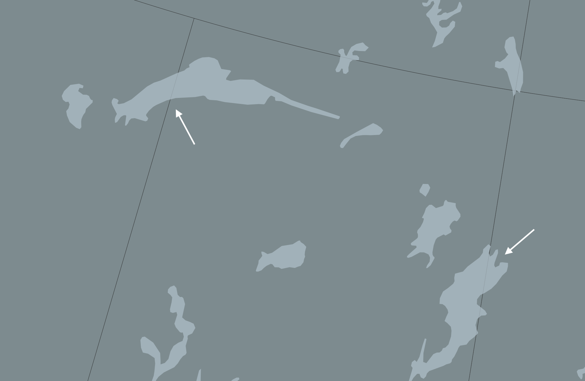

   
- **Lettering** Lettering will come into play in the next step of adding text to a print layout, but it also matters when configuring labels from the main QGIS interface. Halos and buffers make text stand out, whereas you can use size and color of labels to send less relevant ones to the background. 

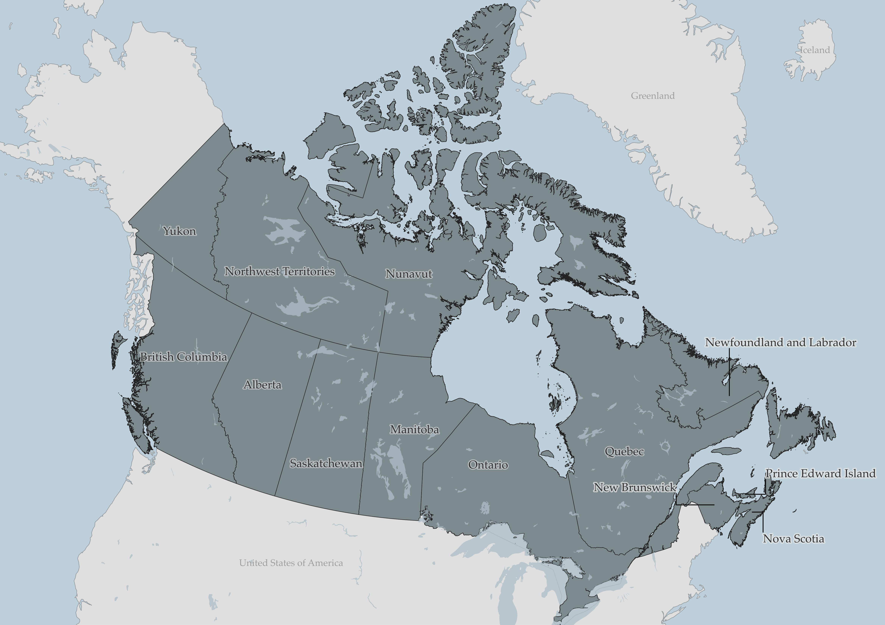

While more comprehensive design work on your map can be managed in an illustration software like Inkscape or Adobe Illustrator, with some time and patience, a great deal of customization can be done right within QGIS. For example, categorizing features and styling their labels differently. In the above map, you'll notice I've added leader lines for the maritime provinces but not for the others. 

 

To Do
{: .label .label-green }
While there is more to Visual Hierarchy, that is enough to get you started. Take 5 minutes to change symbology of each layer with visual hierarchy in mind. You may choose to symbolize Canadian provinces & territories as a single symbol, or as categorized symbols.

(You'll have another 5-10 minutes to work so after print layout and items are introduced in the next page.)

<!-- .add about saving styles etc. and labelling by filters etc.  -->

----

#### Other resources for Visual Hierarchy
{: .no_toc}
- [GIS&T Body of Knowledge](https://gistbok-topics.ucgis.org/CV-03-007)  on Visual Hierarchy
- [Axis Maps guide to Lettering](https://www.axismaps.com/guide/labeling)
- Book chapter on [Cartographic design process](https://colorado.pressbooks.pub/makingmaps/chapter/cartographic-design-process/)
- [The Routledge Handbook of Mapping and Cartography](https://www.taylorfrancis.com/books/edit/10.4324/9781315736822/routledge-handbook-mapping-cartography-alexander-kent-peter-vujakovic) (Search it via UBC Library for free online access as UBC student, staff, or faculty)

