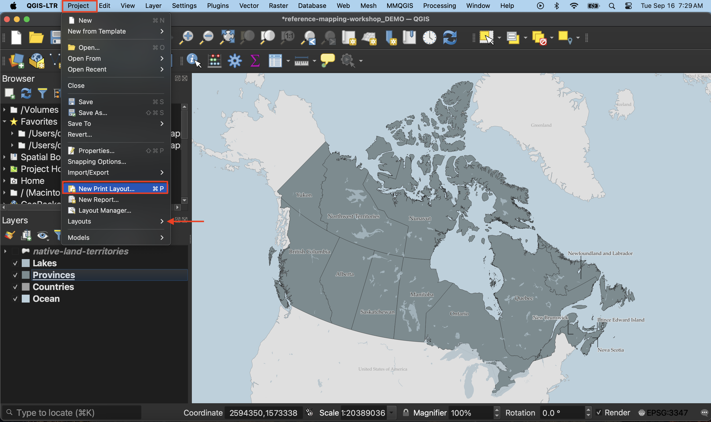
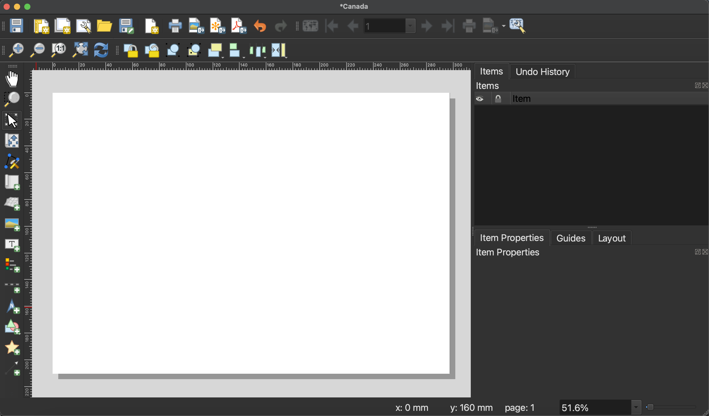
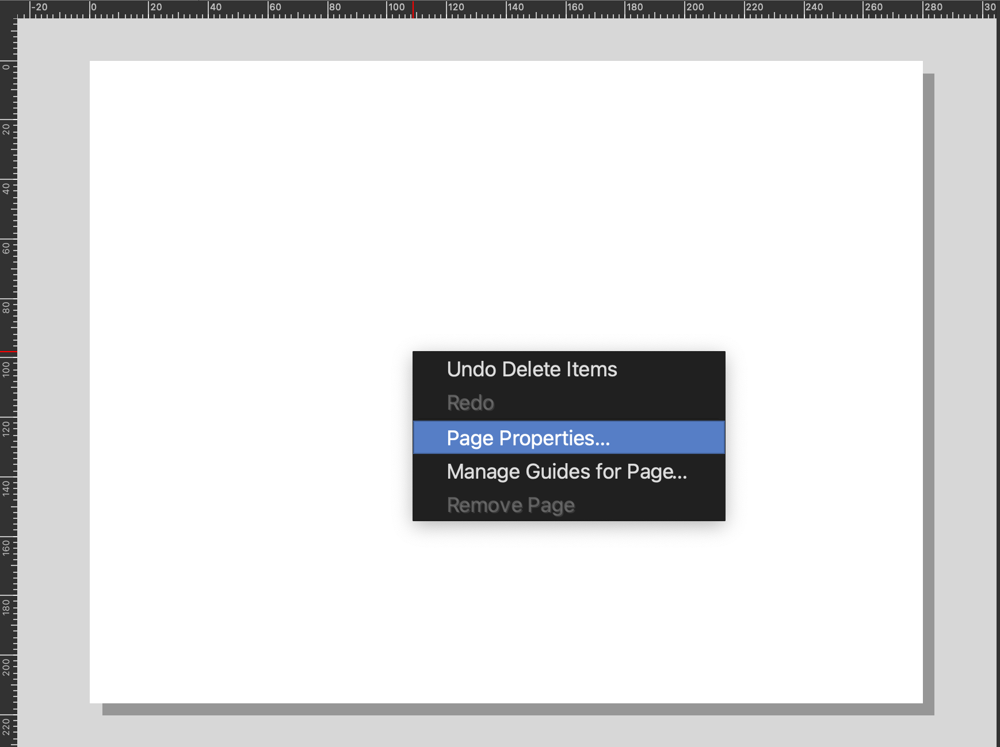
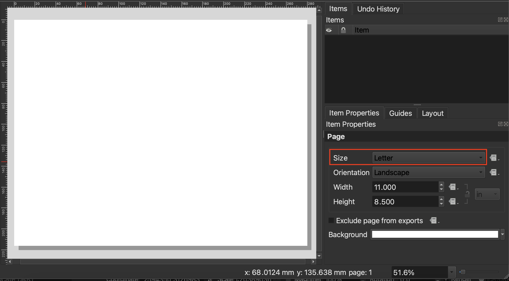
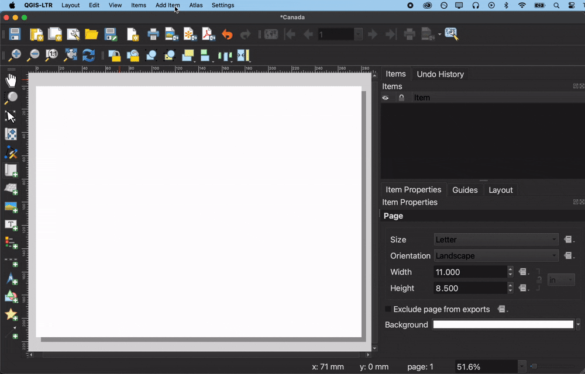
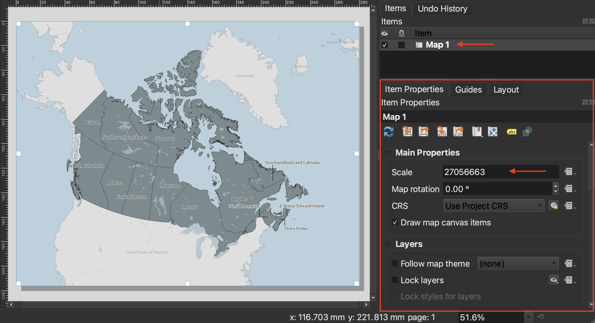
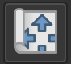
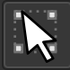
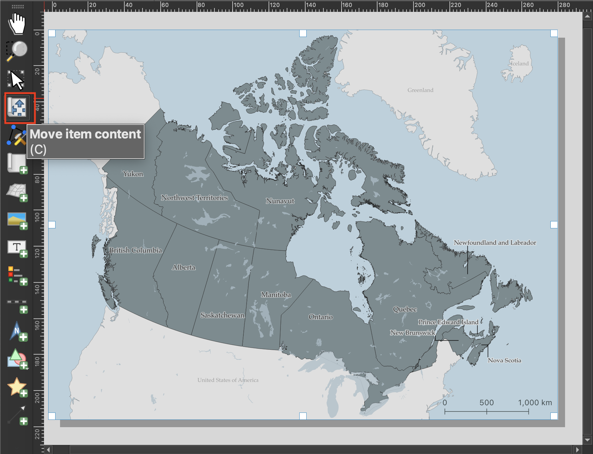
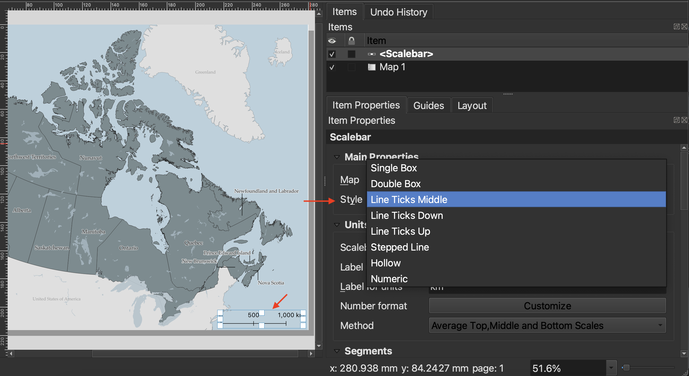

# Creating a Map
{: .no_toc}

Once you are satisfied with your layer symbology, it's time to create a **Print Layout**. A Print Layout in QGIS is like a drawing board where you add the map you created, as well as other elements like a north arrow, legend, scale bar, text boxes, and other marginalia. You can create multiple Print Layouts per QGIS project. By giving each Print Layout you make a unique name, and saving it (and your QGIS project) regularly, you can return to a Print Layout at any time and continue working.  

  

    On this page:
  

  {: .text-delta }
 - TOC
{:toc}

----

## Create a new Print Layout
Create a new **Print Layout** by going the Project menu, and down to "New Print Layout". Call it "Canada".

Alternatively, you can click the Print Layout icon in the Toolbar. 

This will open the Print Layout window. It looks quite similar to the main QGIS interface, so be careful not to edit the wrong thing. Notice, too, that once you've clicked into the Print Layout window, the menu at the top of your screen changes. 

----

## Set Page properties
**Page Properties** govern the orientation and dimensions of the Print Layout, or page. Depending on your publication platform, you might already know your layout constraints. Journals or book publishers will give max and min dimensions for figures, as well as often dictate what file they want them in (`.png`, `.jpg`, `.pdf`, or, often, an `.svg` or `.ai` file). For example, when making maps for books, the largest dimensions might be 4 x 6 inches. 

To change the dimensions of the page, go to "Page Properties..." by right-clicking anywhere on the white space. You can also find Page Properties in the Layout menu at the top of your screen. 

To Do
{: .label .label-green }
Let's set the page dimensions for today's map to be 8.5 x 11 inches — the size of a sheet of copy paper. We'll keep the orientation Landscape. To change the dimensions, expand the drop down menu of **Size** and select "Letter". To set custom dimensions, choose "Custom" size at the very bottom of the menu. This will activate the Height and Width input boxes. Remember to set the units for these dimensions. This way, you can set very specific dimensions depending on your publishing platform. 

Note: If you set smaller dimensions than the default, your Print Layout—the white area juxtaposed to the grey background—will get smaller. To zoom it in so you can see your workspace, drag two fingers diagonally or scroll to enlarge the amount of space your Print Layout takes up on the screen. 

----

## Add items to the Print Layout

At minimum, apart from the map itself, a Print Layout should have a title, scalebar, north arrow, and map author/data source. A legend is required if you have any layers added to your map that aren't reference layers or that need explanation. 

We can add items using the icons on the left-hand vertical toolbar, but I find these difficult to interpret. For this reason, I default to adding items from the **Add Items menu**. 

### Add a map 
{: .no_toc}

First things first, let's add the map we made to our Print Layout. Click on "Add Map". Your curser should turn into a crosshair. Drag diagonally across your Print Layout page, corner to corner. 

Once you add an item to your Print Layout, it will also show up in your **Items** list. This is similar to your Layers Panel, but for the Print Layout. Click on any item in your Items list to view and modify its properties. 

You'll notice that Canada might not take up the full page; in other words, it's rather zoomed out. To zoom in, the most reliable method is simply to change its scale. We can do this from the **Item Properties**. You can activate an Item's properties simply by clicking it in the Items list, and then looking at the below panel. You'll likely have to scroll to modify many of the properties, and resize your Items panel to reach the dropdowns. 

The scale number, 27056663, is the denominator in a fraction 1:27056663. This means one unit on the map represents 27,056,663 units in the real world. To zoom in, we want to reduce the denominator so that the fraction is less small of a number, and 1 unit on the map corresponds to a smaller area in the real world. When in doubt, simply increase or decrease the scale number substantially to gauge which direction you need to go in. For this map, something like `22,000,000` should work. 
 
  - To move your map around within the frame itself, use the **Move item content** tool from the left-hand toolbar.  

  - To select, resize, or move content like the map itself, use the **Move/Select item** tool.
<!--  -->

### Add scalebar
{: .no_toc}
Add a scalebar to your map. 

Best practice is for your scale bar to be in metric units. Choose your scalebar **Style** from the dropdown menu:

Scroll down and expand the **Appearance** option to  customize the symbology of your scalebar, as well as its lettering. Click on **Font** in Appearance to change the font family and color of your scalebar labels. Thinking about Visual Hierarchy, perhaps the scalebar and lettering could be a lighter in color, or slightly transparent. Consider matching the lettering and line's color with the provinces (if you're using single symbol symbology). 

### North Arrow
{: .no_toc}
Add a north arrow. You will notice there's an option to choose either Grid North or True North. According to [QGIS](https://docs.qgis.org/3.40/en/docs/user_manual/print_composer/composer_items/composer_image.html)
  > - **Grid north**: the direction of a grid line which is parallel to the central meridian of the national/local grid
  > - **True north**: direction of a meridian of longitude.

Depending on what projection is used and whereabouts your map is zoomed in to (near a pole or the equator; showing a large geographic area vs. a small one), which you choose will be more or less important. Today's workshop won't go into the specifics, but Grid North is generally okay for maps (less so for compass travel).

The [central meridian](https://gisgeography.com/central-meridian/) is where the 2-dimensional surface that's wrapped around the globe in a projection intersects with that globe. If your mapped area is around a central meridian, which is likely if you're using a UTM Zone'd projection or otherwise projection that's specifically designed for your region because of it's central meridian, then you can go ahead and use Grid North. If your map is centered on a region near the north (or south) pole, you might be better served using Truth North as that will angle the north arrow along the lines of longitude. (Double check this)

  - [See more on north arrows](https://docs.os.uk/more-than-maps/geographic-data-visualisation/guide-to-cartography/north-arrows)

### Labels 
{: .no_toc}
- talk about spacing etc. 
- add label for alaska called "United States of America" and match style

### Neatline
{: .no_toc}
The border - frame around map is called a neatline. We can add this as its own shape, or add border to map item itself. 

### Map author and data source
{: .no_toc}

### Legend
{: .no_toc}
not required here

for each component go through styling and visual hierarchy considerations 

## Edit layout items
with visual hierarchy in mind

## Export your map
image or pdf or svg
make sure at least 600dpi so not grainy 

