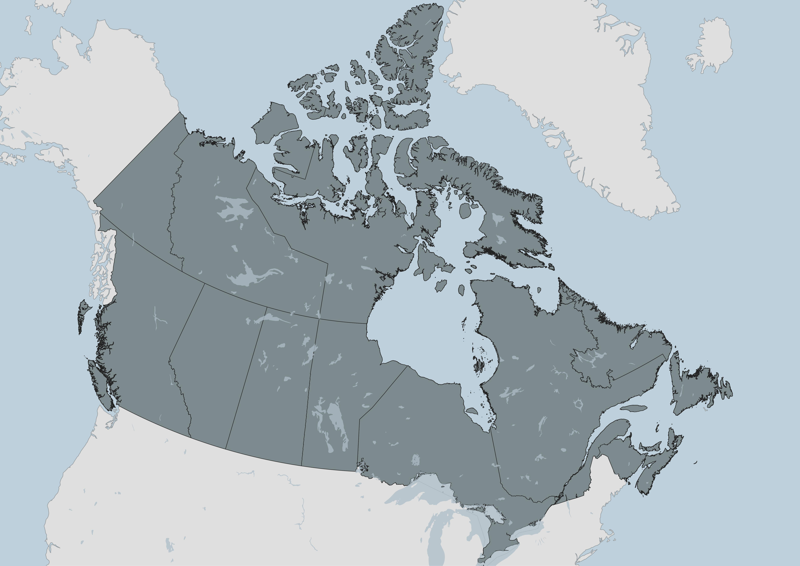
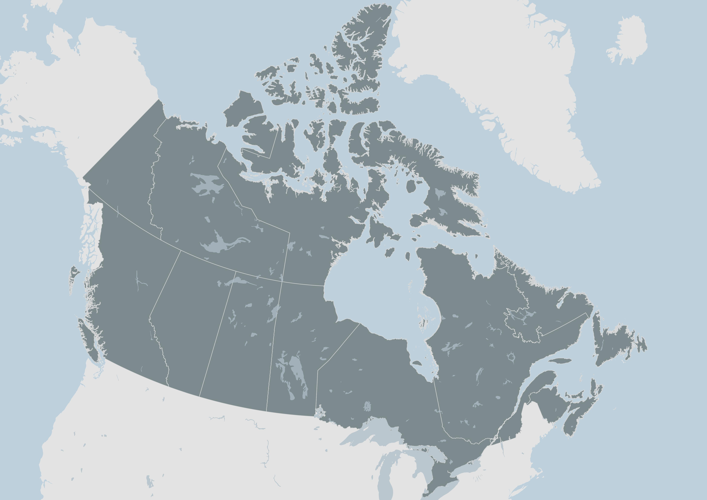
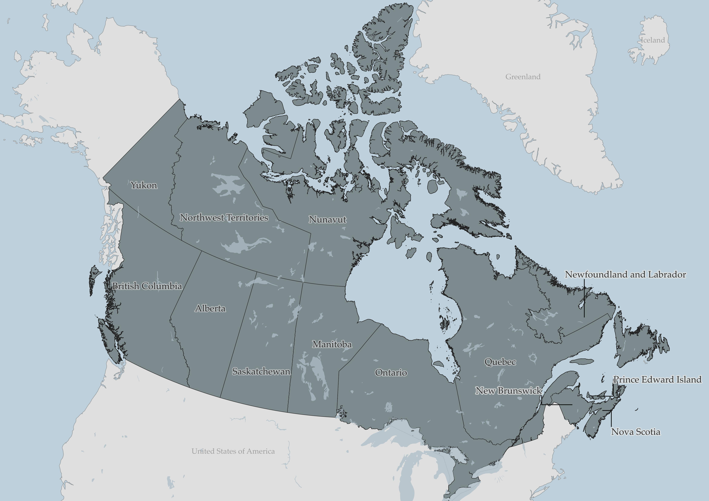

# Visual Hierarchy
{: .no_toc}

Visual hierarchy describes the order in which elements on a map grasp the viewer's attention. What elements do you want to prioritize and what is the order of importance? Maps can become busy places when everything is vying for attention. The following are considerations and techniques for foregrounding what's important, and backgrounding what's less so. 

Note: Some of the elements mentioned below aren't things you currently have on your map, but rather items you'll add to your final map layout like a scalebar, north arrow, and legend. 

## **Color** 
*Bright* and *dark* colors jump forwards, whereas pale and desaturated hues fade to the back. (When working in Black & White, think about your grayscale as a palette in and of itself.) 

First, establish which elements are your foreground and which are your background. These are not often clear divisions, so perhaps you can list them out in descending order of importance. 

When using light vs. dark colors to establish a visual hierarchy between foreground and background, you can *either* choose for your focus elements to be much darker or much lighter. This is especially the case if there are multiple elements that need to be foregrounded. 

<!--carousel styling and code from W3schools-->
<html>
<link rel="stylesheet" href="../style.css">

  
1 / 2

  
  <!-- 
Caption Text
 -->

  
2 / 2

  

<a class="prev1" onclick="plusSlides(-1)">❮</a>
<a class="next1" onclick="plusSlides(1)">❯</a>

   
   

</html>

If there are multiple elements in the foreground, you can choose contrasting colors to distinguish them, or, choose similar colors to connect them. Likewise, choosing similar colors for backgrounded items like a data source statement and north arrow, can help minimize the number of colors the viewer has to interpret. 

Additionally, it can help to use the eyedropper color sampling option to match these elements' color to whatever they are on top of (like the ocean) and then simply make them a tad darker so they are visible still. Same with legend backgrounds and neatlines (borders around map items). Be careful, however, not to make colors too light, lines to thin, or text too small. What appears contrasting on the computer screen will be less contrasting in print. Best practice is to have text size _at minimum_ 7pt, and line width _at minimum_ .3 or .5pt. Again, it depends on your medium of publication but if you plan to publish your maps in print, err on the side of darker, wider, and bigger. 

-  [ColorBrewer](https://colorbrewer2.org/#type=sequential&scheme=BuGn&n=3) is a fantastic resource for generating customized color palettes. [Coloring for Colorblindness](https://davidmathlogic.com/colorblind/#%23D81B60-%231E88E5-%23FFC107-%23004D40) will help you design colorblind-friendly palettes. 

If you want your map to be all around softer, you can set the background elements in a grey or desaturated color, and give a warmer color to your foregrounded elements.

### **Outlines** 
An outline brings something to your attention, adding crispness to form. To send elements to the background, consider removing their outlines. A light-colored outline against a darker foregrounded element will help it stand out and vice versa. If both foreground and background are outlined, consider color matching by adding light-colored outlines to light objects, and dark outlines to darker objects.  light-colored outlines  Consider removing outlines from background layers, such as ocean, lakes, and countries. Consider adding a light outline to provinces of all once color, or removing alltogether if provinces symbolized in a categorized manner. 

  

  

Giving an outline to the lakes in a color slightly darker than their fill emphasizes them nicely:

 

### **Transparency** 

Transparency allows overlapping layers to be seen, as well as lightens the overall hue of a layer. Transparency helps elements fade into the background, like the backing of a legend or a north arrow. 

  

   
- **Lettering** Lettering will come into play in the next step of adding text to a print layout, but it also matters when configuring labels from the main QGIS interface. Halos and buffers make text stand out, whereas you can use size and color of labels to send less relevant ones to the background. 

While more comprehensive design work on your map can be managed in an illustration software like Inkscape or Adobe Illustrator, with some time and patience, a great deal of customization can be done right within QGIS. For example, categorizing features and styling their labels differently. In the above map, you'll notice I've added leader lines for the maritime provinces but not for the others. 

 

To Do
{: .label .label-green }
While there is more to Visual Hierarchy, that is enough to get you started. Take 5-10 minutes to change symbology of each layer with visual hierarchy in mind. You may choose to symbolize Canadian provinces & territories as a single symbol, or as categorized symbols.

<!--show different canadas-->

<!-- .add about saving styles etc. and labelling by filters etc.  -->

----

#### Other resources for Visual Hierarchy
{: .no_toc}
- [GIS&T Body of Knowledge](https://gistbok-topics.ucgis.org/CV-03-007)  on Visual Hierarchy
- [Axis Maps guide to Lettering](https://www.axismaps.com/guide/labeling)
- Book chapter on [Cartographic design process](https://colorado.pressbooks.pub/makingmaps/chapter/cartographic-design-process/)
- [The Routledge Handbook of Mapping and Cartography](https://www.taylorfrancis.com/books/edit/10.4324/9781315736822/routledge-handbook-mapping-cartography-alexander-kent-peter-vujakovic) (Search it via UBC Library for free online access as UBC student, staff, or faculty)

