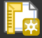
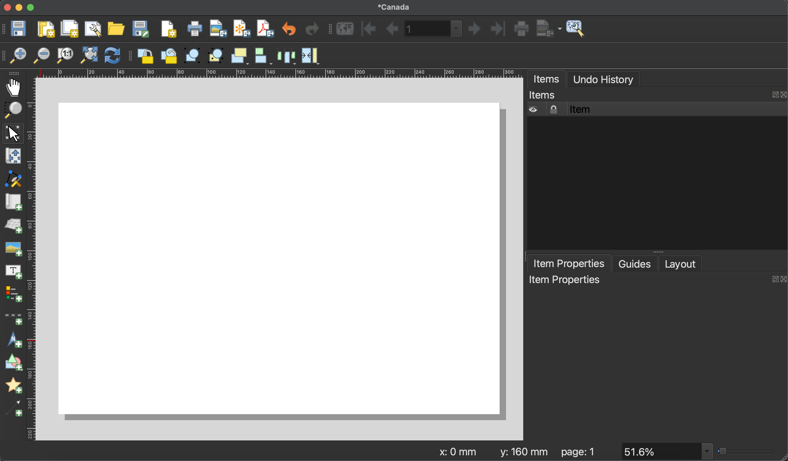
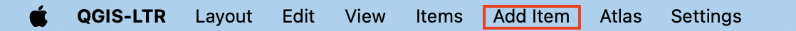
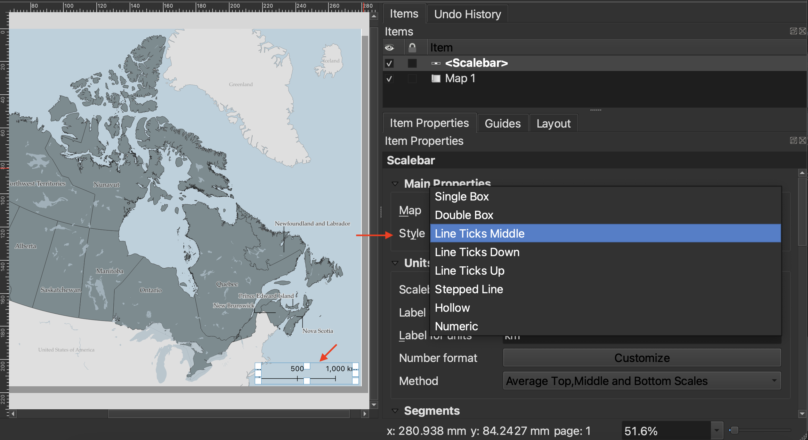

# Creating a Map
{: .no_toc}

Once you are satisfied with your layer symbology, it's time to create a **Print Layout**. A Print Layout in QGIS is like a drawing board where you add the map you created, as well as other elements like a north arrow, legend, scale bar, text boxes, and other marginalia. You can create multiple Print Layouts per QGIS project. By giving each Print Layout you make a unique name, and saving it (and your QGIS project) regularly, you can return to a Print Layout from the at any time (Project menu --> Layouts) and continue working.  

See The QGIS user guide here for a comprehensive introduction to the [QGIS Print Layout](https://docs.qgis.org/3.40/en/docs/training_manual/map_composer/map_composer.html).

  

    On this page:
  

  {: .text-delta }
 - TOC
{:toc}

----

## Create a new Print Layout

To Do
{: .label .label-green } 
Create a new **Print Layout** by going the Project menu, and down to "New Print Layout". Call it "Canada".

Alternatively, you can click the Print Layout icon in the Toolbar. 

This will open the **Print Layout** window. It looks quite similar to the main QGIS interface, so be careful not to edit the wrong thing. Notice, too, that once you've clicked into the Print Layout window, the menu at the top of your screen changes. 

----

## Set Page properties
**Page Properties** govern the orientation and dimensions of the Print Layout, or page. Depending on your publication platform, you might already know your layout constraints. Journals or book publishers will give you max and min dimensions for figures, as well as often dictate what file form they want them in (`.png`, `.jpg`, `.pdf`, or, often, an `.svg` or `.ai` file). For example, when making maps for books, the largest dimensions might be 4 x 6 inches. 

To change the dimensions of the page, go to "Page Properties..." by right-clicking anywhere on the page's whitespace. You can also find Page Properties in the **Layout** menu at the top of your screen. 

To Do
{: .label .label-green }
Let's set the page dimensions for today's map to be A4. We'll keep the orientation set to Landscape. 

To change the dimensions, click the **Size** drop-down options and select "A4". To set custom dimensions, choose "Custom" size at the very bottom of the drop-down. This will activate the Height and Width input boxes. If setting a custom size via Height and Width, remember to include the units for these dimensions. In this way, you can set very specific dimensions depending on the criteria of your publisher.

Note: If you set smaller dimensions than the default, your Print Layout—the white page juxtaposed to the grey background—will get smaller. To zoom it in so you can see your workspace, drag two fingers diagonally or scroll to enlarge the amount of space your Print Layout takes up on the screen. If you change the size of your Print Layout after you've already added a map, remember to adjust the map size; only what is contained within the Print Layout will be exported. 

----

## Add items to the Print Layout

At minimum, apart from the map itself, a Print Layout should have a title, scalebar, north arrow, and map author/data source. A legend is required if you have any layers added to your map that aren't reference layers or that need explanation. 

We can add items using the icons on the left-hand vertical toolbar, but I find these difficult to interpret. For this reason, I default to adding items from the **Add Items menu**. 

### 1. Add a map 
{: .no_toc}

First things first, let's add the map we made to our Print Layout. Click on "Add Map" from the Add Items menu. Your curser should turn into a crosshair when hovered over the page whitespace. Drag diagonally across your Print Layout page, corner to corner. 

Once you add an item to your Print Layout, it will also show up in your **Items** list. The Items list is similar to your Layers Panel, but for the Print Layout. Click on any item in your Items list to view and modify its properties. 

You'll notice that Canada might not take up the full page; in other words, it's rather zoomed out. To zoom in, the most reliable method is simply to change its scale. We can do this from the **Item Properties**. You can activate an Item's properties simply by clicking it in the Items list, and then looking at the Properties panel below it. Note: You'll likely have to scroll to modify many of the properties, and resize your Items panel to reach the dropdowns. 

The scale number, `27056663`, is the denominator in a fraction `1:27056663`. This means 1 unit on the map represents 27,056,663 units in the real world. To zoom in, we want to reduce the denominator so that the fraction is a larger number, and 1 unit on the map corresponds to a smaller, more localized area in the real world. When in doubt, simply increase or decrease the scale number substantially to gauge which direction you need to go in. For this map, something like `22,000,000` should work. 
 
  - To move your map around within the frame itself, use the **Move item content** tool from the left-hand toolbar.  

  - To select, resize, or move content like the map itself, use the **Move/Select item** tool.
<!--  -->

### 2. Add a scalebar
{: .no_toc}
Now that we've set the scale of our map, let's add a scalebar to the Print Layout. Just like above, you can add a scalebar from the **Add Item** menu at the top of your screen. (Remember, if you don't see this menu bar, make sure you're clicked into the Print Layout window.) Again, to add the scalebar item to your Print Layout, draw a small rectangle with your cursor. 

Once you've added the scalebar, you can customize it. Choose a scalebar **Style** from the dropdown menu. The scalebar will adjust automatically if you adjust the scale of your map.

Best practice is for your scale bar to be in **metric units**. 

To customize the symbology of your scalebar as well as its lettering, scroll down and expand the **Appearance** option. Click on **Font** in Appearance to change the font family and color of your scalebar labels. Thinking about Visual Hierarchy, perhaps the scalebar and lettering could be a lighter in color, or slightly transparent. Consider matching the lettering and line color with the provinces (if you're using a single symbol symbology for Canada). 

### 3. Add a north arrow
{: .no_toc}
Add a north arrow. You will notice there's an option to choose either Grid North or True North. Grid North is relative to the projection used, whereas True North, like the name implies, is a fixed geographic location. According to [QGIS](https://docs.qgis.org/3.40/en/docs/user_manual/print_composer/composer_items/composer_image.html)
  > - **Grid north**: the direction of a grid line which is parallel to the central meridian of the national/local grid
  > - **True north**: direction of a meridian of longitude

There is also Magnetic North, which is Earth's magnetic pole and which shifts slightly. Depending on what projection is used and whereabouts your map is zoomed in to (near a pole or the equator; showing a large geographic area vs. a small one), which north orientation choose will be more or less important. Today's workshop won't go into the specifics, but Grid North is generally okay for maps not close to either poles and which cover a large area. [Read more on north arrows here](https://docs.os.uk/more-than-maps/geographic-data-visualisation/guide-to-cartography/north-arrows).

<!-- The [central meridian](https://gisgeography.com/central-meridian/) is where the 2-dimensional surface that's wrapped around the globe in a projection intersects with that globe. If your mapped area is around a central meridian, which is likely if you're using a UTM projection (in a specific Zone) or otherwise projection that's specifically designed for your region because of it's central meridian, then you can go ahead and use Grid North. If your map is centered on a region near the north (or south) pole, you might be better served using Truth North as that will angle the north arrow along the lines of longitude.  -->

### 4. Add labels 
{: .no_toc}
Although you can add labels to your map based on layer attributes in the main QGIS interface, you can also add individual text labels, including place names as well as titles and attributes/data sources to the Print Layout via the Add Labels item. 

Go ahead and add a label for Canada if you don't have provinces individually labelled from before. To increase the font size and spacing, scroll down in the Item properties and click on Appearance. You can increase the spacing to stretch a Canada label across the entire country. 

Visual Hierarchy is relevant to labelling in a couple ways. 
Color, transparency, size, yes
Also font style. 

Labels for countries not included should be in a small and non-descript color. Additionally, Alaska should be labelled "United States of America" and match the style of the contiguous "United States of America" label below Canada.

### 5. Add a neatline
{: .no_toc}
The border around your map frame is called a neatline. You can add a neatline by turning on the **Frame** option of your map item, and then styling it. 

<!-- We can add this as its own shape, or add border to map item itself.  -->

### Map author and data source
{: .no_toc}

At the bottom of your map, just above the neatline, it's customary to include the map author and data sources. The sources for this map are Natural Earth & Statistics Canada. If your map includes Indigenous territories, be sure to note Native Land Digital too. 

### Legend
{: .no_toc}
Though not required here, a legend explains data layers added to a map. The Additional Content section will delve into adding and styling a legend. However, note that you can add a legend from the **Add Items menu**. 

## Export your map
You can export your map as an image, PDF, or scalable vector graphic (`.svg`) from the Print Layout toolbar, or from the Layout menu. You can also print your map directly from QGIS. 

When exporting as an image or PDF, you will be prompted to enter the resolution. I recommend increasing the resolution to at least 450dpi, otherwise your map will be blurry. 

