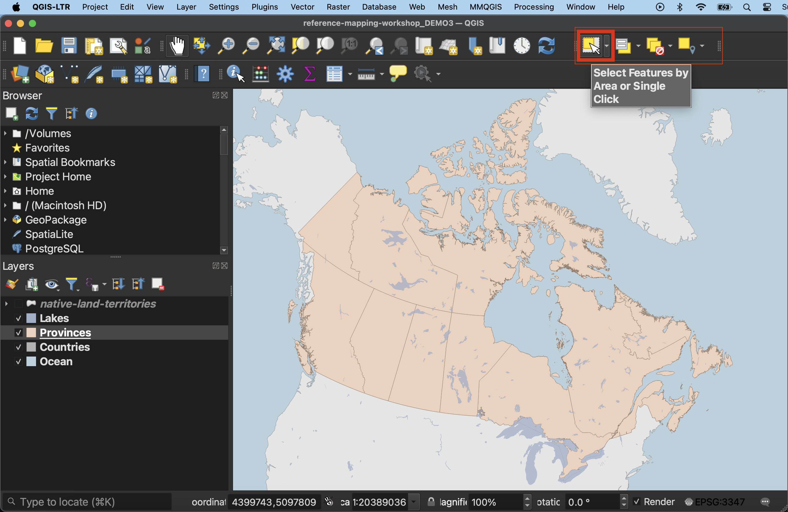
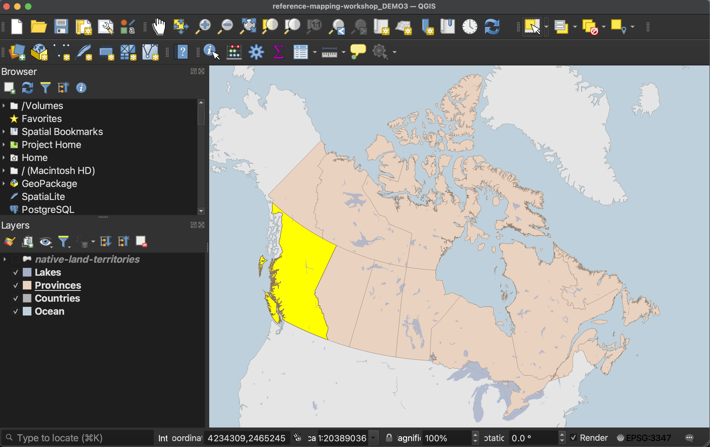
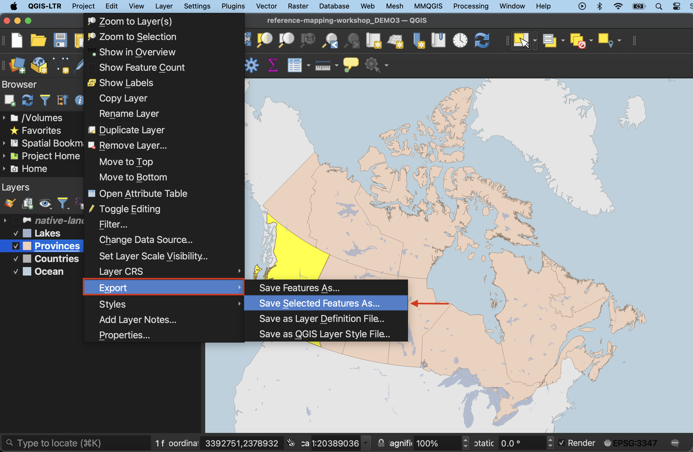
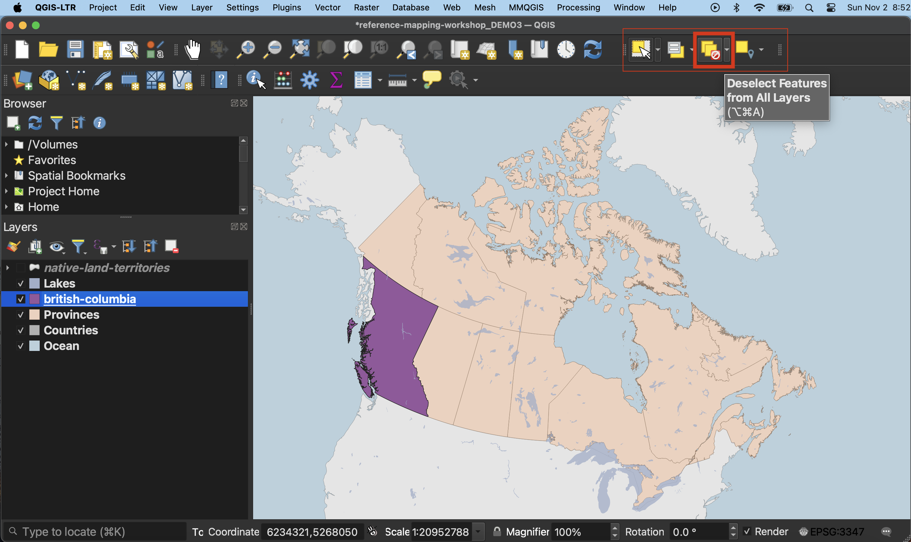
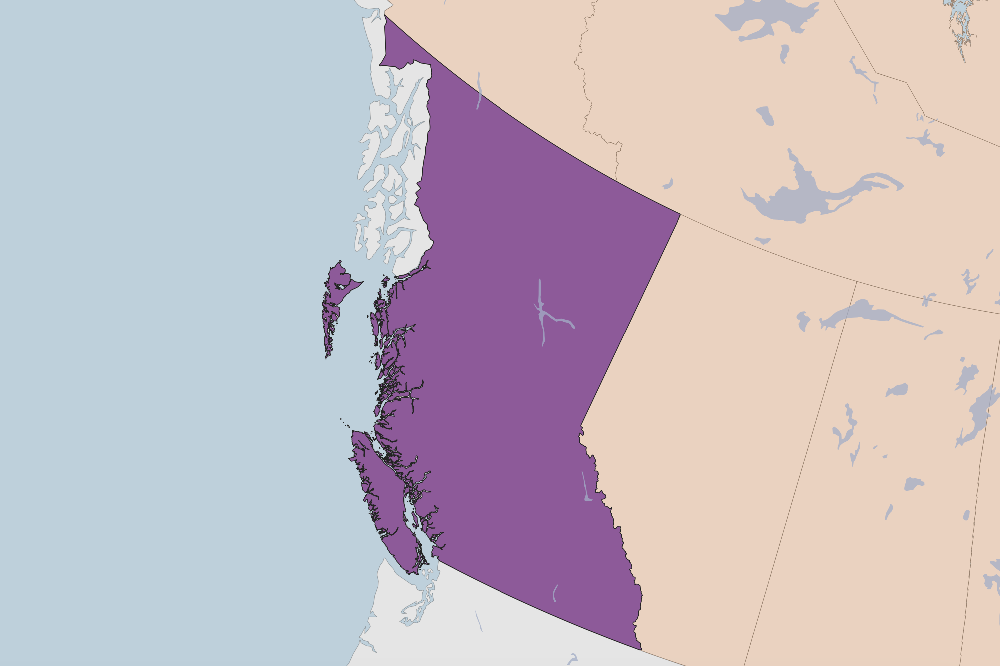
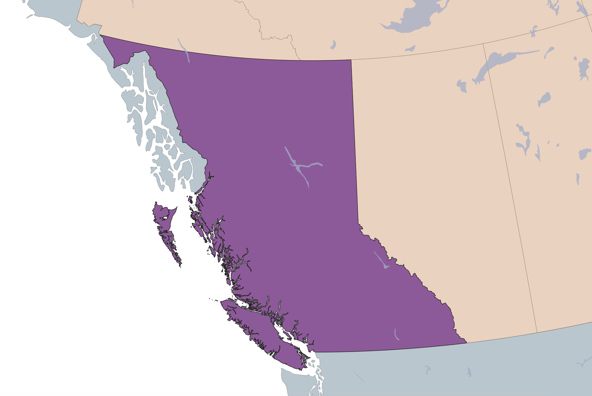
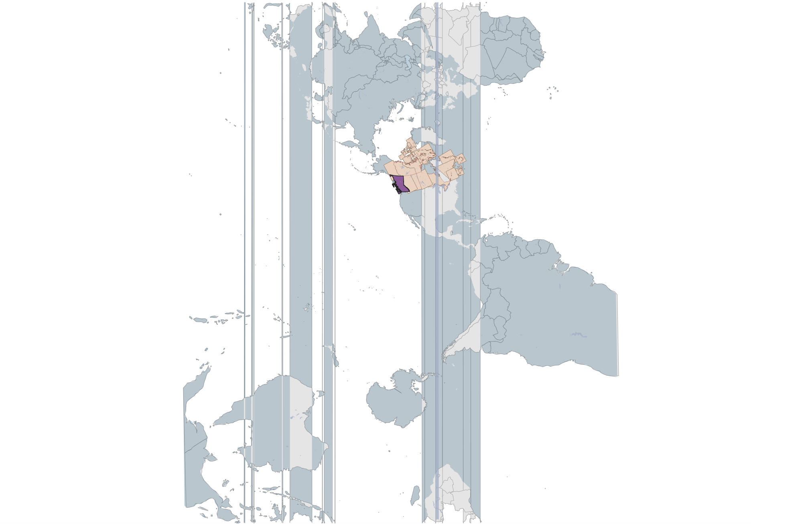
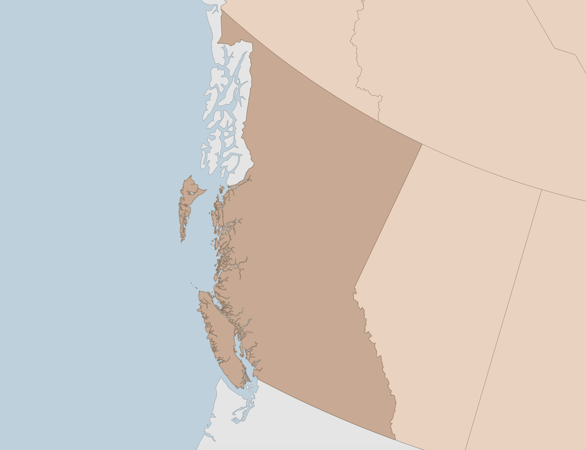

# Selections 
Perhaps you only want to use a portion of the data downloaded, such as a specific province or country. This extended tutorial will show you how to run selections on your data from inside QGIS, and export selected features as a new dataset. 

### Case Scenario: Map of British Columbia
Say you wanted to create a map of British Columbia, where the rest of the Canadian provinces serve as the basemap. You probably want to style British Columbia differently than the other provinces, which is difficult to do when they are all one data layer. 

One solution is to create a new data layer that is *just* British Columbia. We can do this by running a simple select and exporting this selection to a new file. 

## Select features
There are many kinds of selections you can run, and many ways to go about selecting. When the goal is to select a polygon feature, the easiest is to just select it by clicking. In your toolbar, there should be a set of selection tools. If not, right-click on the toolbar greyspace and add the Selection Toolbar. 

Click on the first icon, "Select features by area or single click".

Then, with the Select tool activated, click on British Columbia. It should become highlighted. 

- If you open the Attribute Table of `Provinces`, you should see British Columbia is also highlighted there. Note that selections only work on layers that are turned on. Not also that while British Columbia was selected, the `Countries` layer beneath it was not. In order to select a layer it must be visible and selected in the Layers Panel.  

## Export selection
Once you've selected British Columbia, you can Export your selection as a new file. Right click `Provinces` in the Layers Panel and go to **Export --> Save selected features as...**. Be sure to give your new layer both a name *and* location. Your new layer of just British Columbia should automatically load to your QGIS project. If it doesn't, add it now. 

Importantly, you must now cancel your selection on the `Provinces` layer. Then, click hand icon to return your cursor the pan map tool. This will ensure you don't make more unintentional selections. 

 

## To adjust or not to adjust projections
Notice that when you zoom-in to British Columbia, the province might seem to be rotated at an angle. That's because your project is still likely set to a projection that works well for the entire country, but not so well for a single province. 

From the **Project** menu go to **Properties** and change the project's **CRS** to `NAD83 / UTM zone 10N`. Zoom to British Columbia again. You may need to use the zoom tools to properly zoom in. 

Now however, you'll notice the ocean has disappeared and is now symbolizing the surrounding countries layer. Go ahead and zoom-to the `Ocean` layer to see what happened. Essentially, when we changed the project's CRS from something that worked for world-wide layers to a projection that suited British Columbia specifically, it distorted the other layers including `Ocean`, `Countries` and `Lakes`. 

You have a couple of options. Because everything except oceans is visible when you zoom close to British Columbia, you could just choose to exclude oceans and add a background color instead to simulate the ocean. Or, you could change the project projection back to `NAD83 / Statistics Canada Lambert`. 

## Map styling
Now you can style British Columbia with visual hierarchy in mind. 

 

----

<!-- ## Alternative - style by expression -->