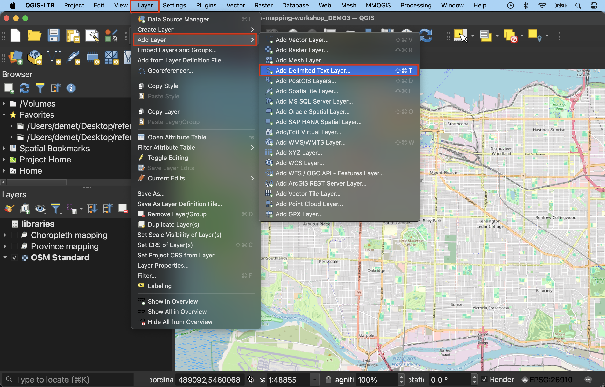
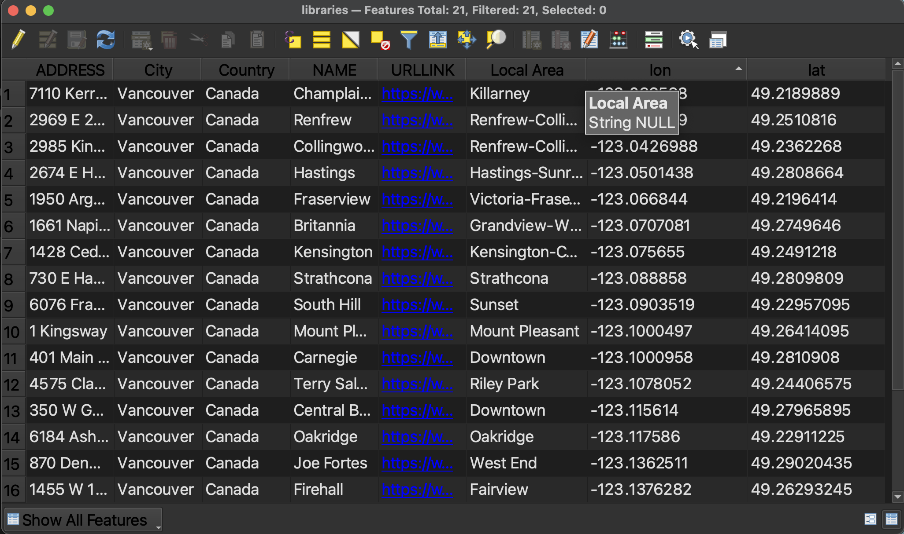
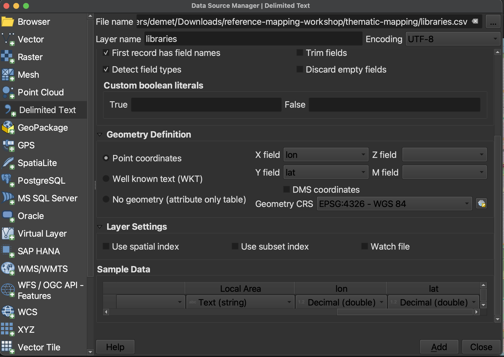
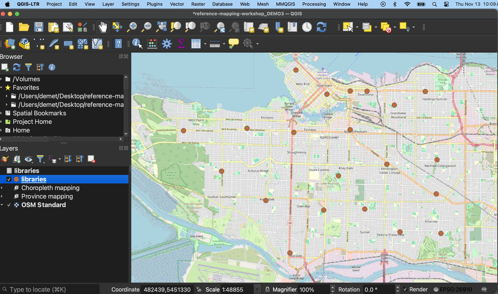

# Adding CSV data

Tabular data stored in CSV (comma separated value) files can be uploaded to a GIS and rendered spatial so long as latitude and longitude are given in two distinct columns and their values stored *as numbers*. The following page will demonstrate how to upload CSV data to a QGIS project. 

If you haven't already, please **download and unzip the workshop folder**. Remember to download it to a location on your physical computer, like Desktop or Downloads. *Do not download it to OneDrive*. The data for the Additional Content exercises (such as this one) will be in the `thematic-mapping` subfolder. 

[Download Workshop Data](../reference-mapping-workshop.zip){: .btn .btn-blue }

## Creating Layers from CSV files in QGIS 

1. If your data is in an excel or other tabular data file format, the first step is to export it as a CSV file. Your data ***must be in a CSV file format with latitude and longitude stored as numbers in two separate columns*** before we begin. You are welcome to use the demo dataset, `libraries.csv` which can be found in the thematic-mapping subfolder of the reference mapping workshop data folder downloadable above. If you're working in a QGIS project that already has data, it can be helpful to hide any irrelevant layers, add a basemap, and set the project projection to something best suited for the area of your CSV data. If using `libraries.csv`, set the project projection to `NAD83 / UTM zone 10N`.   

2. Go ahead and add your CSV file to your project. You'll notice nothing appears in the map canvas because it isn't a spatial layer yet. Notice too that in the Layers Panel, it looks different than the other spatial layers. Open the attribute table to see what's inside. You'll see the **lat** and **long** are left-justified meaning they've been read in as text, rather than numerical values. This is OK as we can tell QGIS they are numbers in the next step. 

3. From the **Layer** menu at the top of your screen, go to **Add Layer** -> **Add delimited text layer...**

4. The Data Source Manager will open. Click the three dots beside **File name** to navigate to the appropriate CSV file on your computer and select it. 

5. For the demo dataset, the first record, or row, contains the field (aka column) names. Ensure **First record has field names** is checked. 

6. Change **Geometry Definition** to **Point Coordinates**. Now look below to the **Sample Data** section. This gives a preview of your dataset. The data is difficult to see because you cannot expand it, but scroll horizontally until you reach the last two fields (or whichever fields contain your personal data's latitude and longitude). If you scroll vertically (I recommend using the up & down arrows, otherwise you may accidentally change the field type), values will be revealed line by line. Notice for the demo dataset, **lat** and **lon** (latitude and longitude) are currently being read as **Text (string)**. Simply click where it says Text (string) and change it to **Decimal (double)** for both those columns. 

7. Now return to **Geometry Definition**. Ensure the X field is set to longitude and the Y field is set to latitude. This may seem counter intuitive, but consider what values change as you move towards the north or south pole. As you move up or down towards the north or south pole — in other words, as you change along the Y-axis — you are changing latitudes. If you move east to west *around* the globe - constituting change in the X-axis direction - you are changing longitude. 

8. Now click **Add** at the bottom right-hand corner to add your CSV as a spatial layer to your map. Once you add the layer, the Data Source Manager will *not* go away, so you'll have to close it. Libraries should now be added to your map canvas. 

9. If you hover over the `libraries` layer in your Layers Panel, you will see it's still stored as `libraries.csv`. To save this spatial layer, right-click and export it to your data folder in a spatial file format such as shapefile or geojson. 

 
