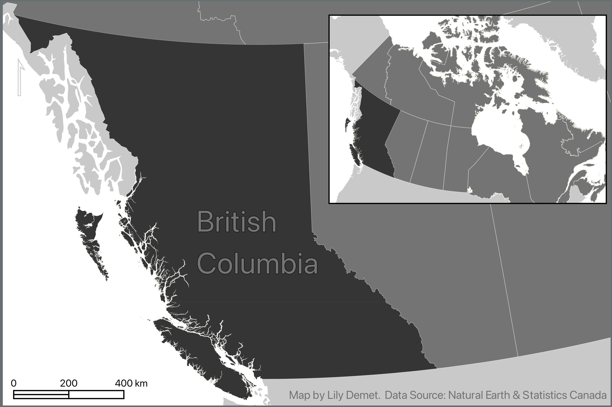

# Insets

Insets, which are maps nested within maps which either zoom-in to show a particular area in greater detail, or zoom-out to contextualize the area of interest within broader geographical context. 

This page will demonstrate how to create insets in your map.

<!-- 
maybe just use map from before. and if selected and exported BC, all the better.
of British Columbia with an inset showing Canada. Will be in black and white. (or choose something else like using the Native Land digital data)

here is what it will look like below. 

Considerations. 
Where to locate it. 
Adding a frame or call out. 
Leader lines

Zooming in, scale. If zooming out, no scale. 
When to use a north arrow. 

Inset might have different projection.  

Show example map I made.  -->