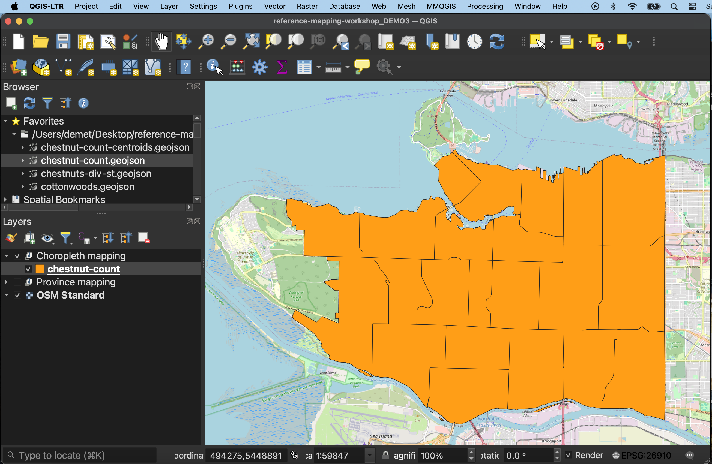
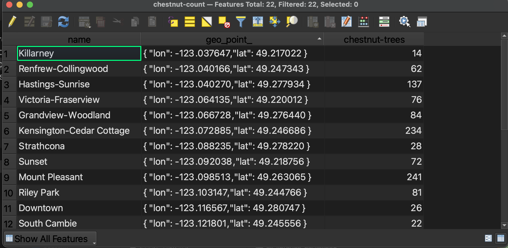
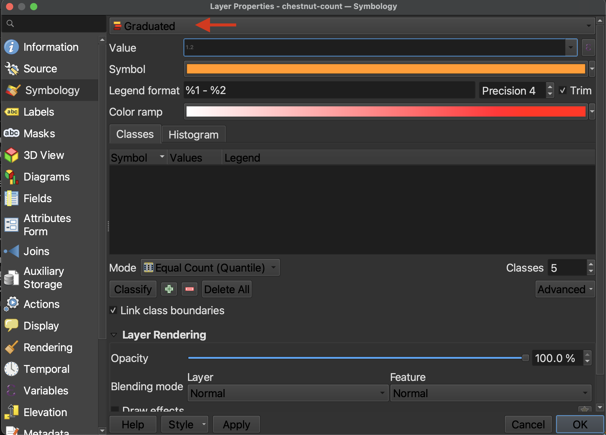
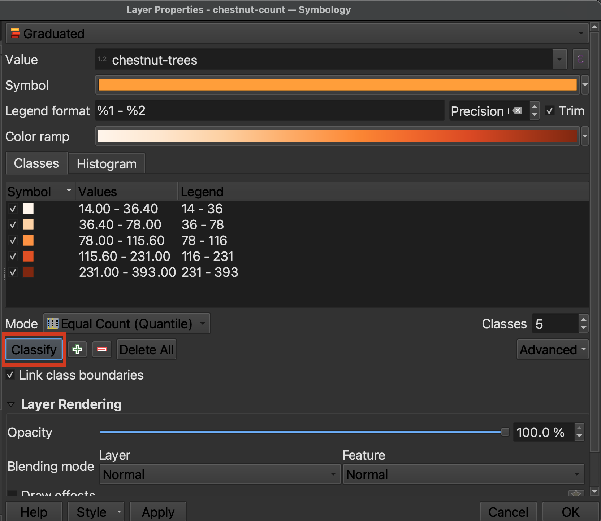

# Thematic Mapping

The following pages will guide you through how to adjust your symbology in QGIS to make a thematic map. The data is already prepared for you in the `thematic-mapping` subfolder of your workshop data folder. Before you begin,
1. Be sure to remove or hide all global layers, and
2. Change the project's **CRS** to `NAD83 / UTM zone 10N`.
3. Having a web-based basemap for reference can be helpful as well. 
4. If the `reference-mapping-workshop` data folder is not already connected as a favorite directory in your Browser Panel, connect it now. 

## Choropleth maps
Choropleth maps are useful to show and compare the density, frequency, or quantity of a value generalized across standardized geographic areas (such as zip-codes, provinces, or countries). Unless you specifically want to emphasize differences in total number of events/data points, it is best practice to normalize your data when choropleth mapping. Normalization is when you divide the values for each geographic area by something like the area in square kilometers or total population of that area. For instance, mapping winter flu cases across census tracts in British Columbia, you'd want to normalize the total cases in each census tract by that tract's total population. Normalization enables better comparison across multiple geographic areas. 

The map below shows total chestnut street trees per Vancouver neighborhood.  

----

## Making a choropleth map 

*1*{: .circle .circle-yellow} `.circle-yellow` Add the file `chestnut-count.geojson` from within the thematic-mapping subfolder of your workshop data folder. Zoom-to the layer. (If your map looks wonky, be sure you've set the project CRS to `NAD83 / UTM zone 10N` from Project menu --> Properties --> CRS.)

 

*2*{: .circle .circle-yellow} The default color may differ in your QGIS project, but once loaded, your layer will something like this. The layer shows Vancouver neighborhoods, but just by looking at it, we can't tell much more. Open the **Attribute Table** of the newly added `chestnut-count` layer. 

Here we can see there are three Fields, one for the neighborhood name, one for its geometry, and a final column storing the number of total chestnut street trees in each neighborhood. *We know this is stored as a number because the contents of this column are right justified.* 

If you are interested in how these counts were calculated, see our [Introduction to QGIS](https://ubc-library-rc.github.io/gis-intro-qgis/) which will take you step-by-step through creating this dataset. 

 

*3*{: .circle .circle-yellow} Remember, a choropleth map visualizes different values across standard geographic areas through gradations in color. So, what we need to do is change the **Symbology** of the `chestnut-count` layer to render visible values in the `chestnut-trees` column.

- Open the layer Symbology of `chestnut-count` (Right-click the layer in the Layers Panel --> Properties --> Symbology). 

- At the top of the **Layer Properties - Symbology** window, we can see the layer `chestnut-count` is currently being symbolized by a **Single Symbol**. Click **Single Symbol** to change this. From the drop-down options that appear, select **Graduated**.

 

*4*{: .circle .circle-yellow} Now we have to indicate what value the layer should be used to build the symbology gradient. Because `chestnut-trees` is the only numerical field in the Attribute Table, when you click the drop-down options for **Value**, `chestnut-trees` is the only value you can choose. Choose it. 

 

*5*{: .circle .circle-yellow} **Precision** refers to how many decimals you want to include, and checking the **Trim** box removes trailing zeros from the legend. Because we are dealing with whole numbers of trees, so long as **Trim** is checked it doesn't matter the precision.

    
 

*6*{: .circle .circle-yellow} You can select a color ramp from the given options, or design your own. Hover over "All Color Ramps" to see all options. For now, change the color ramp to `oranges` from All Color Ramps.  

 

*7*{: .circle .circle-yellow} So far, we've set up the symbology but we have to apply it to our values. Click **Classify** to classify the `chestnut-trees` values. (If nothing shows up, make sure you've set the **Value** to the numerical field `chestnut-count`.)

Hit **Apply** to see you map change. 

While the default classification mode is set to **Equal Count (Quantile)**, you can choose amongst different classification modes. Classification modes determine how the distribution of data are grouped or "classified", and therefore which values are associated with which colors. You can also increase or decrease the number of classes. Between 5 and 7 is best practice. Read more about different classification modes [here](https://pro.arcgis.com/en/pro-app/latest/help/mapping/layer-properties/data-classification-methods.htm). 

If you toggle to the **Histogram** tab, you can **Load Values** to see the distribution of `chestnut-trees` values. The X-axis indicates number of chestnut trees whereas the Y-axis, "Count", refers to the number of neighborhoods with this number of chestnut trees. The number of bins refers to how granularly the number line is broken down. Currently there are 30 bins—from 0 to 400—meaning any neighborhood with a count that isn't a multiple of 5 will be split. 

Play around with different classification modes. You can also create your own intervals manually by simply double clicking the values and editing the number bounds. Or, you can adjust a given classification mode by dragging the class lines in the histogram.

 

