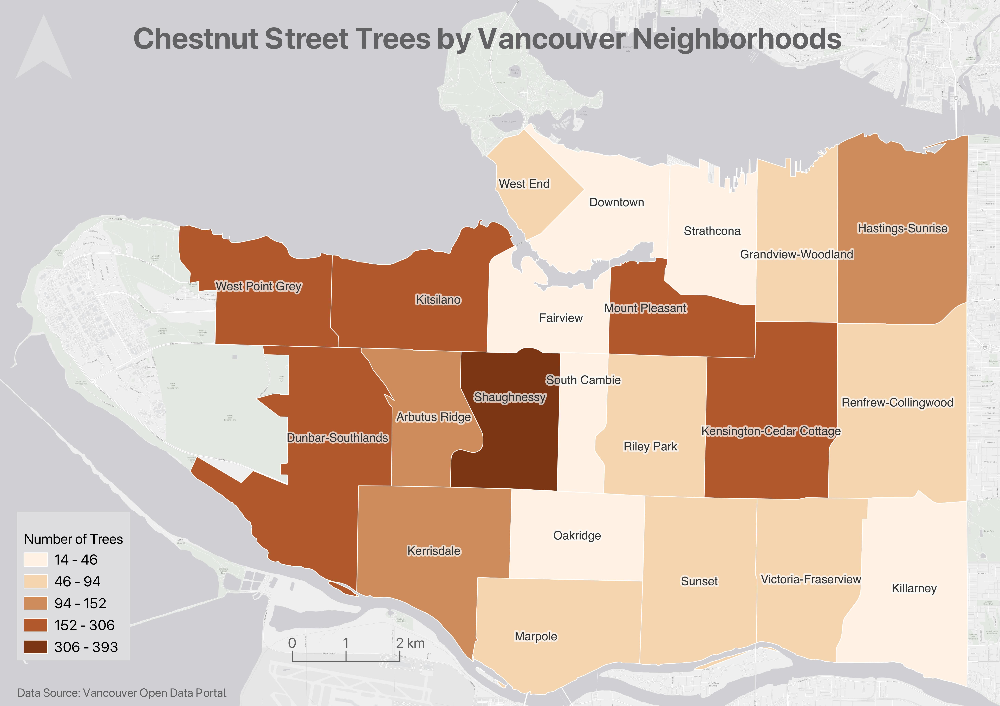

# Thematic Mapping - Choropleth Maps

The following pages will guide you through how to adjust your symbology in QGIS to make a thematic map. The data is already prepared for you in the `thematic-mapping` subfolder of your workshop data folder. 

## Choropleth maps
Choropleth maps are useful to show and compare the density, frequency, or quantity of a value generalized across standardized geographic areas (such as zip-codes, provinces, or countries). Unless you specifically want to emphasize differences in total number of events/data points, it is best practice to normalize your data when choropleth mapping. Normalization is when you divide the values for each geographic area by something like the area in square kilometers or total population of that area. For instance, mapping winter flu cases across census tracts in British Columbia, you'd want to normalize the total cases in each census tract by that tract's total population. Normalization enables better comparison across multiple geographic areas. 

The map below shows total chestnut street trees per Vancouver neighborhood. 

----

## Making a choropleth map 
