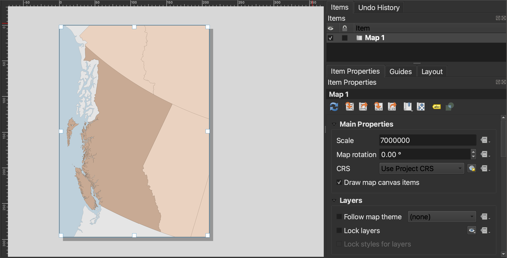
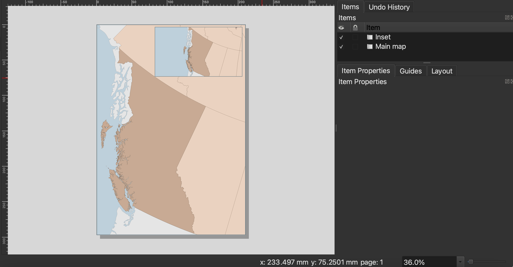
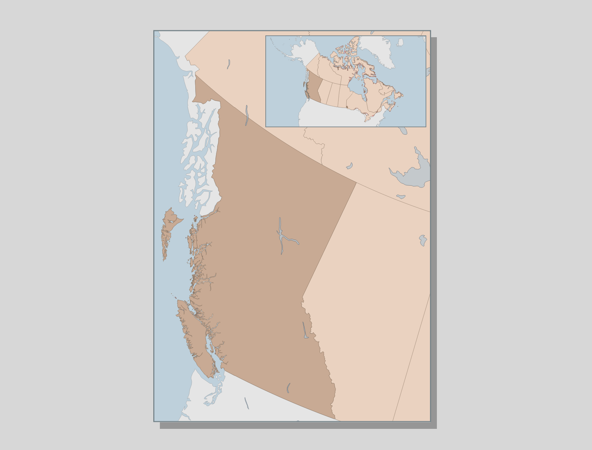

# Insets

Insets are maps nested within maps which either zoom-in to show a particular area in greater detail, or zoom-out to contextualize the area of interest within broader geographical context. 

This page will demonstrate how to create map insets using British Columbia as an example. If you did not create a data layer of *just* British Columbia in the prior page on selections, please add the file `british-columbia.geojson` to your map now. 

## Establishing focus area
Zoom in to British Columbia and style it appropriately if needed. 

Create a new Print Layout and call it `BC-map`. Add your current map to the layout. For this map, Portrait is the best layout orientation. Adjust the scale as needed to something lke `7000000`. 

Use the **Move item content** tool to drag BC to the left of your map, creating a spot for an inset on the upper right-hand corner. Before working any further, go ahead and **Save** your Print Layout.

In the **Items list **, double click your Map 1 to rename it to `Main map`. Then, add another map to the upper right-hand corner. Rename this map `Inset`. 

Adjust the scale of your inset map so that the entirety of Canada is visible, to something like `50000000`, and use the Move item content tool again to center the inset content. 

You can now add neatlines and labeling to both maps. Note that the map scalebar and north arrow should be for the Main map. In some instances, for example when you are creating an inset to zoom in on an area of a thematic map, a scalebar/north arrow for the inset as well is warranted.

You may notice that the `Lakes` layer is only visible on the main map. This is because it is quite distracting to have all the lakes in a zoomed-out map. To get a layer showing up in only one map, turn the layer off in your main QGIS interface and then update the map preview for only the inset.  

 

You can also create leader lines from an area to the inset that's zooming in. However, be sure the inset is the same shape of an area locator and contains exactly what is inside it. 

<!-- 
maybe just use map from before. and if selected and exported BC, all the better.
of British Columbia with an inset showing Canada. Will be in black and white. (or choose something else like using the Native Land digital data)

here is what it will look like below. 

Considerations. 
Where to locate it. 
Adding a frame or call out. 
Leader lines

Zooming in, scale. If zooming out, no scale. 
When to use a north arrow. 

Inset might have different projection.  

Show example map I made.-->