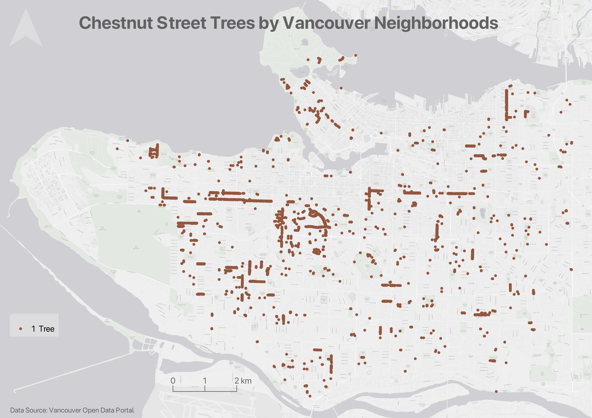

# Mapping Overview: Maps & Tools
{: .no_toc}

Below is an overview of spatial data, Geographic Information Systems (GIS), and the two main kinds of maps. 

Because the following information is introduced in the <a href="https://ubc-library-rc.github.io/gis-mapping-intro/" target="_blank">Intro to Mapmaking with QGIS</a> resource (review of which is a mandatory prerequisite for attending this workshop), the live-facilitated workshop on Reference Mapping will not cover the material below. You are welcome, however, to review the following information in your own time before or after the workshop's facilitation. 

  

    On this page:
  

  {: .text-delta }
 - TOC
{:toc}

----

## Reference Maps 
Maps can be digital, web-based, or physical. Many projects incorporate more than one kind of map into their final output. However, any map can be categorized into one of two main kinds of maps: **reference maps** and **thematic maps**.

**Reference maps** show the lay of the land, such as the geographic context surrounding your research location or area of interest. Reference maps can be as simple as a drop pin location, or more complex with data layers, labelling, and insets. **Insets**, which are maps nested within maps, either zoom-in to show a particular area in greater detail or zoom-out to contextualize the area of interest within broader geographical context.  
   
Reference maps, like any map, should have at minimum an explanatory title, north arrow, scale, legend, map author and data source statement. If there are only one or two data layers which are intuitively symbolized and clearly marked, a legend is sometimes unnecessary. 

 

Other reference maps include road atlases, pocket atlases, or transport specific maps such as the below cycling map of Vancouver. The reference map most often used in your everyday is Google Maps. 

----

## Thematic Maps 

Another kind of map is a **thematic map**. Writes Statistics Canada: “A thematic map shows the spatial distribution of one or more specific data themes for standard geographic areas.” Thematic maps render the results of spatial anlaysis. [QGIS](https://docs.qgis.org/2.18/en/docs/gentle_gis_introduction/spatial_analysis_interpolation.html#:~:text=Overview,Geographic%20Information%20System%20(GIS).) defines **spatial analysis** as:

> the process of manipulating spatial information to extract new information and meaning from the original data. Usually spatial analysis is carried out with a Geographic Information System (GIS). A GIS usually provides spatial analysis tools for calculating feature statistics and carrying out geoprocessing activities such as data interpolation.

Below are examples of different thematic maps, all visualizing chestnut street trees by Vancouver neighborhoods. While today's workshop focuses on making simple static *reference maps* for academic publication, the additional optional content under Hands-On contains documentation for making each kind of thematic map below.

### Choropleth maps
Choropleth maps are useful to show and compare the density, frequency, or quantity of a value generalized across standardized geographic areas (such as zip-codes, provinces, or countries). Unless you specifically want to emphasize differences in total number of events/data points, it is best practice to normalize your data when choropleth mapping. Normalization is when you divide the values for each geographic area by something like the area in square kilometers or total population of that area. For instance, mapping winter flu cases across census tracts in British Columbia, you'd want to normalize the total cases in each census tract by that tract's total population. Normalization enables better comparison across multiple geographic areas. 

The map below shows total chestnut street trees per Vancouver neighborhood. 

The map below shows chestnut street trees as a fraction of total street trees per Vancouver neighborhood. 

Each map serves a purpose. It's simply important to consider what information you want to convey with your map. 

### Proportional Symbol maps
Proportional symbol maps are useful to visualize the quantity of something across respective locations. Choropleth maps use a color gradient to convey value differentials, whereas proportional symbol maps use symbol size. Proportional symbols are quite intuitive, and can be combined with other parameters like color and lettering size to provide rich spatial information. Proportional symbols can even be layered atop a choropleth map. See [Axis Maps](https://www.axismaps.com/guide/proportional-symbols) for a guide to proportional symbol maps. 

Note: In most cases you *do not* normalize values when using proportional symbols, as that would reduce the range in difference. If anything, it can be useful to exaggerate the range slightly. While Absolute Scaling renders symbols increasingly larger along a linear scale, Perceptual/Apparent Scaling compensates for the eye's tendency to reduce difference in sizes close together. [See here for more](https://makingmaps.net/2007/08/28/perceptual-scaling-of-map-symbols/). 

#### Resources 
{: .no_toc}
- More on [Proportional symbol maps](https://schoolofcities.github.io/urban-data-storytelling/urban-data-visualization/proportional-symbol-maps/proportional-symbol-maps.html)

### Dot Density maps
Useful to show the concentration and distribution of discrete incidents. Each dot can represent an event (e.g., an earthquake), or a multiple such as 10. For more see [Axis Maps](https://www.axismaps.com/guide/dot-density). Dot Density maps can over-simplify. 

### Heatmaps
Useful to show intensity or frequency of occurrence. Heatmaps can be thought about as generalized dot density maps. 

### Cartograms
Cartograms distort area to emphasize the value associated with a geographic region. When using cartograms, it's important to consider whether your audience is already familiar with the un-distorted  geography, otherwise they might not glean the added information. 

There is a case to be made that all maps are thematic, as the definition of boundaries, borders, names, etc. is a political - and almost always contested - act. In other words, there are no neutral maps that simply, impartially, represent an objective reality or truth. See [Crampton and Krygier (2006)](https://acme-journal.org/index.php/acme/article/view/723) or [Harley 1992 (1992)](https://quod.lib.umich.edu/p/passages/4761530.0003.008/--deconstructing-the-map?rgn=main;view=fulltext) for a seminal introduction to critical cartography, or [Wang and Liu (2022)](https://www.researchgate.net/publication/365011390_Maps_and_cartography_Progress_in_international_critical_cartographyGIS_research) for an overview of critical cartography and GIS through the last several decades. See also the classic by Denis Wood, *The Power of Maps*.
{: .note}

 

----

## Tools for Static Mapping
There are many tools for mapping suited to a range of skillsets. Today's workshop will use [QGIS](https://qgis.org/) — a free and open source Geographic Information System (GIS) — to visualize spatial data and make simple, static maps as one might for academic publication.  While GIS isn't the only way to make a reference map, it provides ample detail and involves your original work. For a comprehensive list of different mapping tools and software, see [here](https://ubc-library-rc.github.io/gis-spatial-stories/content/resources-static-maps.html). The QGIS application we will use is quite beginner friendly, especially if you just want to make a simple reference map. And, if you do decide to do more complex spatial analysis, you're halfway there. 

<!-- If you're interested in spending more time honing the aesthetics of your map, you can always export a rudimentary map from QGIS and conduct advanced editing in a graphics illustration software such as Adobe Illustrator or its open-source alternative, [Inkscape](https://inkscape.org/).  -->

 
----

## Geographic Information Systems (GIS) 
This workshop uses a Geographic Information System (GIS) to generate reference maps for publication. GIS is an abbreviation for Geographic Information System. A nice description of GIS that provides a bit of relevancy comes from QGIS's [*A Gentle Introduction to GIS*](https://docs.qgis.org/3.10/en/docs/gentle_gis_introduction/introducing_gis.html):

  >*Just as we use a word processor to write documents and deal with words on a computer, we can use a GIS application to deal with spatial information on a computer*

With that in mind, there are 3 main forms of GISs:
1. **Utilities and Services (tasks)** - Scripts and programming libraries that manipulate spatial data in specific ways. For example, [**geocoding**](https://desktop.arcgis.com/en/arcmap/latest/manage-data/geocoding/what-is-geocoding.htm) services geolocate a set of points based on address or coordinate attribute data. [MMQGIS](https://plugins.qgis.org/plugins/mmqgis/) is a QGIS plugin which contains a tool for geocoding. 

2. **Desktop (analyses)** - Software that provides a suite of tools for processing and spatially analyzing data. In other words, GIS applications you interact with through a graphical user interface from a computer. Examples include the QGIS desktop app we will use today and Esri ArcGIS Pro. 

3. **Infrastructure (management)** - Server and web resources that manage, curate, and distribute collections of spatial data. While Esri offers Server web services with ArcGIS Online, many [open source GIS servers](https://mapscaping.com/open-source-gis-servers/) are out there. 

 

[QGIS](https://qgis.org/) is a popular desktop GIS software, and considered a free and open source software (FOSS) with a very active developer community. Take a moment to browse their website.

## QGIS Advantages  ⇡
{: .no_toc} 
 - QGIS is free and open source, meaning you can download it directly from the web to your personal computer. 
 - QGIS runs on Windows, Mac, Linux, operating systems, meaning you don't need a specific kind of device to use it. Some proprietary and costly software, such as ArcGIS, only run on Windows computers making it difficult to use without specialized equipment. 
 - QGIS has extensive online documentation, including a comprehensive official [User Guide](https://docs.qgis.org/3.40/en/docs/user_manual/index.html) *and* [Training Manual](https://docs.qgis.org/3.40/en/docs/training_manual/index.html), as well as numerous YouTube and internet resources/tutorials created by users like you. 
 - QGIS has an intuitive interface which can be customized by the user. 
 - QGIS has an active development and user communities, meaning people are constantly posing and answering questions on platforms such as Reddit,  StackExchange, and YouTube. This makes troubleshooting a whole lot easier. There is also an annual [QGIS User Conference](https://uc2026.qgis.org/activities/)!
 - QGIS has a robust [plugin](https://plugins.qgis.org/) repository for extended functionality. This means the application you download to begin with doesn't contain every single tool available, just the necessary and commonly used ones. 

## QGIS Disadvantages ⇣
{: .no_toc} 
 - Most recent features can be buggy, which is why we recommend always downloading the latest Long Term Release, often small hyperlink below main download button. 
 - Plugins lack standardized documentation as they are largely user-community developed and contributed
 - Troubleshooting often amounts to searching the web, though this is an important skill to have as a cartographer. 
 - Not ideal for more elaborate spatial analysis or network analysis workflows. 

## QGIS Resources 
{: .no_toc} 
QGIS itself has extensive online documentation, including a robust [User Guide](https://docs.qgis.org/3.40/en/docs/user_manual/index.html) *and* [Training Manual](https://docs.qgis.org/3.40/en/docs/training_manual/index.html). 
    
QGIS also has a vibrant user community, with answers to nearly any question you might have only a web search away. Many helpful tutorial demonstrations can be found on Youtube. For instance, [CWU Geography](https://www.youtube.com/@cwugeography3290) offers especially clear and helpful content, but there are many, many others.

  

## Static or dynamic?
While outside the remit of this workshop, may be important to you is whether your map is static or dynamic. Both reference maps and thematic maps can be either static or dynamic. Static maps tell a spatial story at a single scale. Static maps can be exported/stored/formatted as an image (.jpeg or .png), can be exported as a pdf, printed or embedded digitally into website or online publication. They can also be included in an academic paper, poster, or flyer. Dynamic maps, on the other hand, allow the user to interact with your spatial story. Dynamic display data in an interactive fashion, allowing viewers to pan around and zoom in and out to reveal more information at different scales. This workshop focuses on static reference maps. If you're interested in webmapping, our resources for [webmapping with QGIS Plugins](https://ubc-library-rc.github.io/gis-plugins-qgis/content/webmapping.html) workshop, [webmapping with Leaflet](https://ubc-library-rc.github.io/gis-intro-leaflet/), and our[overview of webmapping tools](https://ubc-library-rc.github.io/gis-spatial-stories/content/resources-web-mapping.html).

----

## Spatial Data
A Geographic Information System (GIS) works with data that is tied to a location on Earth. This type of data is often referred to as "spatial data", "geospatial data", or even "GIS data", and is spatially referenced using location information — most commonly geographic coordinates. A GIS uses this location information to project a geospatial file into a virtual geographic space where it can then be visualized and manipulated. If your data's locative information is in the form of text — for example, country/city names or street addresses — this can be made legible to a GIS with a few extra steps (see [geocoding](https://ubc-library-rc.github.io/gis-plugins-qgis/content/geocoding.html)). You may have to create new columns and populate them with coordinate information. 

### Raster vs. Vector Data
There are 2 main types of geospatial data: **vector** and **raster**. 
        
**Raster data** is data which is made up of pixels arranged in a grid, whereas **vector data** is made up of vertices and the paths between them that create geometries representing real-world features. If you're working with continuous geospatial phenomena such as satellite imagery, topography, or climatic data (like rainfall or temperature), you're likely using raster data. If you’re working with points, lines, or polygons, that’s likely vector data.

### Vector Data
{: .no_toc}

Each vector dataset will contain *either* points, lines, or polygons. However, a dataset can include multiple features (either points, lines, or polygons). For example, below are a handful of vector datasets, including Vancouver neighborhoods (polygons), city blocks (polygons), restaurants (points) and streets (lines). A GIS allows you to add multiple datasets, layer them on top of each other, and run calculations between them. For instance, in a GIS, you could load in the below datasets and then use spatial analysis tools to learn how many restaurants are within your neighborhood, or within 10 blocks of you. 

 

 
 
 

In another example, below is a map consisting of three layers of vector data: cities (points), major roads (lines), and land/water (polygons). Cities, roads, land, and water are all different datasets consisting of vector data. 

Each feature (each polygon, point, or line within a given dataset of points, lines, or polygons) contains various information such as a unique identifier, the area in square kilometers or length, the name, the population, etc. These attributes can be explored from within a GIS by opening what's called the Attribute Table.

### Raster Data
{: .no_toc}

Rasters, on the other hand, can generally only store one value per pixel. This value could be a color representing different kinds of topography (think of the whites, greens, and browns representing different elevations in the image below) or the quantity of something like rainfall or temperature. Multiple rasters *can* be overlaid to generate a multi-part raster, but generally, each pixel of a single raster can store one value meaning your raster is showing one variable. You can also do math between raster layers, or run boolean operations to isolate all pixels that do or do not meet certain criteria. An example of this is Suitability Analysis. 
    

In a GIS, you can convert raster data to vector data and vector data to raster data, and extract raster values to a vector dataset. 

<!-- ## Tabular Data 
Finally, there's **tabular data**. Tabular data is simply data formatted into a table by rows and columns. As mentioned above, all vector data has associated tabular data that can be opened and viewed inside a GIS. Your tabular data may have a spatial component, like coordinates, or it may not. If a spatial component is present, you can simply load it into a GIS and tell the GIS to create a spatial layer by referencing the stored latitude and longitude (you will need to ensure lat and long are in separate columns, and the GIS is reading latitude as _y_  and longitude as _x_). If your tabular data does not have locative information, you can still load it into GIS and join it with a spatial layer that already exists based on a key value. However, your tabular data **must be in `.csv` format**, so be sure to export any excel sheets as `.csv`s (comma separated values) before attempting to load them into a GIS.  -->

### File Extensions
{: .no_toc}
    
Spatial data have different file extensions that you may be used to.

- Raster data will often be [TIF](https://en.wikipedia.org/wiki/TIFF) (aka TIFF) file and have the extention `.tif` or `.tiff`. 

- Vector data come in more diverse file formats. The Shapefile is an industry standard format with the extension `.shp` (and a host of "sidecar files" — be sure to keep them all together). Shapefiles store data in binary. Therefore, shapefiles are not legible to human eyes and can only be opened and visualized by a GIS. GeoJSON, on the other hand, stores vector data in `.geojson` files that can be opened in a code editor or online in [geojson.io](https://geojson.io/). From there, geoJSON can easily be parsed with human eyes.

Spatial data might even be stored in an excel sheet or `.csv` file. See [here](https://ubc-library-rc.github.io/gis-reference-mapping/content/hands-on7.html) for documentation outlining how to add CSV data as a layer to a QGIS project. 

See [here](https://gisgeography.com/gis-formats/) for an exhaustive list of formats spatial data can take. Although the nuance of file formats might seem too detail oriented for an introduction to reference mapping, being aware of different spatial data types and formats will help you know what to download and troubleshoot why something may not be opening/working. If you have no prior experience with spatial data, this may be quite overwhelming right now. However, with a little bit of practical experience under your belt file formatting will quickly become common sense to you. 

 

----

#### Resources
{: .no_toc}

- If you have spatial questions you want to explore with your data, you’ll likely need to perform some kind of spatial analysis within a GIS. Check out [Map Production with QGIS](https://ubc-library-rc.github.io/gis-intro-qgis/) and [Tools and Workflows in QGIS](https://ubc-library-rc.github.io/gis-tools-workflows/) for more on data modification, spatial selections, attribute table calculations, and geoprocessing. If you are still designing your project and unsure as to your output, check out the Research Common's [Designing Spatial Stories](https://ubc-library-rc.github.io/gis-spatial-stories/) workshop, email the Geospatial team at `library.gis@ubc.ca`, or [book a consult](https://libcal.library.ubc.ca/appointments/research_commons#s-lc-public-pt).

- [Considerations for downloading data](https://ubc-library-rc.github.io/gis-spatial-stories/content/resources-for-data-assembly.html) 
- [Adding CSV data to QGIS](https://ubc-library-rc.github.io/gis-reference-mapping/content/hands-on7.html)
- [Creating new shapefiles in QGIS](https://ubc-library-rc.github.io/gis-reference-mapping/content/hands-on8.html)

