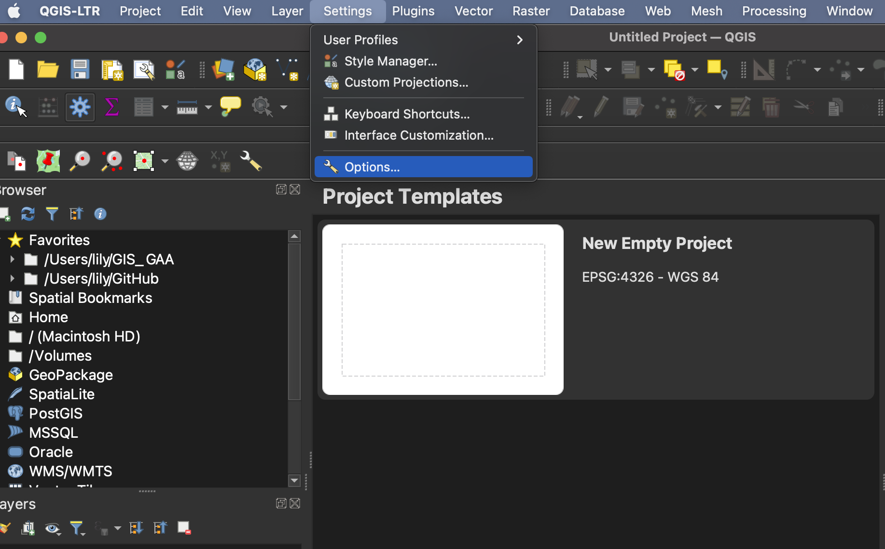

# Introduction to GIS

GIS is an abbreviation for Geographic Information System. A nice description of GIS that provides a bit of relevancy comes from QGIS's [*A Gentle Introduction to GIS*](https://docs.qgis.org/3.10/en/docs/gentle_gis_introduction/introducing_gis.html):

  >*Just as we use a word processor to write documents and deal with words on a computer, we can use a GIS application to deal with spatial information on a computer*

With that in mind, there are 3 main forms of GISs:
1. **Utilities and Services (tasks)** - Scripts and programming libraries that manipulate spatial data in specific ways. For example, [**geocoding**](https://desktop.arcgis.com/en/arcmap/latest/manage-data/geocoding/what-is-geocoding.htm) services geolocate a set of points based on address or coordinate attribute data. [MMQGIS](https://plugins.qgis.org/plugins/mmqgis/) is a QGIS plugin which contains a tool for geocoding. 

2. **Desktop (analyses)** - Software that provides a suite of tools for processing and spatially analyzing data. In other words, GIS applications you interact with through a graphical user interface from a computer. Examples include the QGIS desktop app we will use today and Esri ArcGIS Pro. 

3. **Infrastructure (management)** - Server and web resources that manage, curate, and distribute collections of spatial data. While Esri offers Server web services with ArcGIS Online, many [open source GIS servers](https://mapscaping.com/open-source-gis-servers/) are out there. 

## QGIS

[QGIS](https://qgis.org/) is a popular desktop GIS software, and considered a free and open source software (FOSS) with a very active development community.

### QGIS Advantages  ⇡

 - Free and open source 
 - Runs on Windows, Mac, Linux, Android
 - Extensive online documentation 
 - Intuitive interface
 - Active development and user communities, meaning people are constantly posing and answering questions on platforms such as Reddit and StackExchange. This makes troubleshooting a whole lot easier. 
 - Robust [plugin](https://plugins.qgis.org/) repository for extended functionality

### QGIS Disadvantages ⇣

 - Most recent features can be buggy, which is why we recommend always downloading the latest Long Term Release, often small hyperlink below main download button. 
 - Plugins lack standardized documentation as they are largely user-community developed and contributed
 - Troubleshooting often amounts to searching the web, though this is an important skill to have as a cartographer. 

#### QGIS Resources 
{: .no_toc}
- UBC Research Commons has two workshops to get you started: [Intro to Map Production with QGIS](https://ubc-library-rc.github.io/gis-intro-qgis/) and [Tools and Workflows in QGIS](https://ubc-library-rc.github.io/gis-tools-workflows/). 
- QGIS itself has extensive online documentation, including a robust [User Guide](https://docs.qgis.org/3.34/en/docs/user_manual/index.html#) *and* [Training Manual](https://docs.qgis.org/3.34/en/docs/training_manual/index.html). QGIS also has a vibrant user community, with answers to nearly any question you might have only a web search away. Many helpful tutorial demonstrations can be found on Youtube. [CWU Geography](https://www.youtube.com/@cwugeography3290) offers especially clear and helpful content. 
<!-- - [making a heatmap in QGIS](https://www.qgistutorials.com/en/docs/3/creating_heatmaps.html) -->
    
 

## QGIS Graphical User Interface (GUI)
open project and give ppl a tour.. or have them open and create project... more realistic.? 

**Toolbars** - Toolbars are where you will find the most useful geoprocessing, editing, navigation, and other tools. You can customize this area of your GUI to fit your needs. 
    
**Browser and Layers Panel** - The browser panel lets you easily navigate your file system for data and project files. Your layers panel displays your project's data layers and provides access to configuration settings. If you ever accidentally close a Panel, you can open it again by going to the **View** Menu at the top of your screen, down to **Panels** and then selecting the ones you wish. You can also right-click anywhere in the toolbar's greyspace and select Panels and Toolbars to show/hide. 
 
**Status Bar** - The status bar displays current information about the map canvas, and allows you to make adjustments in the map's scale and rotation.    
 
**Map Canvas or Map View** - Call it either one. This is where the map is displayed as layers are loaded. You can zoom/pan the map canvas as well as select features and other operations.    

### Interface Preferences 
You can change the look and feel of your GUI, as well as adjust default settings from **QGIS-LTR --> Preferences** or **Settings --> Options.** 

### Increasing Icon and Font Size
To increase the size of icons and text on your interface, go to the **Settings** menu at the top of your screen and click on **Options**.
   

Resize the dialogue box so you can see the drop-down for "icon size" and "font." Icon changes will happen as soon as you click OK. Changes in font size won't update until you quit and restart QGIS, so make sure you save your project now. 
   

