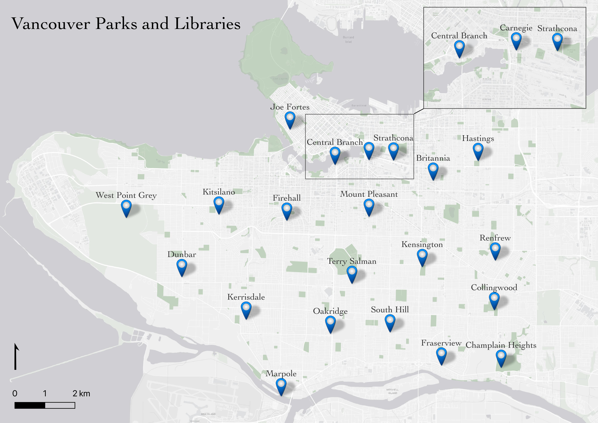
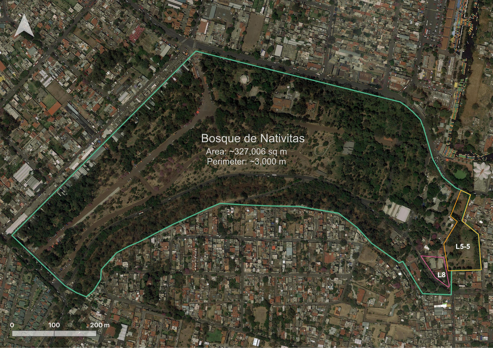

# Reference Maps 
Maps can be digital, web-based, or physical. Many projects incorporate more than one kind of map into their final output. However, any map can be categorized into one of two main kinds of maps: **reference maps** and **thematic maps**.

**Reference maps** show the lay of the land, such as the geographic context surrounding your research location or area of interest. Reference maps can be as simple as a drop pin location, or more complex with data layers, labelling, and insets. Insets, which are maps nested within maps which either zoom-in to show a particular area in greater detail, or zoom-out to contextualize the area of interest within broader geographical context.  
   
Reference maps, like any map, should have at minimum an explanatory title, north arrow, scale, legend, map author and data source statement. If there are only one or two data layers which are intuitively symbolized and clearly marked, a legend is sometimes unnecessary. 

<!-- 
The above satellite imagery reference map was made by the workshop author for a colleague's dissertation. -->

 

Other reference maps include road atlases, pocket atlases, or transport specific maps such as the below cycling map of Vancouver. The reference map most often used in your everyday is Google Maps. 

<!-- ## Thematic maps -->
<!-- Although this workshop focuses primarily on reference maps, it's helpful to know your options before choosing an output for your publication. -->
<!-- 
Another kind of map a **thematic map**. Writes Statistics Canada: “A thematic map shows the spatial distribution of one or more specific data themes for standard geographic areas.” Thematic maps visualize the results of some spatial analysis. [QGIS](https://docs.qgis.org/2.18/en/docs/gentle_gis_introduction/spatial_analysis_interpolation.html#:~:text=Overview,Geographic%20Information%20System%20(GIS).) defines **spatial analysis** as:

>> the process of manipulating spatial information to extract new information and meaning from the original data. Usually spatial analysis is carried out with a Geographic Information System (GIS). A GIS usually provides spatial analysis tools for calculating feature statistics and carrying out geoprocessing activities as data interpolation.

If you have spatial questions you want to explore with your data, you’ll likely need to perform some kind of spatial analysis within a GIS. If you are still designing your project and unsure as to your output, check out the Research Common's [Designing Spatial Stories](https://ubc-library-rc.github.io/gis-spatial-stories/) workshop, email the Geospatial team at `library.gis@ubc.ca`, or [book a consult](https://libcal.library.ubc.ca/appointments/research_commons#s-lc-public-pt).

Below are examples of different thematic maps, all visualizing chestnut street trees by Vancouver neighborhoods. 
 

### Choropleth maps
Useful to ...

### Proportional Symbol maps
Useful to ...

### Dot Density maps
Useful to ...

### Heatmaps
Useful to ...

### Cartograms 
Useful to ...

----

## Static or dynamic
Another consideration that, while outside the remit of this workshop, may be important to you is whether your map is static or dynamic. Both reference maps and thematic maps can be either static or dynamic. Static maps tell a spatial story at a single scale. Static maps can be exported/stored/formatted as an image (.jpeg or .png), can be exported as a pdf, printed or embedded digitally into website or online publication. They can also be included in an academic paper, poster, or flyer. Dynamic maps, on the other hand, allow the user to interact with your spatial story. Dynamic display data in an interactive fashion, allowing viewers to pan around and zoom in and out to reveal more information at different scales. This workshop focuses on static reference maps. If you're interested in webmapping, check out [QGIS Plugins]() workshop, [Introduction to webmapping]() and (spatial stories)() workshops. (link specific pages.)

 -->
