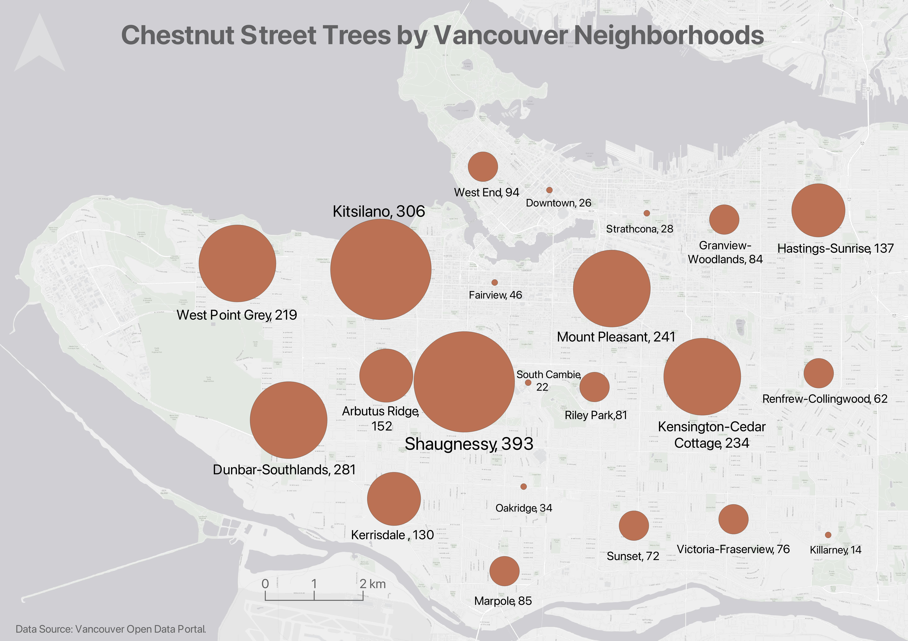

# Thematic Maps 

Another kind of map is a **thematic map**. Writes Statistics Canada: “A thematic map shows the spatial distribution of one or more specific data themes for standard geographic areas.” Thematic maps render the results of spatial anlaysis. [QGIS](https://docs.qgis.org/2.18/en/docs/gentle_gis_introduction/spatial_analysis_interpolation.html#:~:text=Overview,Geographic%20Information%20System%20(GIS).) defines **spatial analysis** as:

> the process of manipulating spatial information to extract new information and meaning from the original data. Usually spatial analysis is carried out with a Geographic Information System (GIS). A GIS usually provides spatial analysis tools for calculating feature statistics and carrying out geoprocessing activities as data interpolation.

<!-- >> see other workshops like intro and tools and workflows for data modification, selects, etc. if you need to do processing/calculations to your spatial data before youre ready to symbolize it.  -->
If you have spatial questions you want to explore with your data, you’ll likely need to perform some kind of spatial analysis within a GIS. If you are still designing your project and unsure as to your output, check out the Research Common's [Designing Spatial Stories](https://ubc-library-rc.github.io/gis-spatial-stories/) workshop, email the Geospatial team at `library.gis@ubc.ca`, or [book a consult](https://libcal.library.ubc.ca/appointments/research_commons#s-lc-public-pt).

Below are examples of different thematic maps, all visualizing chestnut street trees by Vancouver neighborhoods.
 

## Choropleth maps
Useful to show and compare the density, frequency, or quantity of a data value generalized across standardized geographic areas (such as zip-code, province, or country). Unless you specifically want to emphasize differences in total number of events/data points, normalization is best practice. Normalization is when you divide the values for each geographic area by something like the area or population of that area. This enables better comparison across multiple geographic areas. 

---- 

## Proportional Symbol maps
Useful to visualize quantity of something across respective locations. Where choropleth maps use a color gradient to convey value differentials, proportional symbol maps use symbol size. Proportional symbols are quite intuitive, and can be combined with other parameters like color (or even situated on top of a choropleth map) to provide rich information. See [Axis Maps](https://www.axismaps.com/guide/proportional-symbols) for a guide to proportional symbol maps. 
Note: In most cases you *do not* normalize values when using proportional symbols, as that would reduce the range in difference. If anything, it can be useful to exaggerate the range slightly. While Absolute scaling renders xyz, perceptual/Apparent scaling compensates for the eye's tendency to reduce difference in sizes close together. [See here for more](https://makingmaps.net/2007/08/28/perceptual-scaling-of-map-symbols/). 

<!-- https://schoolofcities.github.io/urban-data-storytelling/urban-data-visualization/proportional-symbol-maps/proportional-symbol-maps.html -->

You can make proportional symbol maps in QGIS simply by converting polygons to centroids (if not already points) and then going to symbology and chosing xyz. Alternatively, if you want to spend extensive time styling your map and proportional symbols manually, you can export centroids (and other geographic layers) as an `.svg` file and open it in an illustration software like Adobe Illustrator or [Inkscape](https://inkscape.org/). The formula for *radius* of proportional symbols in absolute scaling is as follows: 
> rC = (vC / vL) 0.5 * rL
 

> where rC is the radius of the circle to be calculated, 
> rL is the radius of the largest circle, 
> vC is the data value of the circle to be calculated, and 
> vL is the data value of the largest circle 

For perceptual scaling, increase the exponent to 0.57.   

Note: The language for this formula is from GEOS372 Cartography Lab 6 by Dawn Mooney. 

---- 

## Dot Density maps
Useful to show the concentration and distribution of discrete incidents. Each dot can represent an event (e.g., an earthquake), or a multiple such as 10. For more see [Axis Maps](https://www.axismaps.com/guide/dot-density). Dot Density maps can over-simplify. 

----

## Heatmaps
Useful to ...

## Cartograms 
Cartograms distort area to emphasize the value associated with a geographic region. When using cartograms, it's important to consider whether your audience is already familiar with the un-distorted  geography, otherwise they might not glean the added information. 

----

There is a case to be made that all maps are thematic, as the definition of boundaries, borders, names, etc. is a political - and almost always contested - act. In other words, there are no neutral maps that simply, impartially, represent an objective reality or truth. See [Crampton and Krygier (2006)](https://acme-journal.org/index.php/acme/article/view/723) or [Harley 1992 (1992)](https://quod.lib.umich.edu/p/passages/4761530.0003.008/--deconstructing-the-map?rgn=main;view=fulltext) for a seminal introduction to critical cartography, or [Wang and Liu (2022)](https://www.researchgate.net/publication/365011390_Maps_and_cartography_Progress_in_international_critical_cartographyGIS_research) for an overview of critical cartography and GIS through the last several decades. See also the classic by Denis Wood, *The Power of Maps*.
{: .note}

