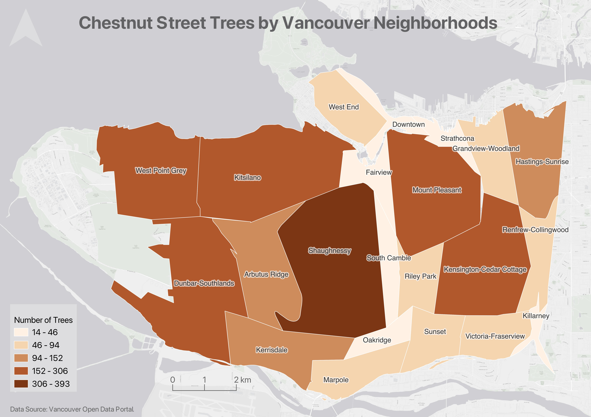

# Thematic Maps 

Another kind of map a **thematic map**. Writes Statistics Canada: “A thematic map shows the spatial distribution of one or more specific data themes for standard geographic areas.” Thematic maps render the results of spatial anlaysis. [QGIS](https://docs.qgis.org/2.18/en/docs/gentle_gis_introduction/spatial_analysis_interpolation.html#:~:text=Overview,Geographic%20Information%20System%20(GIS).) defines **spatial analysis** as:

> the process of manipulating spatial information to extract new information and meaning from the original data. Usually spatial analysis is carried out with a Geographic Information System (GIS). A GIS usually provides spatial analysis tools for calculating feature statistics and carrying out geoprocessing activities as data interpolation.

<!-- >> see other workshops like intro and tools and workflows for data modification, selects, etc. if you need to do processing/calculations to your spatial data before youre ready to symbolize it.  -->
If you have spatial questions you want to explore with your data, you’ll likely need to perform some kind of spatial analysis within a GIS. If you are still designing your project and unsure as to your output, check out the Research Common's [Designing Spatial Stories](https://ubc-library-rc.github.io/gis-spatial-stories/) workshop, email the Geospatial team at `library.gis@ubc.ca`, or [book a consult](https://libcal.library.ubc.ca/appointments/research_commons#s-lc-public-pt).

There is a case to be made that all maps are thematic, as the definition of boundaries, borders, names, etc. is a political - and almost always contested - act. In other words, there are no neutral maps that simply, impartially, represent an objective reality or truth. See [Crampton and Krygier (2006)](https://acme-journal.org/index.php/acme/article/view/723) for a seminal introduction to critical cartography, or [Wang and Liu (2022)](https://www.researchgate.net/publication/365011390_Maps_and_cartography_Progress_in_international_critical_cartographyGIS_research) for an overview of critical cartography and GIS through the last several decades. See also the classic by Denis Wood, *The Power of Maps*.
{: .note}

Below are examples of different thematic maps, all visualizing chestnut street trees by Vancouver neighborhoods.
  

## Choropleth maps
Useful to ...

## Proportional Symbol maps
Useful to ...

## Dot Density maps
Useful to ...

## Heatmaps
Useful to ...

## Cartograms 
Useful to ...

----

