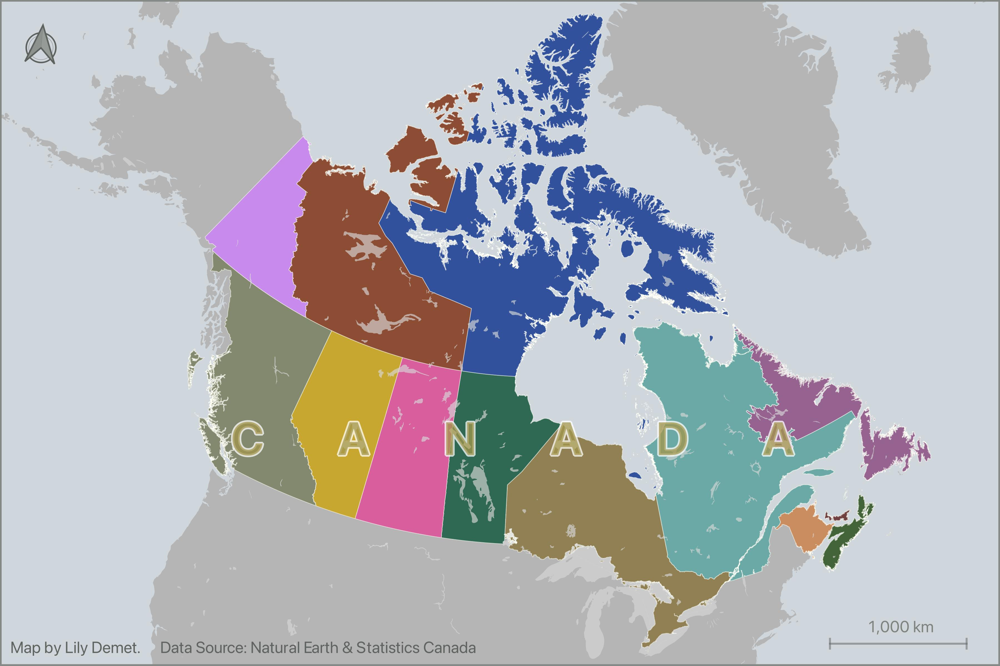

# Reference Mapping for Academic Publication

In this beginner-friendly workshop, you will learn how to create simple, static reference maps to accompany academic publications. We will use [QGIS](https://qgis.org/), a free and open-source Geographic Information System (GIS) for analyzing, modifying, and visualizing spatial data. By the end of this workshop, you will have the confidence to:

<!-- This workshop is geared towards mapping novices. If you want to create  a map that geographically contextualizes your study area, or have a project involving data with a spatial component you're eager to visualize, this workshop is for you.  While making such maps on your own can feel daunting, this workshop will give you the confidence to: -->

- Decide what kind of map best conveys your research or contextualizes your study area;
- Find and download relevant spatial data;
- Load datasets into QGIS and style them as data layers;
- Compose a map that includes a title, scale bar, legend, and north arrow; and
- Export this map into formats compatible with print and digital publication.
 

<!--carousel styling and code from W3schools-->
<html>
<link rel="stylesheet" href="./style.css">

  
1 / 3

  
  <!-- 
Caption Text
 -->

  
2 / 3

  

  
3 / 3

  

<a class="prev1" onclick="plusSlides(-1)">❮</a>
<a class="next1" onclick="plusSlides(1)">❯</a>

   
   
   

</html>

Why make your own reference map? While maps of your research area may already exist, they often have licenses that prohibit their republication elsewhere. Alternatively, you might want to show a location specific to your research, or mark the sites where fieldwork was conducted. Although the use of existing maps is frequently restricted, the data used to create them is often readily available. This means you can make your own map with it!

---
## Before the Workshop!!

1. **Review our Introduction to Mapmaking with QGIS** Please note that the fundamental skills and concepts pertaining to spatial data, map types, and the QGIS interface will *not be* covered during this workshop. Therefore, prior to the workshop date, please review our *[Introduction to Mapmaking with QGIS](https://ubc-library-rc.github.io/gis-mapping-intro/)*. **Review of this resources *is required* for workshop attendance.** 

2. **Make sure you've downloaded QGIS** QGIS can be downloaded from [qgis.org's Downloads page](https://qgis.org/en/site/forusers/download.html). In most cases, you'll want to download and install the **Long term release** instead of the latest release - currently **QGIS 3.40.4 'Bratislava'**. This will give you most of the functionality you'll need without encountering the software bugs of newly released versions. See the subpage to this page **[installing QGIS](./installing-qgis.md)** for further guidance. 

2.  **Download and unzip the workshop data folder** below. Download it to a folder on your physical computer, such as Desktop or Downloads, _not_ OneDrive.

[Download Workshop Data](./reference-mapping-workshop.zip){: .btn .btn-blue }

If you're coming to this workshop with your own data in-hand, be sure to move it inside the unzipped workshop data folder. Additionally, make sure it is either in a spatial data format (such as Esri Shapefile, `.shp`, or geoJSON, `.geojson`), or saved as a `.csv`. For the purposes of this workshop, if your data is in `.csv` format it _must_ have coordinate information saved in _two separate columns_, one for latitude and one for longitude. If you only have cities/countries or street addresses, follow the link in the resources below to book a 1:1 consult for additional support. If you have street addresses, you can also _geocode_ these in QGIS (see [here](https://ubc-library-rc.github.io/gis-plugins-qgis/content/geocoding.html) for documentation.)
{: .note}

     

## Audience

**Geospatial novices welcome!** This workshop is geared towards mapping novices. If you want to create a map that geographically contextualizes your study area, or have a project involving data with a spatial component you’re eager to visualize, this workshop is for you. However, we ask that you please take an hour to review our [Introduction to Mapmaking with QGIS](https://ubc-library-rc.github.io/gis-mapping-intro/) prior to the workshop. 

For a further introduction, you are welcome to explore our [Intro to QGIS](https://ubc-library-rc.github.io/gis-intro-qgis/), [Tools and Workflows in QGIS](https://ubc-library-rc.github.io/gis-tools-workflows/), and [Plugins in QGIS](https://ubc-library-rc.github.io/gis-plugins-qgis/) offerings _in that order_.

If your goal is to map your research area or visualize research data, this workshop is for you. However, if you are looking to conduct spatial analysis on your data, we recommend the QGIS workshops listed above. If you realize you actually want to make interactive and dynamic web-based maps that can be embedded in a website or shared via a link, check out our [Webmapping Workshop](https://ubc-library-rc.github.io/gis-intro-leaflet/).
    

Finally, if you don't know what kind of output you want just yet, we encourage you to explore our resource for [Telling Spatial Stories](https://ubc-library-rc.github.io/gis-spatial-stories/). Here, you will be guided through choosing an output format and tools that serve your purpose, skillset, and timeframe. 

---

#### GIS Resources at UBC:

<!-- - General Informational website for all things UBC GIS: [gis.ubc.ca](http://gis.ubc.ca/) -->
- UBC Library guide for finding and working with GIS resources: [guides.library.ubc.ca/gis](http://guides.library.ubc.ca/gis)
- Archive of [Research Commons workshops](https://ubc-library-rc.github.io/)
- Research Commons [Events Calender](https://researchcommons.library.ubc.ca/events/) for upcoming facilitated workshops
- Contact UBC Library’s Geospatial team: `library.gis@ubc.ca`
- Schedule a 1:1 consult with the geospatial team [here](https://libcal.library.ubc.ca/appointments/research_commons#s-lc-public-pt)

This workshop was authored by <a href="https://geog.ubc.ca/profile/lily-crandall-oral/" target="_blank">Lily Demet</a> and reviewed by Alex Alisauskas.

