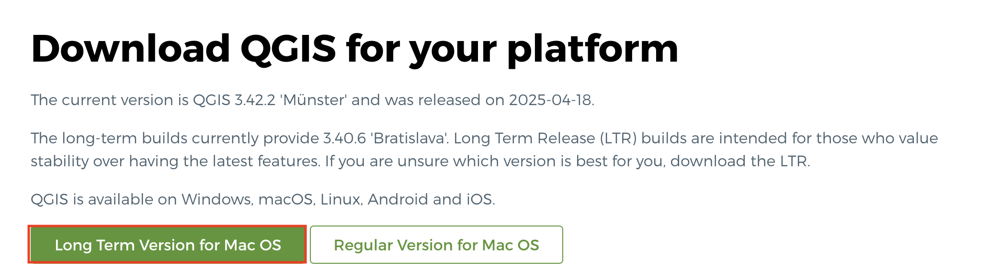

# Downloading & Installing QGIS

QGIS can be downloaded from [qgis.org's Downloads page](https://qgis.org/en/site/forusers/download.html). In most cases, you'll want to download and install the **Long term release** instead of the latest release. This will give you most of the functionality you'll need without encountering the software bugs of newly released versions.

To Do
{: .label .label-green }
Install QGIS for your operating system. From [qgis.org's Downloads page](https://qgis.org/en/site/forusers/download.html), select your computer's operating system from the drop-down menu. 

 

## For Mac, choose the "Regular Version for macOS"

  
## For Windows, scroll down and choose the Long Term Release

    
Later on in this workshop, you will be given a tour of the interface, as well as guided through adding data to a project and saving your project. For now, just make sure you have properly downloaded QGIS and are able to launch it. See below for troubleshooting tips if you're working on a Mac computer. 

 

### Troubleshooting
If you're working on a MacOS and get the message: _"QGIS-LTR can’t be opened because Apple cannot check it for malicious software"_ when you try to open the application, go to System Preferences --> Security & Privacy --> General and unlock your settings. At the bottom of the dialogue box you will see an option to Open Anyway. Click that, then re-lock your settings and try again to open the QGIS-LTR application. 

